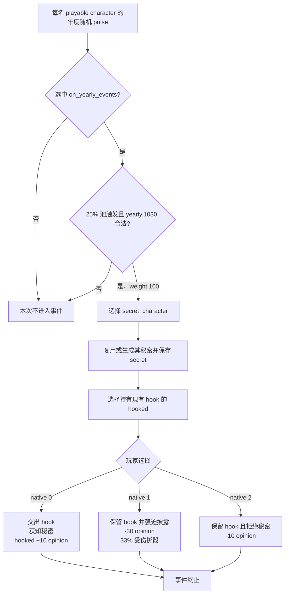

# CK3 1.19.0.6 `yearly.1030` 把柄换秘密决策树

## 状态与边界

- [static-confirmed] 只绑定 CK3 `1.19.0.6` 与 `ck3.exe` SHA-256
  `2D00FF3101EF70B566F2FCBAE292F09263199C80E9DC8F139B82D7D96F83DB86`。
- [paused live RED] R418 retry 03 在 PID `204536`、connection generation `1` 的真实暂停帧命中
  `yearly.1030` instance `1096`，日期为 `53943096`。桥接器发布 `secret_character`、`secret`、`hooked`
  三个 saved scope，native `0/1/2` 均 shown/enabled；未尝试选择。
- [production-live primitive] R418 attempt 04 在同一 PID / connection generation 选择 authored `1` /
  native `0`，instance `1096 -> null`、snapshot `native:457 -> native:458`、revision `458 -> 459`，
  `postcondition_verified=true`。该路线交出 ROOT 对 `hooked` 的现有 hook，换取 `secret_character` 的秘密与
  `hooked` 对 ROOT 的 `+10` 好感。

这条记录只解决真实 promotion 时间线上的事件中断，不把一次 campaign 的人物 ID、日期或 instance 写入通用合同。

## 原版入口与前置效果

`random_yearly_playable_pulse` 每年在每个 playable character 的独立随机时点调用一次。它可能选中
`on_yearly_events`；该组先经过 `chance_to_happen = 25`，再在合法候选中给 `yearly.1030` weight `100`。
这不是固定的年触发概率，因为同帧合法 group 和 event 集都会改变分母。

事件要求 ROOT 同时拥有：

- 一名与 ROOT 同地、可用的 AI 成年 `hooked` character；
- 一名 ROOT 尚未掌握其秘密、也没有其 hook 的目标。目标来自 rival、spouse、powerful vassal、normal
  councillor 或 liege。

窗口显示前的 `immediate` 会写入持续 `2000` 日的 `had_event_yearly_1030` flag，选择
`secret_character`，必要时为其生成一个符合条件的秘密，保存 `secret`，再选择提供情报的 `hooked`。目标判定明确
排除 ROOT 已持有 hook 的人物，因此 `secret_character` 与 `hooked` 必然不同；两者又都是 AI character，所以均非
当前玩家。

## 有界续跑策略

三个选项都没有后续事件，但成本不同：

1. authored `1` / native `0` 移除现有 hook，向 ROOT 揭示秘密，并让 `hooked` 获得 `+10 grateful_opinion`。
   arrogant、ambitious、greedy、deceitful、paranoid、callous、sadistic 或 vengeful ROOT 可能承受源码声明的
   personality stress。
2. authored `2` / native `1` 保留 hook 并强迫对方披露秘密；它造成 `-30 cruelty_opinion`，还有 `33%` 的
   `hooked` 受伤掷骰，并可能产生 personality stress。
3. authored `3` / native `2` 保留 hook 但放弃秘密，造成 `-10 disappointed_opinion`；ambitious、vengeful 或
   paranoid ROOT 可能承受 personality stress。

续跑选择 native `0`，因为它是唯一同时取得秘密、避免强迫受伤掷骰并避免负面 opinion 的路线。交出 hook 和可能的
性格压力是明确保留的代价，不能描述成零成本选项。

严格合同要求：

- ROOT 为当前玩家；`secret_character` 与 `hooked` 是彼此不同、且均非玩家的 character；`secret` 类型为
  `secret`，当前桥不要求它尚未发布的稳定 identity；
- saved scope 名字精确为 `secret_character,secret,hooked`；
- snapshot 与 rendered option count 都为 `3`，native indices 精确为 `(0,1,2)`，三项均 shown/enabled；
- 只提交 authored `1` / native `0`，并用旧 instance 消失或前进作为后置条件；命令 ACK 本身不算完成。

## 证据

- 原版定义：`Crusader Kings III/game/events/yearly_events/yearly_events_2.txt:2927-3277`，SHA-256
  `64B778B7B3DFE1056EB0151A7ED3AA7CFB3E6E738E68144006BAF97E93E0A3E8`。
- 原版年度池：`Crusader Kings III/game/common/on_action/yearly_on_actions.txt:2933-2946`，SHA-256
  `0FC85A284224A68D1CA0A4EF071D4F4A4F49896753AEC463975A12EE4E1116FA`。
- 英文与简体中文 localization SHA-256 分别为
  `49FEA5E7066464140EBAF10421C356DF3CED5DB1370C11210F658E446DC16440` 与
  `F6A248C14B923AA4ED33753C766DE302D67705DFC2065CBB27A6A4A04FF18631`。
- R418 retry 03 选择前 RED：
  `_runtime/p1-terminal-resume-r418-20260911/live-artifacts/terminal-stages-red-attempt-03.json`，SHA-256
  `A814FA6203FC0EC0E1BAA17E2D9DC7C3CA586E3F69B12A0B33CAC30832B89E90`。
- R418 attempt 04 同进程动作 GREEN（artifact 最终保留后续 `.0072` RED）：
  `_runtime/p1-terminal-resume-r418-20260911/live-artifacts/terminal-stages-red-attempt-04.json`，SHA-256
  `5F1710E928F214C28FF4DF19478117F333E22473BF9E9713F0039AE766138146`。
- 可移植合同、analysis 与 observation：
  `ck3_autonomous_player/src/xar_autoplayer/vanilla_events/records_yearly.py`。
