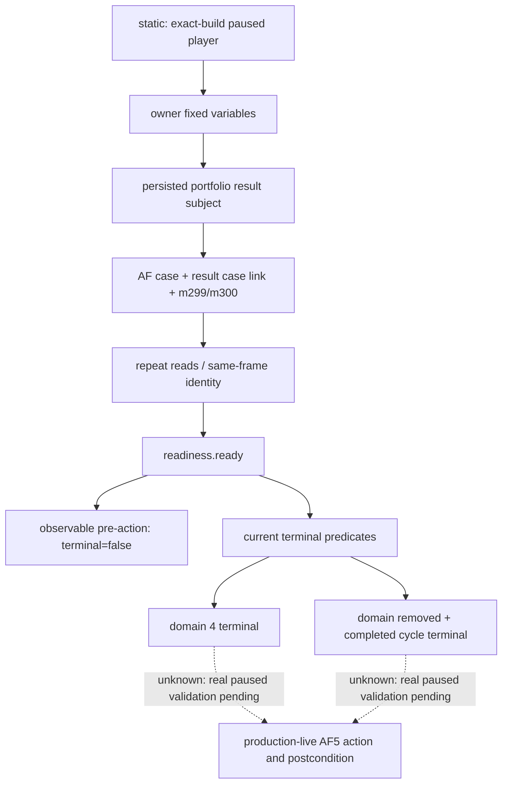

# 天朝二期 AF5 独立终态观测 v1

记录日期：2026-09-11（Asia/Shanghai）。状态：**static-ready；真实 paused AF5 前后帧与 production-live 验收待完成**。

本查询补齐已经影响 P1 验收的具体观测缺口：AF5 关闭后 portfolio domain 立即变为 4，次日还会移除临时 domain、stage、subject；旧 promotion/compensation 查询限定 domain 1–3，并依赖实际位于 compensation 之后的 `.147` receipt。旧查询无法独立证明 AF5 完成。生产阶段顺序和失败归因见 [R400 路线勘误](../phase2-promo/r400-af5-stage-order-and-terminal-observation-2026-09-11.md)。

本专题是 mod 自有业务账本的只读观测。CK3 原生 AI 策略树为 N/A；下面冻结的是实际读取链与业务状态判定，不改变产品阶段顺序或选项效果。

## 公开接口与帧绑定

MCP 工具：

```python
ck3_query_zhongguo_compensation_af5_snapshot_v1(
    request_nonce: str,
    expected_revision: int,
) -> dict[str, object]
```

Service 方法为 `query_zhongguo_compensation_af5_snapshot_v1(request_nonce, *, expected_revision)`。Capability 为 `game.command.query-zhongguo-compensation-af5-snapshot-v1`，原生 step 为 `query-zhongguo-compensation-af5-snapshot-v1`。

`expected_revision` 使用公开 snapshot revision。Python 从同一暂停帧取得 played owner、native revision、日期与 connection generation；native 请求携带 owner、nonce 和映射后的 native revision。subject 由 provider 读取玩家 `zg361_comp_portfolio_result_subject` 派生，该字段在 portfolio 清理后仍保留；临时 `zg361_comp_portfolio_subject` 存在时还会与它核对。接口不需要当前活动事件，也不需要 source/result event 相关性。

原生 envelope 的 payload key 为 `zhongguo_compensation_af5_snapshot`。公开 service 返回该 payload，并附加 `build / source / binding`，将 `source_backend_id` 标为 `native-headless`；native payload 使用 `ck3-1.19.0.6-native-zhongguo-compensation-af5-snapshot-v1`。查询前后的 snapshot、玩家、native revision、日期、暂停状态和 connection generation 必须保持一致。

[JSON schema](../../ck3_autonomous_player/schemas/zhongguo-compensation-af5-snapshot-v1.schema.json) 同时描述 native payload 与公开 facade；facade 必须包含上述三个绑定对象。冻结 SHA-256：`B8839712AE999E49C7B3EE5E20DBDA14C9DBD0BB8C0511CEA6F83FE903933EBB`。

业务叶子统一为 `{status, value, unavailable_reason}`：成功时为明确的整数或布尔值；产品尚未写入或已经移除的字段保留 typed unavailable。操作前尚未产生 m299/m300 receipt，以及关闭后临时 domain/stage 消失，都是本接口需要表达的状态。

| 分组 | 发布字段 |
|---|---|
| `af5.portfolio` | domain、stage、completed_cycle、visible_pending、result_identity |
| `af5.case` | identity、result_case_serial、state、active、last_operation、last_route、repurchase_resolved、unit_conserved |
| `af5.m299`、`af5.m300` | identity、state、active、consumed、route |
| 顶层 | 帧来源与玩家/subject 绑定、readiness、terminal、unavailable_reason |

各 identity 包含 owner_character_id、subject_character_id、cycle_serial、case_serial。只有 AF case identity 额外包含 revision；receipt 冻结在 state 5，其消费时刻可能早于最终 case revision，因此不把 receipt revision 当成最终 case revision。

## Exact build 与 ABI 复用

唯一绑定的游戏构建为 CK3 `1.19.0.6`，EXE SHA-256：

`2D00FF3101EF70B566F2FCBAE292F09263199C80E9DC8F139B82D7D96F83DB86`

本查询复用已冻结的 character-variable 读取 ABI，实际链为：

`BindZhongguoCaseNativeEnvironmentV1 → IsZhongguoVariableAbiExactV1 → ReadZhongguoFixedVariableSetV1`。

变量上下文、标识符表/查找/名称、character storage/fallback slot 的 RVA，以及 numeric/character kind 和 fixed-point scale，沿用[现有 ABI 合同的 native_variable_abi](../../ck3_autonomous_player/native_bridge/research/zhongguo_promotion_compensation_postcondition_v1_abi.json)。该链接只复用底层读取 ABI；其中旧 promotion receipt 与 portfolio domain 选择语义不适用于本查询。

[AF5 header](../../ck3_autonomous_player/native_bridge/include/xar_bridge/zhongguo_compensation_af5_snapshot_v1.hpp) 直接复用 `ZhongguoCaseNativeEnvironmentV1 / ZhongguoCaseAccessV1`，冻结 9 个 owner 变量与 28 个 subject 变量。实际 provider/serializer 位于 [AF5 native source](../../ck3_autonomous_player/native_bridge/src/zhongguo_compensation_af5_snapshot_v1.cpp)。在 application-main paused frame 中读取 owner 与固定 subject 两次，并检查两次原始行及前后帧一致。

私有候选沿用 `XAR_CK3_ENABLE_ZHONGGUO_PROMOTION_COMPENSATION_CANDIDATE_V1` 构建开关。新查询占用 `permitted_executor_trigintary`；Python 仅在 native descriptor 宣告 capability 时执行，hybrid 也从 native 取得该能力。开关打开或接线完成都不能升级 live readiness。

## Readiness、终态与两个 case 编号

`readiness.ready` 表示当前 AF5 身份和帧可以读取，与 `terminal` 分开：

- `player_owner_binding_ready`：AF owner 与 portfolio result owner 均为同帧玩家。
- `portfolio_subject_binding_ready`：AF subject 匹配持久 result subject；临时 subject 存在时也匹配。
- `same_case_identity_ready`：两组 owner/subject/cycle 绑定成立，AF case 和 result case 各自为正；`af5.case.result_case_serial` 匹配 portfolio result case，AF revision 为正。
- `same_frame_ready`：两次读取与暂停帧保持一致。
- `ready`：以上四项均成立。

**AF case serial 与 delivered-result case serial 属于两个独立编号空间。** AF serial 来自 case kernel；`af5.case.result_case_serial` 来自 subject 的 `zg361_comp_result_case`。m299/m300 的 receipt case 匹配 AF case；portfolio 的 result case 则匹配 `case.result_case_serial`。不能要求 AF case serial 等于 result case serial。

原生 `terminal=true` 要求 `ready=true`，且当前帧同时满足：

| 对象 | 当前帧终态条件 |
|---|---|
| AF case | state=6，active=false，last_operation=300，last_route=3，repurchase_resolved=true，unit_conserved=true |
| m299 与 m300 | 两份 receipt 的 active/consumed=true、route=3、state=5，owner/subject/cycle/AF case identity 均匹配 AF case |
| Portfolio | visible_pending=false；domain=4，或 domain 已移除且 completed_cycle 等于 AF cycle |

产品依据为 [AF stage barriers](../../mod_zhongguo_style/common/scripted_effects/zg361_compensation_24_af_stage_barriers_effects.txt)、[AF case kernel](../../mod_zhongguo_style/common/scripted_effects/zg361_case_kernel_033_domain_af_lti_grant_effects.txt) 与 [portfolio closure](../../mod_zhongguo_style/common/scripted_effects/zg361_compensation_07e_portfolio_closure_effects.txt)。

单次查询只能证明当前帧。行动验收还必须把执行前后的 AF identity 对齐，要求 revision 前进，独立核对实际选项动作与后置状态；`accepted=true` 的传输 ACK 不承担这个结论。readiness=true、terminal=false 是正常可观察前态。



## 已执行验证与待办

[合成 fixture](../../ck3_autonomous_player/tests/fixtures/zhongguo_compensation_af5_snapshot_v1.json) 明确标注 `synthetic_contract_fixture_not_live`，包含三帧：`pre_action`、`immediate_terminal_domain4`、`closed_portfolio_terminal`。fixture 使用 result case `14`、AF case `214`，覆盖两个编号空间不同的情况；关闭后 domain/stage typed unavailable 仍可通过观测。

2026-09-11 实际执行，工作目录为仓库根：

```powershell
py -m unittest discover -s ck3_autonomous_player/tests/unit -p test_zhongguo_compensation_af5_snapshot_v1_bridge.py -q
# Ran 6 tests; OK

py -m unittest discover -s ck3_autonomous_player/tests/unit -p test_gameplay_bridge.py -k test_official_mcp_client_lists_and_calls_ck3_tools -q
# Ran 1 test; OK

git diff --check
# exit 0
```

6 项聚焦测试覆盖 step 往返、三帧 native schema 与 facade schema、真实 Python transport/driver/service 路径、同帧变化与 capability 来源，以及正式 MCP client 调用新工具。MCP 测试使用合成 endpoint，未运行 CK3。

尝试运行既有 `test_zhongguo_promotion_compensation_v1_bridge.py` 时，系统 Python 与 `Z:/ck3_mod_rewrite/ck3_autonomous_player/.venv/Scripts/python.exe` 均缺少 `pytest`，该旧模块未执行；未将此项计为通过。

同日还对真实 C++ 测试可执行文件输出的 [cold-terminal JSON](Z:/ck3_mod_rewrite/_runtime/r401-af5-bld1/af5-native-fixture.json) 做了一次跨语言验证。该文件来自 `xar_ck3_zhongguo_compensation_af5_snapshot_v1_test.exe --json`，仍是合成 fixture。实际执行：

```powershell
@'
from pathlib import Path
import json, sys
from jsonschema import Draft202012Validator
sys.path.insert(0, str(Path('ck3_autonomous_player/src').resolve()))
from xar_autoplayer.bridge.zhongguo_compensation_af5_snapshot_contract import ZhongguoCompensationAf5SnapshotQueryV1, normalize_native_zhongguo_compensation_af5_snapshot_v1
p=Path('Z:/ck3_mod_rewrite/_runtime/r401-af5-bld1/af5-native-fixture.json')
frame=json.loads(p.read_text(encoding='utf-8-sig'))
normalized=normalize_native_zhongguo_compensation_af5_snapshot_v1(frame,expected_query=ZhongguoCompensationAf5SnapshotQueryV1(frame['player_character_id'],frame['request_nonce']),expected_snapshot_revision=frame['snapshot_revision'],expected_date_raw=frame['date_raw'],expected_player_character_id=frame['player_character_id'])
schema=json.loads(Path('ck3_autonomous_player/schemas/zhongguo-compensation-af5-snapshot-v1.schema.json').read_text())
Draft202012Validator(schema).validate(normalized)
print(json.dumps({'result':'GREEN','evidence_kind':'native_synthetic_serializer_fixture_not_live','input':str(p),'request_nonce':normalized['request_nonce'],'revision':normalized['snapshot_revision'],'player':normalized['player_character_id'],'subject':normalized['subject_character_id'],'case_serial':normalized['af5']['case']['identity']['case_serial'],'result_case_serial':normalized['af5']['case']['result_case_serial'],'domain':normalized['af5']['portfolio']['domain'],'ready':normalized['readiness']['ready'],'terminal':normalized['terminal']},ensure_ascii=False))
'@ | py -
```

结果 exit 0、GREEN：nonce=`af5-fixture`，revision=41，player=200，subject=100，AF case=214，result case=14，domain typed unavailable，ready=true，terminal=true。这证明当前 C++ serializer 与 Python contract/schema 的实际互通，不代表游戏内冷恢复通过。

01:11 追加：R402 已取得真实 paused 前态与 authored/native `42/41` 后独立终态，query 升为 `production-live primitive`；围绕它的 AF5 单元已完成有界实机循环。owner32904/subject27448/cycle2/AF case1/result case58 保持，state5→6、revision19→22、m299/m300 route3 consumed=true。原生存档、全日志扫描与受管清理 GREEN；精确 commit、DLL、artifact 与 hash 见[实机结果](../phase2-promo/r400-af5-stage-order-and-terminal-observation-2026-09-11.md#r401r402-实机结果0111-追加)。真实冷恢复仍待验收，合成冷态不升级为 live。
