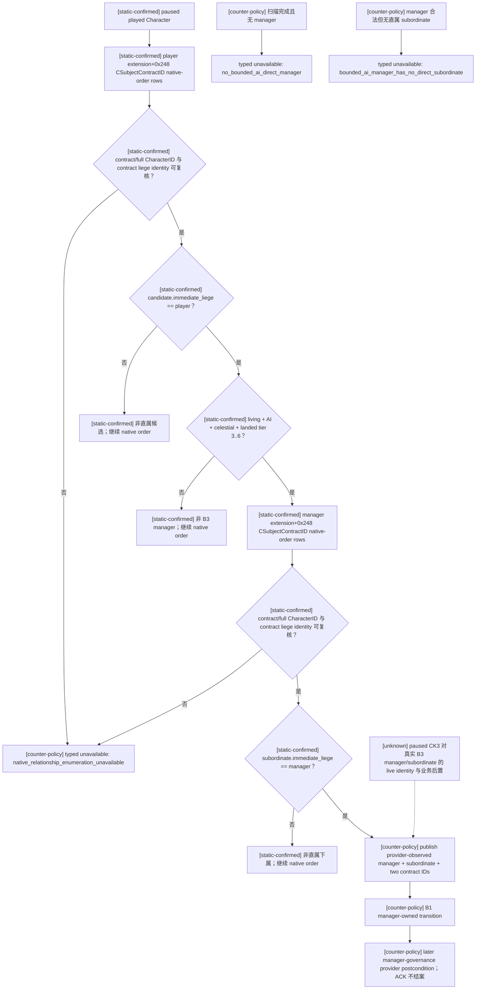

# CK3 1.19.0.6：天朝 B3 经理与直属下属 selector v1

## 证据与范围

- 状态：`production transport integrated + static/fixture ready, live pending`。
- 游戏版本：CK3 `1.19.0.6`。
- EXE SHA-256：`2D00FF3101EF70B566F2FCBAE292F09263199C80E9DC8F139B82D7D96F83DB86`。
- 固定 capability：`game.command.query-zhongguo-manager-subordinate-selector-v1`。
- 固定 selector kind：`zg361-bounded-ai-direct-manager-selection-v1`。
- 请求只含 `request_nonce` 与 paused snapshot revision，不接受 manager、subordinate、AI、government、rank 或关系断言。
- 本专题只为已实现的 B3 manager-governance action cell 选择一个真实 AI 经理及其一个真实直属下属；不研究宗教，也不发布任意角色/关系枚举器。

静态输入来自同一 exact EXE 的现有闭合链：

1. `Character+0x1B8 -> extension+0x248` 是该角色作为 liege/suzerain 一端持有的
   `CSubjectContractID` native-order 数组，data 在 `+0x248`、signed count 在 `+0x254`、行宽 4 bytes。
   原生战争 builder 的 `0x27A1F08..0x27A1FB8` 与 `0x27A1FBA..0x27A2111` 分别从双方角色读取并遍历同一集合。
2. `CSubjectContract` storage 是 `module+0x570CCA0`，fallback 是 `module+0x570CC50`；对象 full ID 在
   `+0x08`，subject `Character*` 在 `+0x20`，liege/suzerain `Character*` 在 `+0x28`。RTTI type descriptor
   `0x522F770` 命名 `.?AVCSubjectContract@@`，对象大小为 `0xD8`。
3. selector 不把“出现在合同数组”直接等同于直属封臣。每个候选还必须通过 full CharacterID resolve，且调用
   `0x2613480(candidate)` 得到的 immediate liege 指针与 source owner 指针相同；因此 tributary、失效合同与非直属关系均不会入选。
4. manager 资格复用已冻结的原生观察：死亡 marker `Character+0x1C8`；human predicate `0x28BCEB0`；
   primary title `0x25F3350`，title template `+0x160`、tier `+0x5C`；effective government `0x26165B0`，
   stable key MSVC string 在 `government+0x18`。仅 living、AI、`celestial_government`、primary-title tier `3..6`
   的玩家直属候选进入经理集合。
5. manager 自身的同一 contract 集合再枚举一次；第一个 full-generation 有效且 immediate liege 精确等于经理的
   subject 成为直属下属。若一个合格 manager 没有直属下属，继续玩家合同 native order 寻找下一组完整 pair；选择保留
   两层 native order，不排序、不接受调用方 ID、不把缺失填成 `0`/`null`。

## 原生关系树与 B3 消费树



## 只读 ABI 与失败语义

生产 query 必须在 application-main 且 paused frame 中执行：

```text
frame before
  -> select(manager, subordinate, manager_contract, subordinate_contract)
  -> select(manager, subordinate, manager_contract, subordinate_contract)
  -> frame after
```

两份 selection 与前后 frame 必须逐字段相等；回传后不保留 engine pointer。任一数组 count 小于 0、超过
`65,536`、非零 count 配空 data、contract/character storage resolve 失败、fallback、full ID 回读不一致、
contract liege pointer 不等于 source owner，均返回
`native_relationship_enumeration_unavailable`，不得跳过坏行后伪造“无候选”。完整无错扫描后没有合法 manager 才返回
`no_bounded_ai_direct_manager`；至少一个 manager 合法、但所有合法 manager 都无直属下属才返回
`bounded_ai_manager_has_no_direct_subordinate`。

`AuthorizeZhongguoBoundedAiDirectManagerV1` 生产 binding 使用同一 exact helper，只验证“该指定 manager 是玩家的 living AI
celestial landed duke+ 直属封臣”；它不接受调用方 eligibility flags。selector 的公开结果则额外证明一个直属 subordinate，
供 B3 action cell 使用。

## Readiness 与实机门

静态 fixture 可以证明 native-order 选择、资格过滤、两层直属关系、坏 storage/ID/count、无 manager、无 subordinate 与
双读漂移；它不升级 live。首次实机必须保存同一 paused revision 的 selector response、随后 B1 transition 的 provider-observed
receipt、以及 manager-governance later query 的 F032/F035 后置；queue ACK 仍只表示提交。完成这组 artifact 前状态保持
`production_transport_integrated_static_and_fixture_ready_not_live`。
