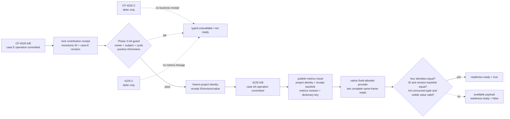

# 天朝项目贡献到指标结果只读观测 v1

状态：**private-candidate-live-validated-and-source-captured-not-default**。共享 mailbox/bridge/Python/MCP 已完成接线；R303 在 exact build 上取得真实 paused provider GREEN，R313 又取得 schema-2 projects source checkpoint，但默认 CK3 adapter 仍关闭该候选，尚非默认 production capability。

能力名：`game.command.query-zhongguo-projects-metrics-postcondition-v1`。它只回答一个窄问题：CP #026 的真实贡献 receipt，是否被 Phase 3 #229 的指标结果以相同 ID 与 revision 明确回链，而且 source、result、contribution、metrics 是否属于同一 manager/subject/cycle/project case。

## 为什么需要产品字段

CP #026 属于 case E，Phase 3 #229 属于独立 case AA；两者各自拥有不同的 kernel case serial 与 revision。旧脚本只有 #026 的 kernel operation receipt/可见贡献值，以及 #229 自己的 metric object/version/dictionary code，无法证明“这一条 metrics 消费了那一条 contribution”。把两个碰巧相等的 case serial 拼起来会制造不存在的业务事实，因此本次先在权威生成器里补了显式 lineage，而不是在 provider 中猜测。

真实写入链如下：

- CP #026 A/B 在 operation 成功后递增受评人作用域的 `zg361_cp_contribution_receipt_cursor`，写 contribution receipt ID，并把成功后的 `case_e_revision` 写为 receipt revision；C 不签发。
- Phase 3 初始化器只在当前 owner/subject/cycle 与 CP receipt 一致、ID/revision 为正时冻结项目四元身份、receipt 与贡献值。
- #229 A/B 在自己的 case AA operation 成功后，原样复制冻结的 receipt ID/revision 与项目四元身份，并发布 metrics revision/dictionary code；C 不发布。

## Exact-build ABI 与访问边界

该 reader 复用已经冻结的 CK3 `1.19.0.6` 变量 ABI：EXE SHA-256 `2D00FF3101EF70B566F2FCBAE292F09263199C80E9DC8F139B82D7D96F83DB86`，scope-variable context RVA `0x3329A40`、identifier table/lookup/name RVA `0x3B971A0/0x3B97020/0x3B97090`、character storage/fallback slot RVA `0x570C130/0x570C138`。完整机器可读合同位于 `ck3_autonomous_player/native_bridge/research/zhongguo_projects_metrics_postcondition_v1_abi.json`。

查询只读 caller 明确给出的 project subject scope；caller 提供 request nonce、expected snapshot revision、owner filter 与 subject character ID。paused player 必须是该项目的绑定 owner 或 subject，owner 必须与 subject 不同；provider 不读取 owner scope，也不允许选择变量名、receipt 或 dictionary key。固定 allowlist 恰好 49 个字段：9 个 CP portfolio closure/cursor 字段、15 个 CP #026 直接 receipt/consume/provenance 字段、1 个 P3 portfolio cycle 字段，以及 24 个 P3 source/result 投影字段。

provider 在 application main thread、paused snapshot 上做两次完整 allowlist 读取；前后 frame 或原始行任一变化即返回 `state_changed`。它不保留引擎指针。CP #026 receipt owner 缺失返回 `project_source_not_found`；直接 CP 身份、A/B choice、receipt、consumed tuple 或 visible provenance 不闭合返回 `project_source_not_ready`。只有直接 CP source 闭合后才发布 available payload；后续 P3 字段缺失保持 typed unavailable，并由显式 checkpoint state 区分。

## Readiness 合同

`checkpoint_state` 有四个 available 状态：`cp26_ready_p3_absent` 表示直接 CP #026 A/B receipt 已闭合且同周期 P3 initializer 尚未运行；`p3_initialized_source_not_ready` 表示同周期 initializer 已出现但 copy 尚未闭合；`p3_source_ready_result_pending` 表示 copy 闭合而 #229 result 未提交；`p3_result_committed` 才允许最终 `ready=true`。顶层 unavailable 必须使用 `checkpoint_state=unavailable`。这使 source-checkpoint capture 不再依赖尚未运行的 P3 source 投影，也不使用 ACK、fixture 或 clone 冒充业务状态。

最终 `ready=true` 同时要求：paused player 是绑定 owner 或显式 subject，owner filter 正确；CP portfolio 已闭合，final owner/subject/cycle 与当前项目一致，final case/state 为正、conservation 为 1 且不存在 pending player event；source/result/contribution/metrics 四组项目关联身份完整且逐项相等；contribution ID/revision/value 与 metrics revision/dictionary key 完整、范围合法；metrics 的 source receipt ID **及 revision** 都等于 contribution；#229 自身 consumed owner/subject/cycle/state/choice 与 visible value/provenance case 一致；双读同帧。

注意：#229 的 AA kernel case identity 只用来证明 metrics operation 确实提交，它不替代 CP 项目关联身份，也不要求 AA case serial 等于 CP case serial。

## 当前证据和下一步

当前已有权威生成器输出、生成器单测、独立 C++ fixture reader/serializer 测试、JSON schema、ABI/source contract 与 Python source-contract 测试。fixture 证明闭合投影和负例逻辑；R303 另以真实 CK3 证明 exact-build 内存读取、显式 subject ACL、组合关闭、同暂停帧 owner→subject 切换，以及 CP #026 receipt 到 P3 #229 metrics 的业务回链。

历史 canonical `5c54014` 的 fresh private build、schema-2 source-capture manifest、
stage 7→8 与 effect 文件边界取证、当时尚未执行的 CK3 命令，集中冻结在
[projects/metrics source-capture no-launch freeze](zhongguo-projects-metrics-source-capture-no-launch-5c54014-2026-09-04.md)。
该文是历史 no-launch 基线，不再代表当前 live/readiness 边界。

R303 权威实机 artifact 为 `Z:\ck3_mod_rewrite\_runtime\p2r303projectsmetrics\report.json`，SHA-256 `926BBD25076F69205B8AAA7CCC366AB470227BCBE174017B7E86C282862D7B01`。在 raw date `53247312`、owner `32904`、subject `30938`、cycle `4` 上，provider 先于 owner-played paused frame 读到 portfolio closed、final case `2`、final state `6`、conservation `1` 与 pending player event absent；随后 native set-player 在同一 raw date 切换至 subject，action cell 仅执行一次 `life-advance`，最终读到 contribution receipt ID `1`、receipt revision `3`、value `1`、metrics revision `2`、dictionary `metric_dictionary_subject_v1`，并以 `same_cp26_receipt_consumed_by_committed_p3m229_result` 结束。session cleanup GREEN，源 checkpoint 哈希保持不变。

R313 在同一 CP26 lineage 的 raw date `53246712` 捕获 `.26` Route A source：provider 在 owner `32904` 仍为 played
character 时，以显式 subject `30938` 读到 contribution receipt `1` / revision `3` / value `1` 和
`checkpoint_state=cp26_ready_p3_absent`；此时 `portfolio_closed=false`、P3 source/result 不存在，符合 source checkpoint 而非结果
postcondition 的合同。随后 native set-player 在不改变 date、PID 或 connection generation 的情况下切至 subject，再保存
`89,548,228` bytes checkpoint，SHA-256
`72FB7D0F04C8B584555C35AC87313A5581FA8610344F72ABA4758904BC4C433B`。R313 report SHA-256 为
`9225D94ABCA8E47AFF0D2CBB3BE51785E28F5C0781F412F4B1D917B13046E76F`，schema-2 projects registry SHA-256 为
`7F80326DA8B0EBBBCEE26DE21E2A55A6F74AAE989D567F9B8909BD1F7B3190DE`；cleanup GREEN，原始 source checkpoint 哈希未变。

R313 capture 明确记录 `generic_character_rebind_used=true`，这是本次受管 native set-player 取证事实，不是默认 adapter
能力声明，也不授权 fixture、console 或手工变量改写。promotion 与 projects 两项合并后的 two-of-four artifact SHA-256 为
`8128750541EE7683EAB5CAD83CFDAF11FCCE47F8017019E3B5541A76F1AD603A`；canonical registry 仍为 `2/4 incomplete`，footage
仍为 `0/8`。

中央 production choreography 已把同一不可变 cycle 的 Credit/Project producer 固定为 stage 7、Metrics/Delivery consumer 固定为 stage 8；P3 opener 只能在 CP portfolio 同周期闭合后运行。生成器分片仍为 10 个 whole-file purpose shards、每文件最多 9 个 effect，无 `>20` 例外。

共享 `CMakeLists.txt`、mailbox 第 24 固定槽 `permitted_executor_quattuorvigintary`、`bridge.cpp` handler/result frame/query counter、Python driver/service、MCP 与 facade 已接线。R303 已闭合 private candidate 的 exact-build paused live 验收，R313 已闭合 `capture_projects_metrics` schema-2 source entry；默认 CK3 adapter 仍不广告该 capability，所以 `production_live_ready=false` 保持不变。下一步是完成剩余 incident/operations 与 cross-cycle/endgame source entry，并根据正式 runner 集成结果决定是否把候选开关转成默认；在此之前不得把“私有候选实机 GREEN”扩大成默认 production capability、八段素材或完整跨周期闭环。
