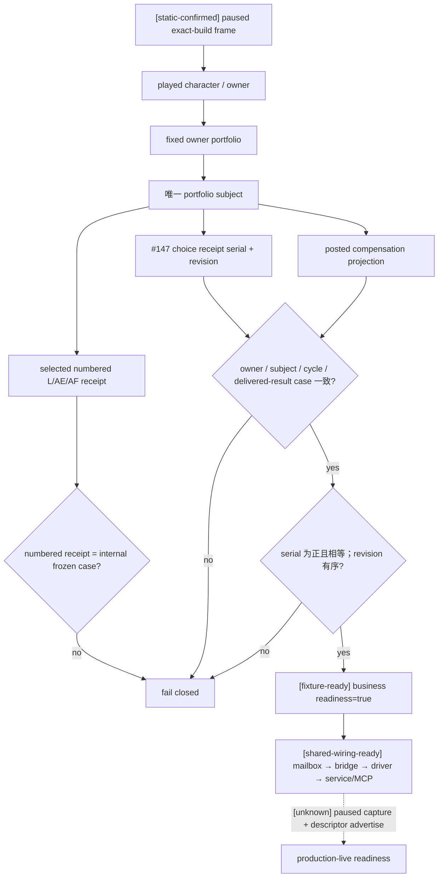

# 天朝二期晋升选择—薪酬入账只读观测口 v1

状态：**static-ready + fixture-ready + shared-wiring-ready；默认不宣告，paused production-live 未验收。**

## 目标与证据边界

`game.command.query-zhongguo-promotion-compensation-postcondition-v1` 是只读业务后置条件查询。它把同一晋升业务的 source、result、frozen case、晋升选择回执和已入账薪酬回执绑定到同一 owner / subject / cycle / case，并验证 revision 与 receipt serial。

- [static-confirmed] exact build 固定为 CK3 `1.19.0.6`，EXE SHA-256 为 `2D00FF3101EF70B566F2FCBAE292F09263199C80E9DC8F139B82D7D96F83DB86`。
- [static-confirmed] 晋升 #147 真实 consumer 写入 `zg361_pp_m147_receipt_serial` 与 `zg361_pp_m147_receipt_revision`；serial 等于 immutable delivered-result case。
- [static-confirmed] 33 个 L/AE/AF compensation consumer 在真实 consumed 路径发布统一的 `zg361_comp_promotion_receipt_*`。只有 #147 已 active/consumed、owner/subject/cycle/case 一致且 serial 相关时才发布。
- [static-confirmed] provider 只从 played owner 的固定 portfolio 解析唯一 subject，只读固定变量 allowlist；调用者不能指定 subject、mechanism 或变量名。
- [static-confirmed] public MCP 只接受 `request_nonce / expected_revision`。内部 wire 的 owner 字段由同帧 played character 派生，并在 mailbox 再次等值校验，不是调用者可选角色入口。
- [static-confirmed] 业务字段缺失、类型不符、非整数 fixed-point 或非法布尔值时，对应字段输出 `status=unavailable / value=null / unavailable_reason=<具体原因>`；identity、revision 或 serial 关系不一致时相应 readiness 为 `false`，不得形成业务 GREEN。
- [static-confirmed] 独占 mailbox 使用 `permitted_executor_trivigintary`（第 23 槽）；共享 bridge 已有 reader、serializer、result frame、handler 和独立 query counter。
- [static-confirmed] Python driver、service 与 MCP 已注册同名能力，响应绑定 `snapshot_id / revision / native_revision / connection_generation`；事件 facade 再绑定 source/result snapshot。
- [static-confirmed] 默认 CK3 adapter descriptor 没有宣告该 capability。因此没有 paused live artifact 时，调用会 fail closed，不会把静态或 fixture 证据冒充 production-live。
- [unknown] 尚无 exact-build paused artifact 证明这些投影在真实游戏帧中的最终类型和值。

本域是 mod 自有业务账本，不存在要照抄的 CK3 原生 AI 选项树；原生决策树为 N/A。本专题仍冻结 exact-build 读取链、证据等级与未闭合 live 分支。

## 只读绑定图

虚线是唯一尚未闭合的实机分支。共享接线完成不改变 live 证据等级。

## 原子性、ACL 与 fail-closed

provider 必须在 application-main paused frame 中执行：

1. 从 played character 读取完整 owner allowlist；
2. 只接受 `zg361_comp_portfolio_subject` 指向的有效非玩家 subject；
3. 读取 subject 的 #147、posted projection 与 L/AE/AF selector；
4. 从固定 33 项 mechanism allowlist 解析 numbered receipt；
5. 重读 owner、subject-base 与 selected receipt；
6. 要求前后 frame、所有 raw rows、身份、serial 和 revision 关系一致。

以下任一情况都会 fail closed：未暂停、revision 漂移、非 application-main、owner 不是 played character、subject 无效、operation 不在 allowlist、numbered receipt 跨 case、业务 identity 漂移、serial 非正或不相等、choice revision 未绑定、posted revision 不晚于 choice revision、二次读取变化、connection generation 变化。

业务结果只来自上述 provider 读取的 #147 choice 与 posted compensation receipt。事件选项提交的 ACK 仅证明请求已被 bridge 接受，不能替代 receipt、identity、serial、revision 或 readiness。

## 产物与验证

- 权威生成器：`mod_zhongguo_style/tools/gen_361_feedback_promotion_pip_runtime.py`、`gen_361_compensation_runtime.py`；生成文件不得手改。
- provider/serializer：`zhongguo_promotion_compensation_postcondition_v1.hpp/.cpp`。
- mailbox：`zhongguo_promotion_compensation_postcondition_v1_mailbox.hpp/.cpp`，第 23 独占 executor 槽。
- Python：`zhongguo_promotion_compensation_postcondition_contract.py`、`native_driver.py`、`service.py`、`mcp_server.py`。
- schema：`schemas/zhongguo-promotion-compensation-postcondition-v1.schema.json`。
- ABI：`native_bridge/research/zhongguo_promotion_compensation_postcondition_v1_abi.json`。
- source contract：`native_bridge/research/fixtures/zhongguo_promotion_compensation_postcondition_v1_source_contract.json`。
- no-launch preflight：`py tools/preflight_zg361_phase2_promotion_compensation_action_cell.py`；它同时核对 reader/serializer、严格 typed schema、mailbox、shared bridge、native driver、service、MCP 与 default-off descriptor，且固定输出 `ck3_started=false / provider_live_result_claimed=false`。
- 测试覆盖：完整 GREEN、字段缺失/类型不符的 typed unavailable、身份/serial/revision 漂移、未知 operation、same-frame 漂移、严格 mailbox 输入、JSON schema、source/result snapshot 与 connection generation facade 绑定、默认不 advertise。

MSVC 静态接线验证包含共享 DLL、provider fixture、mailbox 与主 mailbox source contract；不启动 CK3。只有后续 exact-build paused capture 通过后，才允许把 adapter descriptor 打开并升级为 production-live。

所需 source checkpoint 固定为：同一 connection generation 上 paused、map-ready 的 `zg361pp.147`，played character 同时是 event root 与 owner，保存的 `zg361_pp_prompt_owner / zg361_pp_prompt_subject / zg361_pp_prompt_case / zg361_pp_prompt_cycle / zg361_pp_prompt_mechanism / zg361_pp_prompt_state` 完整，且恰有 3 个选项。随后提交 option 1，等待 `zg361comp.1` paused result event，再以推进后的 native revision 查询一次 provider；只有 provider `readiness.ready=true` 且 option number、owner/subject 与 action request 同源，才可形成 live GREEN。

## Phase2 正式 runner 接入

- [static-confirmed] `promotion_compensation_gameplay_action_and_postcondition_matrix` 已进入正式 Phase2 domain cell registry；promo span 的唯一 gameplay entrypoint 是 `run_promotion_compensation_gameplay_action_cell`，不再使用通用事件 ACK/快照推进器冒充业务验证。
- [static-confirmed] source 固定为真实 `zg361pp.147` 的 option 1，result 固定为 `zg361comp.1`。source 只能来自 `Phase2SourceCheckpointProvider` 已登记的 `real_ck3` checkpoint：必须校验实文件大小、SHA-256、seed lineage、provider/UI receipt，并明确拒绝 fixture、console 和 generic character rebind。
- [static-confirmed] source/result 必须保持同一 connection generation 与 played owner，且 snapshot revision、native revision 均推进；最终业务 GREEN 仍只由本 provider 读取到的 #147 choice receipt 与 posted compensation receipt 给出。action ACK 只证明提交已接受。
- [live-pending] exact-build adapter 仍默认不 advertise capability；正式 preflight 会因此 fail closed。仓库内未写入或合成 checkpoint，必须取得上述真实 paused source/result artifact 后才能升级 production-live。

### Promotion source checkpoint capture 入口（schema 2，live-pending）

- `--phase2-promotion-source-checkpoint-live` 是独立的只读观察 + 原生保存入口；它仅在受管 product-only session 中等待真实
  `zg361pp.147`，验证 option 1 shown/enabled、played/root/saved owner 一致，以及保存的
  owner/subject/case/cycle/mechanism/state 六个 scope。它不选择 option，因此不产生 action ACK。
- 每次成功只输出 `capture_promotion_compensation` 一条真实 entry，冻结 absolute checkpoint path、bytes、SHA-256、`date_raw`、
  owner/subject、seed lineage、PID/connection generation 与 query/save 前后同帧 binding。
- 此产物明确是 canonical registry 的确定性 merge 输入，不是完整 registry：
  `incomplete_for_canonical_4_entry_registry=true`、`canonical_registry_ready=false`。必须再取得 Projects、Incident、Endgame
  三条真实 entry，并由 `zhongguo_phase2_source_checkpoint_registry.py` 按固定顺序组装，禁止复制或伪造后三条。
- no-launch 入口为 `py tools/preflight_zg361_phase2_promotion_source_checkpoint_capture.py`；它只核对代码/合同，固定报告
  `ck3_started=false`。provider descriptor 继续 default-off，单条 source capture 不提升 provider 或完整 action cell 的 live readiness。

## open_kaishek 同步输入

open_kaishek 必须同步以下语义，而不是只放宽 JSON：

1. corpus 新增 #147 `receipt_serial / receipt_revision` 与 `zg361_comp_promotion_receipt_*` 变量族；
2. 两份 receipt serial 必须为正、彼此相等，并等于 portfolio delivered-result case；
3. choice revision 同时匹配 #147 consumer revision 与 posted `choice_revision`，posted revision 必须更新；
4. delivered-result case 是跨产品业务 identity；T 与 L/AE/AF 内部 case-kernel identity 仍独立；
5. 新 MCP 返回必须保持 owner/subject/cycle/case/revision、snapshot 和 connection generation 绑定；
6. capability 尚未 advertise 或 paused live 未通过时，兼容层只能报告 `static-ready/unknown`，不得把 fixture 当作 production。
