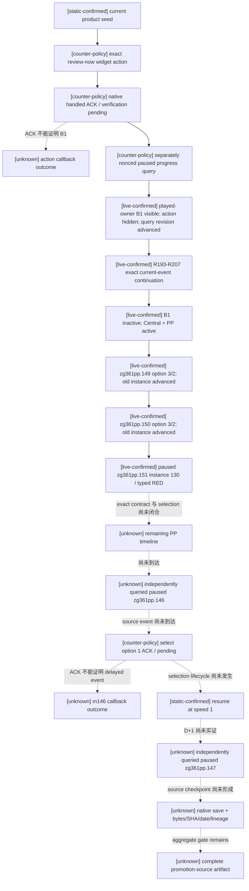

# 天朝二期 Promotion source progress 与 review-now action v1

状态：`typed observation/selection production-live slices / complete promotion-source live pending`。R162 已在修复后的
review-action dispatcher 后独立观察到真实 B1 active；R193–R207 又在同一 product-only CK3 进程中持续读取
B1/Central/PP progress、精确处理 current-event，并以 event-instance 后置条件证明选项生效。正式 capability 仍保持
default-off；这些局部 live 证据不等于 `.147` source checkpoint、薪酬后置或完整迁移树 GREEN，动作 ACK 也从未被当作状态证据。

## Exact build 与施工边界

- CK3：`1.19.0.6`
- `ck3.exe` SHA-256：`2D00FF3101EF70B566F2FCBAE292F09263199C80E9DC8F139B82D7D96F83DB86`
- 产品路径只面向当前 played、non-AI、celestial liege；不接受调用者传入角色、变量名、decision 名或 widget 名。
- 查询与动作 capability 均保持 default-off；descriptor 只登记 fail-closed transport，直到唯一真实实机前置完成。

## 产品入口与观测

`zg361_review_now_decision` 与固定原生 action 共用 `zg361_review_now_business_valid_trigger`。原生 action 仍核对 game rule、celestial、non-AI、150 prestige 和共用业务 trigger，扣除相同 150 prestige，并只写同一个 `zg361_review_now_pending`。既有 `zg361_review_now_bridge_gui` 消费该 flag，并调用既有 `zg361_b1_open_cycle_effect`；没有 fixture、控制台或 generic rebind。

固定 off-screen product surface 只发布五个 allowlisted widget：window、review action、played-owner B1 active、central active、PP active。reader 在 application-main paused mailbox 中完成两次同帧读取，缺失或不一致返回 typed unavailable。

### 2026-09-07：R193–R207 retained product timeline

- R193 从 1,031 文件正式产品投影 fresh launch 出 PID `44264`；R194–R207 都 reconnect 同一 PID，没有 CK3 restart。
  R207 使用 connection generation `19`，默认 speed 5；R193–R207 的产品 runtime blocking diagnostics 均为 `0`。
- 该段不是原版 AI 选项策略：`zg361pp.149/.150/.151` 的产品定义均以 `is_ai = no` 限制为玩家经理事件。
  runner 只在 canonical event key、完整 event instance、同日 paused snapshot、played/root、完整 saved-scope name/type/CharacterID
  与实际 shown/enabled native option 集合全部命中 exact contract 后，才允许确定性选择。选项效用来自本 mod 冻结源码；
  通用 CK3 事件物化与选择 ABI 仍由 [`events-and-interactions.md`](events-and-interactions.md) 约束。
- R205 暂停于 `zg361pp.149` instance `128`；R206 以 authored option `3` / native index `2` 完成它，并暂停于
  `zg361pp.150` instance `129`。R207 又以 `3/2` 完成 `.150`：起止 snapshot `native:933 -> native:934`、
  revision `2 -> 3`，旧 instance 消失，`event_selection.status=event_instance_advanced`；随后独立 query 在
  `date_raw=53186904` 读到 `.151` instance `130`。
- `.151` 当前是 typed RED，而不是产品 RED：窗口 root 为 CharacterID `32904`，53 个 saved scopes 精确物化为
  19 个 `character` 与 34 个 `value`，native indices `0/1/2` 全 shown+enabled；但尚无 exact selection contract，
  所以 runner 没有点击。`effect_preview_ready=false`、`semantic_decision_ready=false` 仍保持。
- R206 / R207 report SHA-256 分别为
  `5DA38B3F05D92722BCCB685D538F4F02D9C5FC0468F162FA4B7F33CFD5BC651D` 与
  `BC1EB388686709C0E9FC9CB2438D77423BCDDA9E6118E5073268EE0C3515C80C`。R207 只证明 `.150` 的 exact lifecycle；
  `.151`、剩余 PP 卡、AF5 修复、`.146 -> .147` 和完整 promotion-source/full-tree 均未据此升级。

### 2026-09-05：D0 witness 与重复开案入口对齐

这是生产源码合同不匹配的最小修复，状态为 `source-confirmed / static-ready`，尚不构成新实机 GREEN：

- 真实 `zg361_review_now_bridge_gui` 消费 pending flag 后调用 `zg361_b1_open_cycle_effect`；后者在 D0 写入
  `zg361_b1_cycle_active`、递增 `zg361_b1_cycle_serial` 并设置 `zg361_b1_cycle_state = 1`。
  原 witness 却必须看见后期才出现的 `zg361_review_in_progress`，因此确定性漏报刚打开的 B1。
- witness 现在接受 `cycle_active OR review_in_progress`，仍保留 non-AI、正 serial 与 state `1..8` 条件。
  旧 late-review 路径未删除；只存在 legacy review flag、没有 manager cycle 字段的存档仍不被认作 B1。
- `zg361_review_now_business_valid_trigger` 增加 `NOT cycle_active`，与业务 opener 既有的 active 排除相同。
  决议合法性及原生 action 的 shown/effect 两处都复用该 trigger；D0 开案后重复入口不再保持可用。
  本补丁不修改 open-cycle、事件时间线、150 prestige 费用或 pending flag 消费方式。
- `zg361_b1_initialize_subject_case_effect` 会给受评者写入同名 `cycle_serial` 和独立的
  `case_state/case_active`，这些不等于 played owner 的 manager `cycle_state/cycle_active`。
  当前 canonical seed 的 provider matrix 明示 owner `32904` / subject `29037`，不能据此把玩家
  `29037` 的 subject 案升级成管理者周期；本补丁也不为 legacy-only seed 补造状态或重新绑定身份。

有限 Python fixture 位于 `tools/test_zg361_promotion_source_b1_witness.py`：直接读取真实生成 opener 的
D0 flag/serial/state 写入片段、真实 bridge、GUI 与 shared trigger；旧 witness 对该投影为 false，修复后为 true。
它只求值本 witness 的有限 Boolean/flag/number 子集，不执行完整开案、原生 GUI、调度或世界状态，
不是 CK3 runtime，也不是 open_kaishek finite-runtime。
fixture 源文件 SHA-256：`9687d77fb158080450024aed2ab0ef589a8eccbb37d6f6e04113a0eec75cd99a`。

本轮先执行 open_kaishek parser，再执行 focused fixture：

- open_kaishek commit：`84a2b18fedad74de37bf5cd0472519ee321f367d`；CLI `0.1.0-cli`，目标 profile
  `ck3-1.19.0.6-zg361`；CK3 exact build/EXE SHA 沿用本文顶部冻结值。`parse` 本身不运行 profile 语义。
- JAR：`Z:/workspace/open_kaishek/kaishek-cli/target/kaishek-cli-0.1.0-SNAPSHOT.jar`，SHA-256
  `bb94cd9142112a62df57b901ca5e008b3a8ec0c05feec6ec3d3a7551df5512c9`。
- corpus ID `promotion-source-b1-witness-d0-20260905`：以下两份真实脚本均 `PARSED`、diagnostics `0`、
  `roundTrip=true`；只能称 parser GREEN。`set_variable/change_variable` 的真实执行、scope 及 native
  widget 可见性不受此 parser 结果证明，仍需 CK3 paused query。

| 输入文件（相对 mod_zhongguo_style） | 字节数 | SHA-256 |
| --- | ---: | --- |
| `common/scripted_guis/zg361_promotion_source_progress_guis.txt` | 2059 | `bb8b1af26e5b58aa827a4aef1ebbde6a4a2e536f227a3375a145fed23f249e8f` |
| `common/scripted_triggers/zg361_triggers.txt` | 5188 | `6412efc348aaee0a60f557c03994dc4dcda65c4974edb29d77f014aa6124af36` |

实际命令（工作目录为本 worktree；两次 parse 后再运行测试）：

```powershell
java -jar Z:/workspace/open_kaishek/kaishek-cli/target/kaishek-cli-0.1.0-SNAPSHOT.jar parse mod_zhongguo_style/common/scripted_guis/zg361_promotion_source_progress_guis.txt
java -jar Z:/workspace/open_kaishek/kaishek-cli/target/kaishek-cli-0.1.0-SNAPSHOT.jar parse mod_zhongguo_style/common/scripted_triggers/zg361_triggers.txt
& Z:/ck3_mod_rewrite/tools/.venv/Scripts/python.exe tools/test_zg361_promotion_source_b1_witness.py -v
```

focused 测试 `4/4 GREEN`：D0 新旧对照、late-review 兼容、idle/legacy-only/subject-only/AI 排除、
active gate 与两个原生动作路径及决议共享入口。R162 后续已用完整新投影证明
`review action -> independently observed manager B1; action hidden`；尚未闭合的是 `.146 -> D+1 .147` 及其保存证据。

## 动作与证据链



ACK 只说明 exact command 已由 native transport 接受：review ACK 不证明 pending flag 被消费或 B1 已打开；`.146` option ACK
也不会证明 route A 已消费、D+1 ticket 已形成或 `.147` 的 frozen scopes/UI 已出现。R162 的 review-action 路径由后续 B1
progress query 证明；R193–R207 的每次事件 GREEN 都由旧完整 instance 消失的独立 postcondition 证明。`.146/.147` 尚未到达，
因此对应分支继续保持虚线 `unknown`。

## Runner choreography

正式 `--phase2-promotion-source-checkpoint-live` 入口现在先运行 `enter_promotion_source_checkpoint_v1`：

1. 绑定同 connection generation 与 played owner；若 B1/central/PP 已在真实产品中运行，直接续跑。
2. 否则执行固定 review action，并以独立 progress query 证明 played-owner B1 active。
3. 当前 event 命中 purpose-split exact contract 时，逐项核对 canonical key、instance/date、root、完整 saved scopes 与实际
   materialized native options；选择后必须观察旧 instance 消失。未知 key、次数越界或任一 shape drift 都 typed RED，不猜选项。
4. 仅在没有 current event 时推进产品时间线；B1/Central/PP 五个固定 widget 的每次 progress query 都绑定同一 paused revision。
   R193–R207 的默认 continuation 使用 speed 5；抵达 `.146` 后的专用 D+1 choreography 才按冻结合同使用 speed 1。
5. 独立查询 `.146` 后选择 option 1；继续到至少 D+1，独立查询 paused `.147`。
6. 交回既有 capture 保存仍未选择的 `.147`，核验六个 saved scopes、option 1 shown/enabled，以及 checkpoint bytes/SHA/date/seed/capture lineage。

## 当前 aggregate live 前置

当前下一 blocker 是为 R207 暂停帧的 `.151` 建立并实机通过 exact contract，然后继续剩余 PP 卡。aggregate live 前置仍是
在 exact build 的 managed、product-only session 中完成一次完整的
`review action -> independently observed B1 -> complete B1/Central/PP -> .146 option1 -> D+1 paused .147 -> native save`。
该 artifact 出现前：正式 query/action capability 不广告，aggregate readiness 仍为 `live-pending`，不声称
promotion/compensation 或完整迁移树 GREEN。AF5 route 3 的产品修复也仍需单独重抵并取得真实 terminal 后置，不能由本次
`.149/.150` GREEN 代替。
