# 天朝二期 Promotion source progress 与 review-now action v1

状态：`static-ready / production-live pending`。本包没有启动 CK3，也不把离线测试或动作 ACK 写成 live。

## Exact build 与施工边界

- CK3：`1.19.0.6`
- `ck3.exe` SHA-256：`2D00FF3101EF70B566F2FCBAE292F09263199C80E9DC8F139B82D7D96F83DB86`
- 产品路径只面向当前 played、non-AI、celestial liege；不接受调用者传入角色、变量名、decision 名或 widget 名。
- 查询与动作 capability 均保持 default-off；descriptor 只登记 fail-closed transport，直到唯一真实实机前置完成。

## 产品入口与观测

`zg361_review_now_decision` 与固定原生 action 共用 `zg361_review_now_business_valid_trigger`。原生 action 仍核对 game rule、celestial、non-AI、150 prestige 和共用业务 trigger，扣除相同 150 prestige，并只写同一个 `zg361_review_now_pending`。既有 `zg361_review_now_bridge_gui` 消费该 flag，并调用既有 `zg361_b1_open_cycle_effect`；没有 fixture、控制台或 generic rebind。

固定 off-screen product surface 只发布五个 allowlisted widget：window、review action、played-owner B1 active、central active、PP active。reader 在 application-main paused mailbox 中完成两次同帧读取，缺失或不一致返回 typed unavailable。

## 动作与证据链

```mermaid
flowchart LR
    S["[static-confirmed] current product seed"] --> A["[counter-policy] exact review-now widget action"]
    A --> K["[counter-policy] native handled ACK / verification pending"]
    K -. "ACK 不能证明 B1" .-> U["[unknown] action callback outcome"]
    K --> Q["[counter-policy] separately nonced paused progress query"]
    Q --> B["[counter-policy] played-owner B1 visible; action hidden; query revision advanced"]
    B --> T["[live-observed] 400-day B1 + separate 150-day post-publication observation bound"]
    T --> E146["[counter-policy] independently queried paused zg361pp.146"]
    E146 --> O1["[counter-policy] select option 1 ACK / pending"]
    O1 -. "ACK 不能证明 delayed event" .-> U2["[unknown] m146 callback outcome"]
    O1 --> D1["[static-confirmed] resume at speed 1"]
    D1 --> E147["[counter-policy] D+1 independently queried paused zg361pp.147"]
    E147 --> SAVE["[counter-policy] native save + bytes/SHA/date/lineage"]
    SAVE -. "only remaining prerequisite" .-> LIVE["[unknown] one managed product-only exact-build live artifact"]
```

两个 ACK 都只说明 exact command 已由 native transport 接受：review ACK 不证明 pending flag 被消费或 B1 已打开；`.146` option ACK 不证明 route A 已消费、D+1 ticket 已形成或 `.147` 的 frozen scopes/UI 已出现。成功分别由后一份不同 nonce、递增 query sequence 的 B1 progress query，以及 D+1 的 current-event query 证明。

## Runner choreography

正式 `--phase2-promotion-source-checkpoint-live` 入口现在先运行 `enter_promotion_source_checkpoint_v1`：

1. 绑定同 connection generation 与 played owner；若 B1/central/PP 已在真实产品中运行，直接续跑。
2. 否则执行固定 review action，并以独立 progress query 证明 played-owner B1 active。
3. 仅在无 event 时以 speed 1 推进，最多 400 天；任何非 `.146/.147` 的可见 event 都 typed RED，不猜选项。这个期限只约束 authored B1 时间线，不能替代对实际产品 call graph / shard 正文同步的验证。
4. 独立查询 `.146` 后选择 option 1；继续到至少 D+1，独立查询 paused `.147`。
5. 交回既有 capture 保存仍未选择的 `.147`，核验六个 saved scopes、option 1 shown/enabled，以及 checkpoint bytes/SHA/date/seed/capture lineage。

## 唯一 live 前置

在 exact build 的 managed、product-only session 中完成一次完整的 `review action -> independently observed B1 -> .146 option1 -> D+1 paused .147 -> native save`。该 artifact 出现前：query/action production capability 不广告，readiness 仍为 `live-pending`，不声称 promotion/compensation 整体 GREEN。
