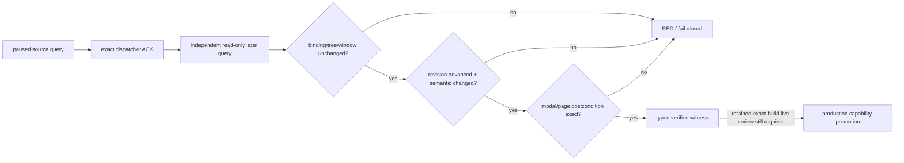

# 天朝二期考核榜 production capability 晋级门 v1

状态：**只读后置验证器 static-ready；production capability 默认关闭；paused live artifact 待补。**

## 为什么 `bridge.cpp` 目前强制返回 `false`

考核榜动作已经能走 exact-build shortcut-manager 语义分发，但其返回值只有
`acknowledged_verification_pending`。这个 ACK 只证明 CK3 接收并处理了事件，不证明考核榜真的打开、关闭或切页。尤其是 native
`handled` 布尔值也可能来自 prehandler 或空 callback group，不能当作 GUI 后置状态。

真正的成功证据必须来自动作之后的另一条只读 `query-zhongguo-scoreboard-state-v1`：它必须保持同一 paused world、玩家、
connection、provider session、GUI tree 与 window instance，同时让 observation sequence 和 observed state revision 前进、semantic
fingerprint 改变，并且 modal 与唯一可见 page 满足动作的明确后置条件。当前仓库只有 exact-build 静态逆向、fixture 和 transport
接线，没有保存过这组真实 paused source → ACK → later-query artifact。因此 `false` 是证据边界，不是忘记接线。

## 本轮最小施工

新增 `zhongguo_scoreboard_production_v1` 独立模块：

- `VerifyZhongguoScoreboardReadOnlyPostconditionV1` 只消费 ACK 与后续只读 state，不执行 GUI action，也不更新 provider tracker；
- 验证 public/native revision、connection、日期、玩家、provider session、tree fingerprint 与 window instance 都未漂移；
- 要求独立 nonce、observation/revision 前进、semantic fingerprint 改变；
- 对 open/switch 验证 modal 打开且只有期望页可见，对 close 验证 modal 关闭且三页全不可见；
- 普通 build 与显式定义 `XAR_CK3_ENABLE_ZHONGGUO_SCOREBOARD_PRODUCTION_V1` 的一次性 live candidate 都保持
  `kZhongguoScoreboardActionV1ProductionCapabilityAdvertised=false`。该宏只打开 verifier/heartbeat 候选诊断，不能修改 hello
  capability list、action result 的生产广告或正式 readiness 文案；晋级必须在 live artifact 审阅后另做源码变更。



机器可读账本在
`ck3_autonomous_player/native_bridge/research/fixtures/zhongguo_scoreboard_production_v1_source_contract.json`。fixture 只能证明 verifier
拒绝 stale revision、provider rebound、同 semantic state、错页和复用 nonce；不能把 capability 升级为 live。

独立 Python collector 在
`ck3_autonomous_player/src/xar_autoplayer/bridge/zhongguo_scoreboard_action_batch.py`。它依次采集
`managed-capable` 与 `received-only` 两种互斥 ACL 表面；每种表面都保存首次 open、三个 switch、close 与再次 open 共六行，其中 close
与再次 open 同时构成 `close-query-open-query` 的两阶段 reopen。`received-only` 的 `switch-managed` 必须精确得到
`managed_acl_denied`，其余十一条动作都必须保存 source、ACK、later query 与 typed proof。即使 action result 仍报告
`production_capability_advertised=false`，单动作 cell 也会先独立调用 verifier 并保存 proof；此时 batch 可以标记
`candidate_batch_complete=true`，但顶层仍必须是 `result=RED`、`promotion_eligible=false` 和
`evidence_stage=transport-batch-unattested`。

生命周期合同现为 schema v3，明确区分两层：

- **单个 surface 内**：六个动作必须保持同一 PID、connection generation、player、date 与 provider session；任一动作中途重启或 rebound 都 RED；
- **两个 surface 之间**：允许且当前只允许一次有凭据的 `canonical-checkpoint-clean-restart`。receipt 必须给出前后不同 PID、连续 generation、
  exact checkpoint SHA-256/bytes/save lineage，以及 `fixture_used=false`、`console_used=false`、
  `generic_character_rebind_used=false`。顶层明确写 `global_single_session_required=false`，绝不把跨 PID 说成同 session。

共享 `tools/run_zhongguo_acceptance.py` 已接入该 collector，并只接受一个窄的真实 surface provider：service 方法
`prepare_zhongguo_scoreboard_surface_v1(surface_id)`。collector 会在 prepare 前后与每条 action 前后读取 native snapshot，再用真实 ACL、
provider session 和 connection 独立复核，不能只信 receipt。当前 service/native driver 尚未提供该方法，因此 runner 会在第一条 action 前保存
`scoreboard_surface_preparation_provider_missing` RED；这属于明确的 capability RED，不是 harness crash，也不允许退回单动作、fixture、
OCR、坐标或通用角色切换。

### 为什么现有 restore 不能直接冒充 provider

`NativeHeadlessGameplayDriver.restore_phase2_span_source_checkpoint_v1` 的真实合同要求 `ending_pid != starting_pid`，并要求
`ending_generation == starting_generation + 1`；底层 `restore-checkpoint` 也明确由 native-session 替换 CK3 进程。因此旧版“两个 surface
共用一个 provider session”的要求与现有受管恢复机制冲突，现已纠正为上面的 per-surface / cross-surface 两级合同。

现有 Phase2 source registry 只覆盖四个事件 span，而且当前 seed contract 仍是
`blocked_seed_generation_required`；它没有两份考核榜产品状态 checkpoint，也没有可核验的 owner/subject surface receipt。因此本轮不能诚实地
给 service/native driver 填一个实现。最小产品状态入口是新增两份 real-CK3 checkpoint：

1. `managed-capable`：played character 等于 `zg361_scoreboard_managed_owner`，且至少一条真实 managed row 已冻结；
2. `received-only`：played character 等于 received-self subject，received/result/B1 tuple 完整联结，且 managed owner/row 均不存在；
3. 每份 checkpoint 都冻结 path、bytes、SHA-256、save lineage、date、player 与产品状态 query receipt；
4. provider 只可调用现有 canonical restore 生命周期并在 restore 后重新 query ACL，不能使用 fixture、OCR、坐标、console 或通用 rebind。

拿到这两份输入后，`prepare_zhongguo_scoreboard_surface_v1` 才有真实可施工数据；此前保持 provider missing RED 是正确边界。

## 仍需的一次串行 live

下一次 CK3 占用应是一条 **单次 runner、两次产品 checkpoint clean restart、每个 surface 内批量 paused、MCP-only** 的候选验收，
而不是为每个按钮分别重启：

1. 依次恢复 managed-capable 与 received-only 两种真实玩家表面，并保存两段明确的 PID/generation lineage；
2. 对 `open`、三个 switch、`close` 分别保存 source query、verification-pending ACK、独立 later query 与 typed verifier result；
3. `reopen` 必须保存 close ACK → closed query → open ACK → open query，不能把一次 toggle ACK 当作 reopen；
4. 同一 artifact 还要保存 hello capability list、exact EXE/bridge hashes 与 managed cleanup receipt；
5. 全批 GREEN 后才把候选开关转成正式默认、更新 state payload 的 `production_live_ready` 与 Python 合同；任一缺项继续 false。

本门只闭合考核榜外层 named-widget action，不声称 focus、scroll、screen rect 或页面内部任意动作可用。

### 精确 preflight / runner 入口

现有受管入口是 `tools/run_zhongguo_acceptance.py`。候选 DLL 接线完成后先执行不启动游戏的同模式 preflight：

```powershell
python tools/run_zhongguo_acceptance.py `
  --preflight `
  --phase2-live-batch `
  --phase2-seed-contract <READY_SEED_CONTRACT_JSON> `
  --bridge-dll <CANDIDATE_XAR_CK3_BRIDGE_DLL> `
  --bridge-injector <MATCHING_INJECTOR_EXE> `
  --bridge-pipe \\.\pipe\xar_ck3_bridge_zg361_<32_HEX> `
  --artifacts-dir <NEW_PREFLIGHT_ARTIFACT_DIR>
```

preflight GREEN 后，用**新的** artifact 目录去掉 `--preflight` 执行同一入口：

```powershell
python tools/run_zhongguo_acceptance.py `
  --phase2-live-batch `
  --phase2-seed-contract <READY_SEED_CONTRACT_JSON> `
  --bridge-dll <SAME_CANDIDATE_XAR_CK3_BRIDGE_DLL> `
  --bridge-injector <SAME_MATCHING_INJECTOR_EXE> `
  --bridge-pipe \\.\pipe\xar_ck3_bridge_zg361_<NEW_32_HEX> `
  --artifacts-dir <NEW_LIVE_ARTIFACT_DIR>
```

当前 `phase2-live-batch` 已接入完整两-surface 批量 collector，不再退回单个自适应 primitive。尚缺的是上述两份 real-CK3 产品状态 checkpoint 与窄 provider；在它们存在前，runner 会在动作前 RED。批量采集器在 action result 仍报告 `production_capability_advertised=false` 时仍会独立调用 `verify_zhongguo_scoreboard_action_v1_postcondition`，保存 typed proof，但让本次整体结果继续保持 RED/`promotion_eligible=false`；候选宏不能为了绕过 runner 的 fail-closed 分支而把广告改成 true。

preflight 至少保存 `runtime_identity.native_bridge_runtime.{mode,pipe_name,dll_path,dll_sha256,injector_path,injector_sha256,visual_fallback}`。live 的
`07c_phase2_scoreboard_named_widget_action_cell.json`（当前 schema v3，不得覆盖失败 attempt）至少保存：

- `result`、`production_capability_advertised`、`verified_pass` 与 `failure_reason`；
- 每个 surface/action 的 `source_query`、`action_request`、`action_result`、`later_query`、`verified_postcondition`；
- source/later 的 public/native revision、connection generation、date、player、provider session、observation sequence、observed state revision、tree/semantic fingerprint、window instance、modal 与三页 visibility；
- hello `bridge_capabilities`、heartbeat 的候选诊断与 action result，证明候选宏已启用 verifier 且两个生产广告面都仍为 false；
- 每个 surface 的固定 PID/session binding、两 surface 间 canonical clean-restart lifecycle、tracked PID/pipe、EXE/DLL/injector SHA-256、
  零 OCR/零坐标声明、cleanup report 与 process-tree empty。

预期批量顶层还应有 `surface_matrix`、`action_matrix`、`all_postconditions_verified` 和 `promotion_eligible`；只有两个 surface、五个原子动作与两阶段 reopen 全部独立验证、且 cleanup GREEN 时，`promotion_eligible=true` 才合法。
