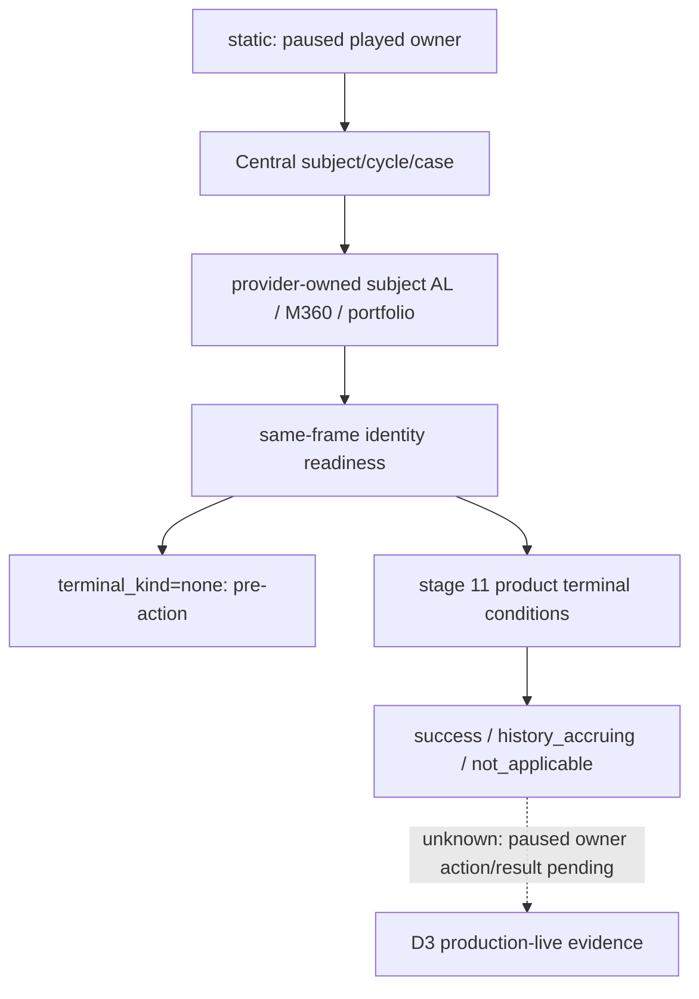

# 天朝二期 Workforce 玩家 owner 视角观测 v1

记录日期：2026-09-11（Asia/Shanghai）。状态：**static-ready；paused production-live 待验收**。

具体阻点来自 Central stage 11 的实际 owner/subject 关系：M360 窗口给玩家 owner，而 AL 与 Workforce portfolio 落在另一个 subject 身上。[既有 collective 查询](zhongguo-workforce-collective-snapshot-v1.md) 固定读取 played subject，无法直接为 owner 窗口提供这一后置状态。本查询从玩家的真实 Central 绑定读取 subject，保留当前玩家身份。

本次只补 D3 owner 视角所需的 AL/M360/portfolio 观测。原有 received-self collective 查询及其完整 cohort/rolling-history 合同不变；本查询没有发布那套完整账本，不能代替三周期及 cohort 守恒专项验收。mod 自有业务的原生 AI 策略树为 N/A，读取和终态判定按以下生产源码冻结。

## 接口与数据

公开 MCP：`ck3_query_zhongguo_workforce_owner_snapshot_v1(request_nonce, expected_revision)`。

Service：`query_zhongguo_workforce_owner_snapshot_v1(request_nonce, *, expected_revision)`。

Capability：`game.command.query-zhongguo-workforce-owner-snapshot-v1`；native step 去掉 `game.command.` 前缀。调用者使用公开 snapshot revision，driver 映射为 native revision，owner 从同帧 played character 取得。

原生 envelope payload key 为 `zhongguo_workforce_owner_snapshot`。公开 facade 在 payload 上增加 `build / source / binding`；native backend 为 `ck3-1.19.0.6-native-zhongguo-workforce-owner-snapshot-v1`，facade 标记为 `native-headless`。查询全程保持同一暂停帧、日期、玩家、revision 和 connection generation。

[Schema](../../ck3_autonomous_player/schemas/zhongguo-workforce-owner-snapshot-v1.schema.json) 同时描述 native 与 facade，SHA-256：`647C5252DFDC64D58F9FCF448DE8816B6B66EF6591485D7B7702ABD51A00A10C`。

`workforce` 内五组字段均采用 typed `{status, value, unavailable_reason}`：

| 分组 | 内容 |
|---|---|
| `central` | subject、Central cycle/case、stage11_status |
| `source` | M360 source status、owner/subject、Central cycle/case、AL cycle/case |
| `al_case` | owner/subject/cycle/case、state、active、revision |
| `m360_receipt` | owner/subject/cycle/case、state、choice |
| `portfolio` | closed、status、cycle、final_conservation_ok、history-accruing/count、success、N/A/reason、owned operations、skipped manager-only、skipped charter |

subject 的权威来源是玩家 `zg361_p2c_subject`。它在 M360 source 尚未形成以及产品合法 N/A 分支中仍可用；source 存在时，再交叉核对 `zg361_p2c_m360_source_*` 与 Central/AL 身份。Central case 与 AL case 是两个编号空间，source 分别记录二者，不直接要求两种 case serial 相等。

[Central finish 源码](../../mod_zhongguo_style/common/scripted_effects/zg361_phase2_central_003_dispatch_control_effects.txt) 保留本周期的 Central subject 与 M360 source，source 在新周期 reset 时才清理；这支持后续从本周期终态存档继续读取。此处为源码结论，真实冷恢复观测仍待验收。

## Exact build 与读取链

冻结 CK3 `1.19.0.6`，EXE SHA-256 为 `2D00FF3101EF70B566F2FCBAE292F09263199C80E9DC8F139B82D7D96F83DB86`。

复用 `BindZhongguoCaseNativeEnvironmentV1 → IsZhongguoVariableAbiExactV1 → ReadZhongguoFixedVariableSetV1`，变量 ABI 的实际 RVA、kind 与 fixed scale 引用[既有 Workforce ABI 的 native_variable_abi](../../ck3_autonomous_player/native_bridge/research/zhongguo_workforce_collective_snapshot_v1_abi.json)。只复用底层 ABI，不沿用旧查询的 played-subject 选择条件。

[新 header](../../ck3_autonomous_player/native_bridge/include/xar_bridge/zhongguo_workforce_owner_snapshot_v1.hpp) 固定 11 个 owner 与 25 个 subject 变量；[native reader/serializer](../../ck3_autonomous_player/native_bridge/src/zhongguo_workforce_owner_snapshot_v1.cpp) 在 application-main 暂停帧中重读 owner/subject 行并核对同帧。Mailbox 槽为 `permitted_executor_untrigintary`，私有候选 capability 使用现有 `XAR_CK3_ENABLE_ZHONGGUO_CAREER_HC_WORKFORCE_CANDIDATE_V1` 开关。

## 可观测性与终态

readiness 字段为 `player_owner_binding_ready / portfolio_subject_binding_ready / case_identity_ready / same_frame_ready / ready`。`ready` 表示身份和读取成立。它不要求 M360 已执行，也不把尚未出现的 terminal 字段当成业务失败。

`terminal` 与 `terminal_kind` 分别报告当前 portfolio 是否满足生产关闭条件、属于哪种关闭。权威分支位于 [Central stage 11](../../mod_zhongguo_style/common/scripted_effects/zg361_phase2_central_009_stage11_workforce_endgame_effects.txt)：

| terminal_kind | 生产状态 |
|---|---|
| `none` | 可观察，但没有满足以下关闭条件 |
| `success` | portfolio closed、status=6、cycle 匹配 Central、final_conservation_ok=true |
| `history_accruing` | status=8；AL inactive/state=8；已关闭、守恒、积累标记成立，history count 为 1–3，owned operations=39、skipped charter=1、terminal_success=false |
| `not_applicable` | status=7；AL inactive；已关闭、守恒、N/A 标记成立，reason 为 360361/360362，owned operations=38、skipped manager-only=2、terminal_success=false |

后三类还要求相同 cycle 与读取 readiness 成立。`terminal_kind=not_applicable` 来自明确产品变量，绝不能从 unavailable 推导；`history_accruing` 也不代表完整三周期或 M361 成功。

`central.stage11_status` 独立发布：portfolio 完成与 Central 已处理回调是两次状态变化。行动 cell 应核对操作前后 AL/M360 身份和真实状态，再判断所需阶段条件；命令 ACK 不证明这些业务事实。



## 实际验证与待办

[合成 fixture](../../ck3_autonomous_player/tests/fixtures/zhongguo_workforce_owner_snapshot_v1.json) 标记 `synthetic_contract_fixture_not_live`。四帧分别是操作前、成功关闭、历史积累关闭、无 M360 source 的明确 N/A。每帧 played owner=147、subject=361，直接覆盖此次两个角色不同的调用条件。

2026-09-11 在仓库根实际执行：

```powershell
py -m unittest discover -s ck3_autonomous_player/tests/unit -p test_zhongguo_workforce_owner_snapshot_v1_bridge.py -q
# Ran 6 tests; OK

py -m unittest discover -s ck3_autonomous_player/tests/unit -p test_gameplay_bridge.py -k test_official_mcp_client_lists_and_calls_ck3_tools -q
# Ran 1 test; OK

git diff --check
# exit 0
```

聚焦测试经过正式 Python transport/driver/service 和 MCP client 路径，验证 owner 与 subject 不同、四种返回状态、同帧条件、native capability 来源及 schema；endpoint 是合成替身，未启动 CK3。

同日已对 native 测试可执行文件产生的 [history-terminal JSON](Z:/ck3_mod_rewrite/_runtime/d3-workforce-owner-bld1-20260911/workforce-owner-native-fixture.json) 完成一次 Python normalizer 与 schema 验证。通过 `py -` 执行，文件按 `utf-8-sig` 解码，关键调用为：

```python
normalized=normalize_native_zhongguo_workforce_owner_snapshot_v1(frame,expected_query=ZhongguoWorkforceOwnerSnapshotQueryV1(frame['player_character_id'],frame['request_nonce']),expected_snapshot_revision=frame['snapshot_revision'],expected_date_raw=frame['date_raw'],expected_player_character_id=frame['player_character_id'])
Draft202012Validator(json.loads(Path('ck3_autonomous_player/schemas/zhongguo-workforce-owner-snapshot-v1.schema.json').read_text())).validate(normalized)
```

结果 exit 0、GREEN：nonce=`workforce-owner-fixture`，revision=41，player=200、subject=100，Central case=14、AL case=214，stage11_status=2，portfolio status=8，ready=true、terminal=true、terminal_kind=`history_accruing`。这是实际 C++ serializer 与 Python 的合成帧互通，未运行 CK3。

待完成：在真实 owner 会话取得暂停前态、执行实际 M360 选项、读取独立后态。当前没有新增 live artifact，不升级为 fixture-live、production-live primitive、production-live loop 或 D3 正式签收。
