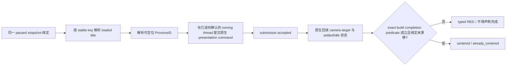

# CK3 原生头衔地图定位 MCP 能力合同

> **状态：仅需求合同，尚未实现。** 本文不代表 `ck3_autonomous_player`、native bridge、MCP server 或任何实机夹具已经具备该能力；当前 readiness 为 `research`。实现、ABI 逆向与正式实机验收留待后续独立任务。

## 1. 需求来源与边界

`mod_zhongguo_style` 的批量实机验收需要在切换到史实宋帝赵曙后，把继承自 1066 书签的印度镜头定位到汴州。现有验收器只能使用快捷键、OCR 和模拟鼠标：即使 CK3 输入线程已经精确签为 US English HKL `0x04090409`，`V` 仍可能没有打开“查找头衔”；原生“更多”菜单虽然能 OCR 到正确行，瞬态 flyout 的 `_mouse_hierarchy_leave` 也可能让点击落空。

这暴露的不是 361 玩法缺陷，而是 MCP 夹具层缺少一个语义动作：**按运行时稳定的 landed-title key 解析头衔，并把地图镜头定位到该头衔的地图锚点。** 正式对接不得再依赖中文名称、GUI 动画、前台输入法或屏幕坐标。

首个消费者：`mod_zhongguo_style` 宣传素材片场准备。首个正向样本为 `c_bianzhou`，其地图锚点为 `b_kaifeng` / ProvinceID `9822`；第二正向样本为 `b_kaifeng`。

本能力只改变地图 presentation state，不得：

- 修改头衔、持有人、首都、玩家角色、日期或任何存档玩法状态；
- 打开“查找头衔”、人物页、holding view 或其他可见窗口；
- 被 `choose_one_life_turn`、`auto_turn` 或其他通用 planner 自动选择，或被描述成自动玩家的玩法决策能力；
- 在发布版 Mod 中增加测试决议、测试按钮或夹具文本；
- 使用 OCR、本地化名、截图像素差、键盘、鼠标或剪贴板完成正式路径。

该 tool 只允许显式调用。后续实现可以按现有 driver dispatch 约束决定是否还需把固定 semantic step 放进执行白名单；但 planner 必须排除它。是否只在 acceptance fixture session 广告也留给实现任务按实际架构决定，本合同不提前增设第二套 capability registry。

## 2. Exact-build 账本

本合同只绑定当前 Windows x64 exact build：

| 对象 | SHA-256 | 已知事实 |
|---|---|---|
| `Crusader Kings III/binaries/ck3.exe` | `2D00FF3101EF70B566F2FCBAE292F09263199C80E9DC8F139B82D7D96F83DB86` | CK3 `1.19.0.6`；未来实现的地址、布局和调用链不得跨 SHA 沿用 |
| `game/gui/window_find_title.gui` | `82A9C3420E5CAB19BC8F7860AA718A4FBD20724132ECBEBCE91E9BBE6BD0E46A` | finder 列表来自 `FindTitleView.GetTitles`；右键调用 `DefaultOnCoatOfArmsRightClick(Title.GetID)` |
| `game/gui/hud.gui` | `1AE3F1371E0A9C43D0B62FC1C1F3A0CDBB0EAB9CF08B85545556CBF3D7386312` | 菜单与全局快捷键均 `ToggleGameView('find_title')`；菜单离开层级后清除展开状态 |
| `game/gui/shortcuts.shortcuts` | `A70755FCE82E7541108CEF926C09860643070FAC15B0EECFA7C6ED7BCFEDC25D` | `find_title_shortcut = "V"` |
| `game/common/landed_titles/02_china.txt` | `342F67E4D3E27A66B05A7257493A28C32AD8C0F9D9B314C0E18BDD8261165811` | `c_bianzhou -> b_kaifeng -> province 9822` |

现有 `campaign-root-context-v1` 已经能发布当前角色的主头衔 TitleID/tier 和首都 ProvinceID，但没有“任意 stable title key → loaded runtime title → 地图锚点”的解析能力，也没有可读的 native camera target/postcondition。因此不得把该既有 query 写成已经满足本合同。

可复用的静态 ABI 候选包括 `CK3GameData+0x2FC8` 的 embedded `CLandedTitleManager`、manager storage `+0x20`、`CLandedTitle+0x10` 的 full-generation TitleID、`CLandedTitle+0x160` 的 template、template `+0x5C` 的 tier，以及 barony template `+0x80` 的 ProvinceID。它们只是后续逆向入口；template stable-key offset、loaded key → runtime `CLandedTitle` registry、`DefaultOnCoatOfArmsRightClick` 的 backing RVA/owning thread，以及可读 camera postcondition 均仍是 `[unknown / required]`。这些缺口闭合前，证据等级只能是 `research/static candidate`。

原版脚本 `pan_camera_to_province` 可以提供独立控制样本或预期 anchor 来源；它本身会移动镜头，不得在同一次动作验收中充当结果 oracle。它不证明 MCP/native 实现路径已经闭合，也不能替代 camera target 的原生回读。

## 3. 最小公开合同

### 3.1 Capability

受管夹具后端仅在完整实现并通过相应门禁后广告：

```text
game.command.center-map-on-landed-title-v1
```

只定义一个首版 MCP tool：

```text
ck3_center_map_on_landed_title_v1(
    title_key: str,
    expected_revision: int
) -> object
```

首版不要求另设公开“查找头衔”查询。动作返回自身的 typed 解析结果，足够诊断“没有找到”“找到但不可定位”和“已定位”。以后若其他 OODA 真的需要任意头衔只读观测，再单独提出 `ck3_query_landed_title_by_key_v1`，不得为了本片场需求提前扩张 schema。

native semantic step 固定为 `center-map-on-landed-title-v1`，`title_key` 必须通过 typed IPC request field 传递；不得把 key 拼进 step 字符串，也不得允许 generic `ck3_execute_step` 用自造字符串绕过 typed MCP facade。`center` 专指地图居中，避免与 HWND/键盘 focus 混淆。

### 3.2 输入

- `title_key`：UTF-8、非空、最长 1024 bytes 的 canonical landed-title stable key，复用现有 stable-key 合同上限；按 loaded runtime registry 精确匹配，例如 `c_bianzhou`、`b_kaifeng`。不得接受本地化显示名“汴州/开封”，不得扫描安装目录文本来伪造运行时成功。
- `expected_revision`：当前 backend-neutral paused snapshot 的非负 revision。调用前必须已经满足 exact-build、连接 generation、episode、map-ready 与 paused admission。
- title key 解析、地图锚点解析、动作提交和后置回读必须绑定同一 `snapshot_id`、`native_revision`、`date_raw`、`episode_run_id` 与 `connection_generation`。中途任一绑定变化即失败，不允许对新状态重放旧意图。

### 3.3 成功结果

```json
{
  "schema_version": 1,
  "step": "center-map-on-landed-title-v1",
  "accepted": true,
  "status": "centered",
  "title": {
    "key": "c_bianzhou",
    "title_id": 12345678,
    "tier_raw": 2,
    "tier_key": "county",
    "center_anchor_kind": "title_province",
    "center_province_id": 9822
  },
  "binding": {
    "snapshot_id": "...",
    "revision": 42,
    "native_revision": 42,
    "date_raw": 389000,
    "episode_run_id": "...",
    "connection_generation": 3
  },
  "native_action_ack": {
    "sequence": 7,
    "status": "dispatched"
  },
  "camera_center": {
    "status": "centered",
    "postcondition_verified": true,
    "before_target_province_id": null,
    "after_target_province_id": 9822,
    "completion_predicate": "exact-build-native-camera-settled-v1"
  },
  "source": {
    "game_version": "1.19.0.6",
    "executable_sha256": "2D00FF3101EF70B566F2FCBAE292F09263199C80E9DC8F139B82D7D96F83DB86",
    "backend_id": "..."
  }
}
```

示例中的 `title_id`、`tier_raw`、revision 和 sequence 只是正数形状，**不是汴州的已冻结真实值**；`before_target_province_id=null` 只表示该示例没有可报告的调用前锚点，不代表合法 ProvinceID 为零。正式 fixture 必须从 loaded runtime 读取并保留 full-generation TitleID，不能把占位值提交为 golden。

`status` 只有两种成功终态：

- `centered`：动作后 camera target 与经 exact-build 证明的 settled/idle completion predicate 均确认居中于 `center_province_id`；
- `already_centered`：调用前即已由同一后置条件确认位于该锚点，`native_action_ack.status=not_needed`，零额外 camera mutation，仍须 `postcondition_verified=true`。

## 4. ACK 与线程语义



- named-pipe 写入、mailbox 入队、`command_result.ok=true`、已发送快捷键、finder 打开、菜单消失或地图像素变化都不是完成 ACK。
- camera 是 presentation state，可能不提升 semantic snapshot revision；不得用 `wait_for_change` 或 revision 增长代替后置验证。
- 后续实现必须先逆向 `DefaultOnCoatOfArmsRightClick(Title.GetID)` 最终使用的 native camera path，并确认实际 owning thread。当前合同不预设它一定是 application-main。
- 完成 ACK 必须回读 native camera target/anchor，并同时满足后续逆向证明足以表示动画结束的 settled/idle 或等价 completion predicate；仅连续看到相同 target 不能预先假定动画已完成。同时复核 paused、日期、episode、玩家角色与 snapshot binding 未变化。
- finder/window/selection 必须保持原状。调用结束时不得残留 finder、holding view、tooltip、焦点选择或测试 UI。

## 5. 错误合同

Python/MCP facade 沿用现有错误分层：

- 参数类型、空 key、非法 UTF-8 或长度超限：`ValueError`；
- capability 未广告：`UnsupportedStepError`；
- stale revision、连接/episode 漂移、timeout、malformed envelope：`BridgeUnavailableError`；
- native typed rejection 至少区分：`unsupported_build`、`requires_owning_thread`、`requires_paused`、`map_not_ready`、`title_key_not_found`、`title_generation_mismatch`、`title_not_centerable`、`camera_state_unavailable`、`state_changed`、`submission_failed`、`internal_error`。

`title_key_not_found` 和 `title_not_centerable` 是合法 typed RED。不得返回 `status=available` 再用 `title_id=0/null` 表示没有找到；也不得静默回退到本地化文本搜索、当前玩家首都或任意同名头衔。

## 6. 后续实现验收合同

本节只规定将来何时可以把状态从 `research` 升级；本轮不执行。

### L0 / static-ready

- 冻结 exact-build stable-key registry、title lifetime、地图锚点与 native camera readback/call chain；
- contract/parser/service/MCP SDK client 测试覆盖正向、already-centered、未知 key、不可定位 key、stale revision 与 malformed result；
- 固定 step 不被普通 planner/auto-turn 自动选择，release Mod manifest 不含任何配套测试 UI；
- schema fixture 只能称 `static-ready`，不能称 `fixture-live` 或 `production-live`。

### 受管实机 / fixture-live

在 fresh managed PID、正确 EXE/DLL/injector hash、paused + map-ready 的同一 CK3 session 中：

1. 从两个明显不同的起始镜头分别调用 `c_bianzhou` 与 `b_kaifeng`；
2. 验证 stable key、full TitleID、tier、`center_province_id` 和 native camera postcondition；
3. 对同一 key 重复调用并得到经过回读的 `already_centered`；
4. 对不存在 key 与不可定位 title 得到 typed RED，且 camera 零变化；
5. 核对日期、episode、玩家、paused、selection 与玩法存档状态不变，finder/holding view 不出现；
6. 正式 MCP SDK client 核心路径的 OCR、截图、窗口激活、键鼠和剪贴板调用计数均为零；
7. pipe/CK3 仍存活，managed cleanup GREEN；保存 PID、build/hash、request sequence、完整 binding、解析 payload、前后 camera readback、负例与 cleanup artifact。

通过以上矩阵后，本能力最多标记 `fixture-live`。除非另有真实玩法消费者与独立 production 证据，不得升级为 `production-live primitive`，更不得写成完整 OODA。

## 7. 本轮 OCR 临时例外

项目所有者于 2026-08-29 明确授权本轮宣传片验收继续使用 OCR。临时路径可以 OCR “更多 / 查找头衔 / 汴州”，并通过画面后置状态判定成败，但必须：

- 在 artifact 与报告中标成 `OCR compatibility path`；
- 失败素材、点击前 hover ACK、点击后 finder ACK 和地图变化门全部保留；
- 不把本轮成功写成 MCP capability 已实现；
- 不删除本合同，后续正式对接仍以本合同的 stable-key + native camera readback 为准。

当前 live 证据 `zga_camera_english_20260829_2144_e2181eb` 只证明：CK3 目标线程三次精确保持 HKL `0x04090409`；`V` 没有出现 IME 候选层也没有 finder；两次 OCR 分别在 `(1820,1176)`、`(1819,1164)` 找到“查找头衔”，点击后菜单消失但 finder 未出现。该 run 是 harness/camera RED，FFmpeg 未启动，不能升级本合同状态。
