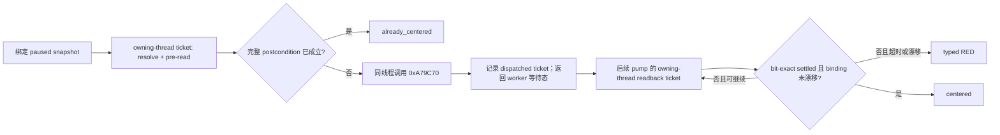

# CK3 原生头衔地图定位 MCP 能力合同

> **状态（2026-08-30）：本能力已在冻结 CK3 `1.19.0.6`、同一受管 PID 的最终 ZhongGuo
> 合批实机中达到 `fixture-live`。** `c_bianzhou`、`b_kaifeng`、重复
> `already_centered`、不存在 key 的 typed RED、同一 session binding、相机 bit-exact settled
> readback 与零 OCR/键鼠 fallback 均为 GREEN；详见第 6 节。本文中的 RVA、布局与完成谓词
> 仍只绑定冻结 EXE。该结论只证明显式片场/验收 primitive，不把它升级为通用 gameplay OODA
> 或跨版本能力；transport ACK 本身仍不是镜头完成。

## 1. 需求、边界与当前优先级

`mod_zhongguo_style` 的批量实机验收和宣传素材准备，需要在切换到史实宋帝赵曙后，按
canonical landed-title key 把地图镜头定位到 `c_bianzhou` 或 `b_kaifeng`。此前的快捷键、
OCR 和模拟鼠标路径受 GUI 瞬态层级、焦点与窗口状态影响，不能提供稳定的语义动作。

正式能力固定为：**从当前 loaded runtime registry 精确解析 stable title key，并按原版头衔
右键/脚本命令使用的 title bounds center 移动镜头，随后从 native camera 原始状态证明镜头
已经 settled。** 当前施工与验收优先使用 MCP 路径；OCR 只保留为历史兼容证据，本轮不再调用。

本能力只改变地图 presentation state，不得：

- 修改头衔、持有人、首都、玩家角色、日期或任何存档玩法状态；
- 打开“查找头衔”、人物页、holding view 或其他可见窗口；
- 被 `choose_one_life_turn`、`auto_turn` 或通用 planner 自动选择；
- 在发布版 Mod 中增加测试决议、测试按钮或夹具文本；
- 使用 OCR、本地化名称、截图像素差、键盘、鼠标或剪贴板完成正式路径。

该 tool 只能被显式调用。固定 semantic step 必须从普通 `ck3_execute_step`、planner 的
`action_steps` 与 auto-turn 候选中排除。

### 1.1 与“查找角色”的边界

本合同只覆盖 landed-title stable key 到地图镜头，不定义或暗含通用角色搜索。当前 ZhongGuo
片场的赵曙 `han_8052` 与陈贯 `han_6071` 由冻结原版 history provenance、fixture allowlist 和
实机角色/头衔 marker 共同证明，并不依赖“查找角色”窗口或一个尚不存在的 MCP 搜索 tool。
通用 character discovery 仍是自动玩家路线图中的独立后续能力；它不是 0.3.0 发布或本次宣传
录制的 blocker，本轮也不据此扩写 MCP 实现。

## 2. Exact-build 与原生逆向账本

### 2.1 冻结构建

| 对象 | SHA-256 | 结论 |
|---|---|---|
| `Crusader Kings III/binaries/ck3.exe` | `2D00FF3101EF70B566F2FCBAE292F09263199C80E9DC8F139B82D7D96F83DB86` | Windows x64，CK3 `1.19.0.6`；下列 RVA、布局和调用链不得跨 SHA 沿用 |
| `game/gui/window_find_title.gui` | `82A9C3420E5CAB19BC8F7860AA718A4FBD20724132ECBEBCE91E9BBE6BD0E46A` | finder 右键使用 `DefaultOnCoatOfArmsRightClick(Title.GetID)` |
| `game/gui/hud.gui` | `1AE3F1371E0A9C43D0B62FC1C1F3A0CDBB0EAB9CF08B85545556CBF3D7386312` | 仅作为旧 GUI 路径对照，不参与 MCP 成功判定 |
| `game/common/landed_titles/02_china.txt` | `342F67E4D3E27A66B05A7257493A28C32AD8C0F9D9B314C0E18BDD8261165811` | `c_bianzhou` 包含 barony/province 9822–9825；9822 只可作为首府来源信息 |

### 2.2 stable key → loaded title

已闭合的 exact-build 路径：

```text
*(base + 0x570E068)
  -> game state +0xA0
  -> CK3GameData +0x2FC8 (embedded CLandedTitleManager)

stable-key resolver: base + 0xA0DC00
key helper:          base + 0x271EC80

full-generation storage root: *(base + 0x570C410)
  slots +0x20 / capacity +0x2C / stride 0x10 / object +0x08
  object +0x10 must equal the complete TitleID
canonical fallback: *(base + 0x570C3F8)
  pointer-equal fallback must be rejected

CLandedTitle +0x160 -> title template
template +0x18     -> MSVC string containing canonical stable key
template +0x5C     -> tier
```

冻结函数切片 SHA-256：

- resolver `0xA0DC00`：`D8869ECDB90DC276881870550661C7FA6B7D1505F4F72F5CA871607344FCEB3`
- key helper `0x271EC80`：`55699C6C481534AE7FEFEE287F88B0F774C7D956083E558714C7437E00863F7F`

解析必须完成 full-generation storage round-trip、fallback 排除和 stable-key round-trip；只按
TitleID 低位 slot、只读文本数据文件，或把当前玩家首府当作目标都不合格。

`capital_province_id` 是 optional positive int32 provenance：有可靠 runtime 回读时返回，否则为
`null`。它不参与相机期望位置或完成判定。特别是 `c_bianzhou` 的原版定位语义必须来自 title
bounds resolver，不能把首府 ProvinceID 9822 直接代入相机；该 resolver 的最终 bounds/center
在某个 loaded runtime 中可以与 `b_kaifeng` 数值相同，但这不把两者变成同一 title，也不改变
各自独立解析 stable key、tier 与 full-generation TitleID 的要求。

### 2.3 原版头衔定位调用链

GUI 注册的 `DefaultOnCoatOfArmsRightClick` 路径已经静态闭合：

```text
0x40AC8B8 -> 0xA239C0 -> 0xA04B80
           -> 0xA79C70(handler, landed_title, true)
              -> 0x20B7DD0(landed_title, bounds[4])
              -> 0xA79B10(handler, derived_target)
```

脚本 executor `pan_camera_to_title`（`0x995580`）独立汇入同一个 `0xA79C70`，因此本能力复用的是
原版 title 语义，不是对 finder GUI 的模拟。

`0x20B7DD0` 递归汇总头衔全部后代，返回
`[min_x,min_z,max_x,max_z]` 四个 signed int32 map-grid bounds；冻结切片 SHA-256 为
`CA27A474114A62E7A19036E7043E2E20377F352F6EDA511A3D1C1353EDFC8D0A`。

相机 handler 的 exact-build 根链为：

```text
owner = *(base + 0x570F7B8)
idler_base = *(owner + 0x10)
MSVC dynamic_cast at 0x3E631F4:
  source TD base+0x501EF28 -> target TD base+0x501EF50
cast_result +0x88 -> handler
handler +0x628 -> camera
```

runtime camera 必须通过 concrete `CGameCamera` primary vptr `base+0x40AF460`；不得拿
base-class ctor vptr `base+0x40AF428` 充当实例门。其 COL 为 `base+0x45F3F50`，type descriptor
为 `base+0x5190FA8`，vtable slot 2 为 `base+0x3470560`。

### 2.4 camera 布局与 settled 证明

exact-build camera 原始字段：

```text
current_state[6] : camera +0x710 .. +0x727，六个 f32
target_state[6]  : camera +0x728 .. +0x73F，六个 f32
zoom_index       : camera +0x744
target write gate: camera +0x777（非零表示写入被阻止）
zoom table       : pointer camera +0x7B0 / count camera +0x7BC
```

更新/插值证据的冻结函数切片 SHA-256：

- update `0x3470560`：`872AEC45CFDEB47D2E73A1FCAA35023737DFC9098A1CA538557B4FEC62570821`
- transition `0x3473630`：`CE8E2A3F7D85270A7531E73CBD3A082B4C9905A7CE559D1FE938C14E0BDAB50B`
- blend `0x3475320`：`9A63742D0BDA9684320B1745F5EC397984536D9323DA84DA2C69498F65A685C9`
- near predicate `0x3475560`：`07876AAE28DBE3FA8AF6209E57BE3B0EAF388A0F3D07E30BA32497450F4ABAF3`

near predicate 先要求前三分量距离平方 `< 0.005`，第四分量绝对差 `<= 0.005`，第五、六分量
绝对差各 `<= 0.00005`；成立后引擎会把 target 的 24 bytes 原样复制到 current。公开合同不把
“接近”冒充完成，而是在复制后要求 `current_state` 与 `target_state` 六个 f32 **逐位完全一致**。
`0x3470FC0` 只刷新 transition，不是 completion signal。

`0xA79C70`/`0xA79B10` 对 bounds center 的运算必须逐步复现：

1. `min + max` 按 uint32 wrap，再重解释为 signed int32；
2. signed sum 以 toward-zero 语义除以 2；
3. X 再按 int32 wrap 减去 `map_x_adjustment`；
4. X/Y/Z 转成 f32，Y 必须为 `+0.0f`。

普通 Python 无限精度平均、浮点平均或首府坐标都不是 oracle。

## 3. 最小公开合同

### 3.1 Capability 与 tool

native 只有在 resolver、dispatch、readback、settled gate、serialization 和 production adapter
全部可用时才可广告：

```text
game.command.center-map-on-landed-title-v1
```

MCP 只公开一个参数化工具：

```text
ck3_center_map_on_landed_title_v1(
    title_key: str,
    expected_revision: int
) -> object
```

固定 semantic step 为 `center-map-on-landed-title-v1`。`title_key` 必须是独立的 typed IPC
field，不得拼进 step 字符串。Python/MCP facade、service、named-pipe client 与 native
production wire 已达到 `static-ready`；只有 exact adapter 才广告 capability。能力未广告时必须
返回 `UnsupportedStepError: capability_not_available`，不能降级到 data Mod、OCR 或视觉
fallback。

### 3.2 输入与绑定

- `title_key`：UTF-8、非空、最长 1024 bytes 的 canonical key；只接受 `e_`、`k_`、`d_`、
  `c_`、`b_` 前缀的小写 ASCII key，例如 `c_bianzhou`、`b_kaifeng`。
- `expected_revision`：当前 backend-neutral paused snapshot 的 non-negative uint64 revision。
- resolver、dispatch 和所有后续 readback 必须绑定同一 `snapshot_id`、public revision、
  `native_revision`、`date_raw`、`episode_run_id`、`connection_generation`、玩家和 paused/map-ready
  状态。任一漂移立即 typed RED，不得在新状态重放旧意图。

### 3.3 成功结果

```json
{
  "schema_version": 1,
  "step": "center-map-on-landed-title-v1",
  "accepted": true,
  "status": "centered",
  "title": {
    "key": "c_bianzhou",
    "title_id": 16777218,
    "tier_raw": 2,
    "tier_key": "county",
    "anchor_kind": "title_bounds_center",
    "capital_province_id": 9822,
    "bounds_extent": [1600, -1000, 1674, -895],
    "map_x_adjustment": 5
  },
  "binding": {
    "snapshot_id": "...",
    "revision": 42,
    "native_revision": 17,
    "date_raw": 53182008,
    "episode_run_id": "...",
    "connection_generation": 3
  },
  "native_action_ack": {
    "sequence": 9,
    "status": "dispatched"
  },
  "camera_center": {
    "status": "centered",
    "postcondition_verified": true,
    "expected_position_xyz": [1632.0, 0.0, -947.0],
    "current_state": [1632.0, 0.0, -947.0, 0.75, 0.0, 1.0],
    "target_state": [1632.0, 0.0, -947.0, 0.75, 0.0, 1.0],
    "zoom_index": 3,
    "expected_zoom_value": 0.75,
    "settled": true,
    "target_write_blocked": false,
    "completion_predicate": "exact-build-native-camera-settled-v1"
  },
  "source": {
    "game_version": "1.19.0.6",
    "executable_sha256": "2D00FF3101EF70B566F2FCBAE292F09263199C80E9DC8F139B82D7D96F83DB86",
    "backend_id": "ck3-1.19.0.6-native-title-map-navigation-v1"
  }
}
```

上例全部数值只是 `static-ready` schema shape，不是汴州实机 golden。

`status` 只有两个成功终态：

- `centered`：`native_action_ack.status=dispatched` 且 `sequence` 为 positive uint64；经过至少一个
  后续 owning-thread pump 的独立回读，完整 postcondition 成立。
- `already_centered`：提交前同一完整 postcondition 已成立；ACK 为 `not_needed`、sequence 为
  `null`，不产生额外 camera mutation。

两者都必须同时满足：

- `anchor_kind == title_bounds_center`，bounds 未倒置；
- `expected_position_xyz` 与 bounds/adjustment 的 exact-build int32 算术结果逐 f32 bit 一致；
- 12 个 current/target float 全部 finite，两个六维向量逐 f32 bit 一致；
- target 的前三分量与 expected XYZ 逐 f32 bit 一致；
- `zoom_index` 在 runtime zoom table 范围内；从该表独立回读的 `expected_zoom_value` 与
  current/target 第四分量逐 f32 bit 一致；
- `target_write_blocked == false`、`settled == true`、
  `postcondition_verified == true`；
- completion predicate 精确为 `exact-build-native-camera-settled-v1`；
- exact-build source 与整套 session binding 未漂移。

`camera_param_4`、`camera_param_5` 只作为第五、第六个 opaque f32 返回；现有证据不支持把它们
命名为 rotation、pitch 或其他高层概念。

## 4. 线程、mailbox 与 ACK 语义



- 静态调用链本身没有携带可独立验证的 thread assertion。production 实现复用现有、已经过
  实机证明的 application-main mailbox，并须在本能力的 live fixture 中再次核对实际线程。
  named-pipe worker 不得解析 title、访问 title registry/camera borrowed object 或调用 presentation
  function；resolver、handler/camera 获取、`0xA79C70` dispatch 与每次原始 camera 回读都只能在
  第十三个 owning-thread executor 中执行。worker 仍沿用既有 `ReadSnapshot` 做 admission 和后置
  binding 复核，故不得扩大声称为“worker 完全不读取任何 CK3 对象”。
- `0xA79C70` 只写 target；current 由后续地图 update 插值。因此 dispatch ticket 与 settled
  readback ticket 必须跨至少两个 mailbox pump，不能在同一个 owning-thread callback 中阻塞
  等待，也不能在 dispatch 返回后立即宣称成功。
- worker/service 可以在 owning thread 之外限时等待 mailbox 结果；每个后续 readback ticket
  都必须重新验证 session binding、paused/map-ready、title generation、camera vptr 和
  target-write gate。
- `0xA79C70` 返回 `void` 且可能静默不写。named-pipe 写入、入队、函数返回、
  `command_result.ok=true`、revision 增长、目标向量被写过、窗口像素变化都不是完成 ACK。
- finder/window/selection 必须保持原状；结束时不得残留 finder、holding view、tooltip、焦点
  选择或测试 UI。

## 5. 错误合同

Python/MCP facade 沿用现有错误分层：

- 参数类型、空 key、非法 canonical key、非法 UTF-8 或长度超限：`ValueError`；
- capability 未广告：`UnsupportedStepError`；
- stale revision、连接/episode 漂移、timeout、malformed envelope：`BridgeUnavailableError`；
- native typed rejection：`unsupported_build`、`requires_owning_thread`、`requires_paused`、
  `map_not_ready`、`title_key_not_found`、`title_generation_mismatch`、`title_not_centerable`、
  `camera_state_unavailable`、`state_changed`、`submission_failed`、`internal_error`。

业务 RED 必须保持机器可区分；未知 rejection string 是 malformed transport。不得返回成功对象再
用零值/`null` 隐藏失败，也不得静默改用本地化文本、首府或任意同名对象。

## 6. 验收门与当前诚实边界

### L0 / static-ready

当前已达到：

- exact-build stable-key resolver、full-generation storage/fallback、title bounds、官方调用链、
  concrete camera 类型门、原始 camera 布局和 settled 更新链已静态冻结；
- Python contract/parser/service/MCP typed facade 与静态 fixture 已落地，覆盖 centered、
  already-centered、未知 key、stale binding、malformed payload、planner/generic-step 隔离和完整
  camera gate；
- native stable-key resolver/round-trip、recursive bounds、official camera dispatch、zoom-table
  readback、跨 pump bit-exact settled gate、serializer、十三槽 mailbox 与 exact adapter/bridge wire
  均已落地；fresh Release full build 与 CTest `41/41` GREEN；
- generic planner、普通 `ck3_execute_step` 与 partial/unknown adapter 均不能调用该固定动作。

上述 L0 证据本身不等于实机。2026-08-30 随后的 L1 矩阵已经通过，因此当前可写为
`fixture-live`；仍不得仅凭静态 fixture、schema 或 transport ACK 把它升级为
`production-live loop`。

静态 fixture 中的 TitleID、bounds 和相机向量只验证 schema 与 parser，不能写成实机 golden。

### L1 / 受管 CK3 fixture-live

L0 native 生产链闭合、能力在冻结 exact build 上诚实广告后，必须在同一 fresh managed PID、
paused + map-ready session 中完成：

1. 从明显不同的起始镜头调用 `c_bianzhou`，证明结果来自整县 title bounds；
2. 调用 `b_kaifeng`，验证 barony 独立解析出的 stable key、tier、full-generation TitleID、bounds
   payload 与 settled 结果；county 与 capital barony 的 bounds 数值允许相同，不能把“数值不同”
   当身份前置；
3. 对同一 key 重复调用，得到经完整 pre-read 证明的 `already_centered`；
4. 对不存在 key 获得 `title_key_not_found` typed RED；若存在可靠不可定位样本，再验证
   `title_not_centerable`，且两类 RED 均不改变 camera；
5. 在安全可控时验证 target-write inhibit 为 typed RED，不把静默失败写成成功；
6. 核对日期、玩家、episode、paused、snapshot/native revision 与连接代次稳定；finder、holding
   view 和测试决议均不出现；
7. MCP 核心路径 OCR、截图判图、窗口激活、键盘、鼠标和剪贴板调用计数全部为零；
8. pipe 与 CK3 存活，managed cleanup GREEN；保存 PID、build/hash、request/dispatch/readback
   sequence、完整 binding、title/bounds payload、前后 camera 原始状态、负例和 cleanup artifact。

通过该矩阵后最多标记 `fixture-live`。除非另有真实 gameplay consumer 与独立 production 证据，
不得升级为 `production-live primitive`，更不得写成完整 OODA。

### 2026-08-30 L1 实机结果

最终合批 attempt：
`Z:\ck3_mod_rewrite_process_assets\zg361\promo\captures\zga_20260830_0930_clean_2fa2ac8_mcp`。
权威 cell report 为 `cell/report.json`，SHA-256
`7D240300754BE5F1FAE8D1B131B3443F95CF20532F09AA17FA2B62DBC1B20665`；顶层与 cell 均为
GREEN，`scenario_evidence.title_navigation_mcp_matrix` 明确记录
`navigation_path_status=native_mcp_fixture_live`。

同一 CK3 PID `39576`、同一 connection generation 和同一暂停 binding 完成
`c_guangzhou -> c_bianzhou -> c_guangzhou -> b_kaifeng -> b_kaifeng -> unknown ->
b_kaifeng -> final c_bianzhou`。其中：

- `c_bianzhou` 和 `b_kaifeng` 从不同起始镜头得到 `centered`，分别返回 TitleID `13948` 与
  `13949` 以及 county/barony tier；本局两者 bounds 均为 `[6836,2619,6836,2619]`，与允许
  county/capital barony 数值相同的合同一致；相机 current/target 与各自期望 XYZ 逐 f32 bit
  一致，`settled=true`、`target_write_blocked=false`；
- 重复 `b_kaifeng` 与最终重复 `c_bianzhou` 得到 `already_centered`、
  `native_action_ack.status=not_needed`；
- `c_xar_title_map_navigation_v1_unknown` 得到 `title_key_not_found` typed RED，随后完整性探针
  证明 binding、玩家和相机未变化；
- 7 次成功 typed 调用的 `target_write_blocked` 全为 false；正式 MCP 路径的 OCR、屏幕/像素
  判断、窗口激活、键盘、鼠标、剪贴板调用计数均为 0；FFmpeg 在矩阵完成前未启动；
- production 没有安全、可逆的 inhibit 控件，因此正向 inhibit 实机项按合同记录为
  `skipped / executed=false / live_claim=false`，没有修改进程内存伪造该分支；
- EXE SHA-256 为本合同冻结值；DLL SHA-256
  `446DE4ACDEC33E8CC7720EFD0B9C94A3616BFA746D8D990E66C935FA316C0002`，injector SHA-256
  `EE2C44A18EE741968C7A5858F27E9CFD605396A4A2582F13AA5FDB0BE8B17AB1`。

因此，原先阻塞宣传片镜头的“夹具层没有按 stable title key 查找并定位头衔”能力缺口已经闭合为
`fixture-live`。这不改变 OCR 失败素材的保留要求，也不把该显式 presentation tool 放入 planner。

## 7. OCR 历史证据与停用决定

2026-08-29 曾获准临时使用 OCR 检查“更多 / 查找头衔 / 汴州”路径。保留的 live artifact
`zga_camera_english_20260829_2144_e2181eb` 证明目标线程三次保持 US English HKL
`0x04090409`；快捷键未打开 finder，两次 OCR 命中菜单文字后点击仍未出现 finder，FFmpeg 也未
启动。该 run 是 harness/camera RED，只能作为旧 GUI/OCR 路径不可靠的兼容性证据。

从本合同本次修订起，头衔镜头定位优先且仅按上述 MCP/native 正式路径继续施工和验收；本轮不再
启动 OCR、键鼠或剪贴板 fallback。历史失败素材不得删除，也不得据此提升 MCP readiness。
