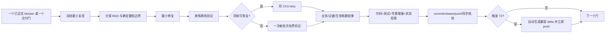
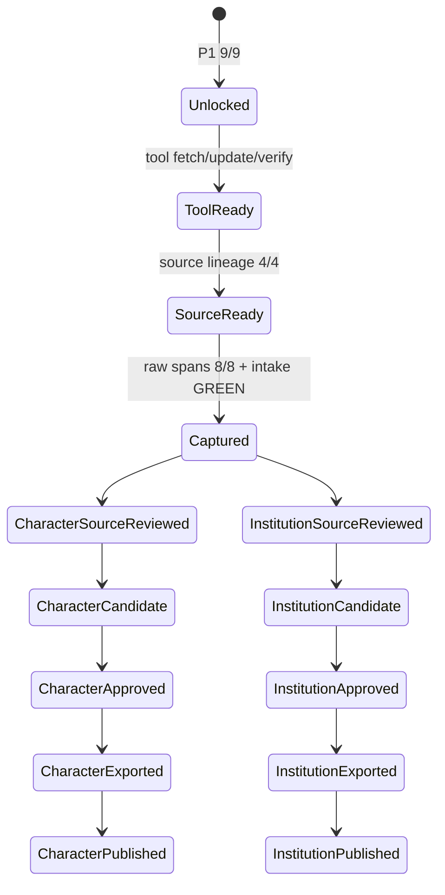
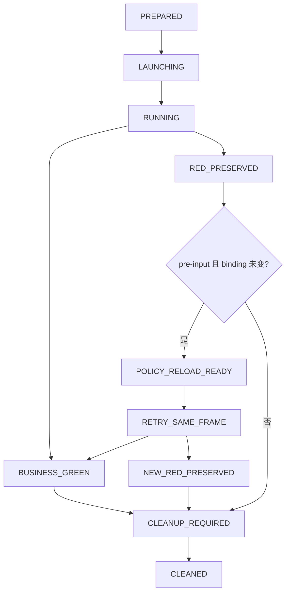

# CK3 mod / T0 / T1 / T2 整体工作流深度审计与改造方案

审计时间：2026-09-12（Asia/Shanghai）

审计基线：

- 根仓：`2c059aa4becf46ea26415cc0973b1d0fd9e2b9cb`；审计开始与取证时 `HEAD == origin/master`。
- `open_kaishek`：审计取证期间同步推进，最终只读复核点为 `0a4400b52b899bbb25bee6275a0588c5301824bf`，当时 `HEAD == origin/main`。
- T0 P1：机器门已经 `9/9 / GREEN`，P2 视频锁已按规则解除；宣传工具检查、根仓远端更新和更新后验证已经完成。
- P2 审计快照：source lineage 为 `3/4`，真实 raw footage 为 `0/8`，人物版和制度群像版均未形成候选。R506 已在 27 个游戏日内到达真实 `zg361we.356`，审计开始时停在 Python consumer contract RED；该状态只用于说明本次方法论问题，不作为本文完成后的实时运行状态。
- 本文只读检查仓库、Git 历史和既有 runtime artifact；没有启动、控制、重启或清理 CK3，没有修改 mod、DLL、runner、MCP 或宣传工具代码。

本文是改造建议，不新增产品验收门，不改变 T0 视频顺序、CK3 单实例、RED 不得吞掉、rebase-only、完成工作包立即 commit/push、T2 触发即同步等用户硬规则。

## 结论

这套方案的工程方向是对的，但执行系统已经明显过度复杂。问题不在“验收太认真”，而在以下四种耦合：

1. **业务结果、harness 正确性和进程清理共用一个 GREEN/RED 表面。** 这会把 Python consumer 错误写成产品 RED，也会让 cleanup GREEN 或进程退出码看起来像业务成功。
2. **冻结输入与整个移动中的 Git HEAD 绑定。** 产品、bridge 和 checkpoint 没变时，文档或无关代码提交仍会迫使 operator 重做 activation；Python-only 修复又可能因为旧进程没有统一 retry 控制而失去同帧恢复机会。
3. **每个故障都派生专用 operator、receipt、provider 和逐轮专题。** 局部解决方案没有及时上提到公共生命周期，导致同类问题换一个 job 名重新出现。
4. **历史证据、当前状态和进度汇报写在同一批长期追加文档里。** 旧状态虽标了 superseded，仍以“当前”语气留在权威入口，人工接班必须重新判断哪一段才有效。

现有体系中必须保留的部分也很明确：exact-build 与字节哈希、动作 ACK 不算业务后置、失败 artifact 不改写、单实例 CK3、最短确定性 checkpoint、真实事件 SOP、P1 九项门、双片独立候选与审片、通用只读 MCP 资产。这些是质量基础。改造目标是让这些基础更便宜、更清楚地运行。

建议把系统从“逐 attempt 文件驱动”改成“一个机器状态账本 + 标准运行生命周期 + 内容寻址证据 + 生成式报告”。短期只补当前 P2 会真实用到的控制面；全面拆分 runner 和整理历史文档放到两条成片交付以后。

## 审计范围与证据

重点阅读和比对：

- [T0 P1 / AF5 交接](2026-09-11-t0-p1-af5-handoff.md)
- [前次方法论评审](../autonomous-agent-progress/retrospectives/2026-09-11-t0-methodology-review.md)
- [T0 延期复盘](../autonomous-agent-progress/retrospectives/2026-09-10-t0-schedule-slip.md)
- [实测工作流程](../testing-workflow.md)
- [自动玩家目标与路线图](../autonomous-agent-progress/goal-and-roadmap.md)
- [一代人 blocker ledger](../autonomous-agent-progress/one-generation-blocker-ledger.md)
- [T0 P1 验收索引](../phase2-promo/phase2-acceptance-case-index.md)
- [二期宣传入口](../phase2-promo/README.md)
- [双成片生产合同](../phase2-promo/phase2-dual-cut-production.md)
- [P2 工具与远端更新](../phase2-promo/p2-toolchain-master-update-2026-09-12.md)
- [P2 endgame source operator](../phase2-promo/p2-endgame-source-bounded-operator-2026-09-12.md)
- 2026-09-10 至 2026-09-12 的日报、W37 周报和日计划会
- 根仓与 `open_kaishek` 的近期 Git 历史
- P1 gate、P1 evidence manifest、R506 activation/action/RED artifact
- 当前 operator、action-cell、provider 和 source-capture 实现规模与继承关系

量化结果来自一次只读扫描：

| 指标 | 观察值 | 含义 |
|---|---:|---|
| `docs/phase2-promo/*.md` | 166 份、17,348 行 | 宣传与验收知识已经难以靠人工顺序阅读维护 |
| 以 `r数字` 开头的 phase2 专题 | 73 份 | 轮次成为主要知识分片，而非业务能力或故障类型 |
| 2026-09-03 至 2026-09-12 根仓提交 | 1,310 个 | 活动量极高；提交数不能直接代表交付速度 |
| 上述提交中以 Record/Sync/Document/Update/Close 开头 | 303 个 | 证据和状态维护产生显著 Git 写放大 |
| 同期 `open_kaishek` 提交 | 110 个；其中 2026-09-12 为 37 个 | 触发即同步被大量人工增量文档实现 |
| `run_zhongguo_acceptance.py` | 24,535 行 | 单个核心 runner 已承担过多领域和生命周期职责 |
| 五个主要 phase2 operator | 约 3,201 行 | 虽复用 AF5 基类，仍重复 status/start/retry/cleanup/serve 变体 |
| source capture/provider/action 相关抽样 | 多个 700–1,800 行模块及大体量测试 | 合同细节很强，但组合成本高，fixture 漂移面大 |
| P1 evidence manifest | 273,429 bytes | 完整证据适合存档，不适合作为人读状态入口 |
| P1 gate | 3,548 bytes | “小 envelope 引用大证据”是值得推广的正确模式 |
| R506 `af5-red.json` | 553,179 bytes | 根因只有一个 scalar scope 不匹配，却被完整世界快照淹没 |

这些数字不证明每个文件或提交都无效。它们与已经发生的接班误判、状态矛盾、旧 fixture 常量、同帧恢复丢失和多次排期失效结合后，足以证明当前组织方式需要改变。

## 应当保留的工程原则

### 1. P1 的九项机器门

九项门把“主体工程签收”从 361 场景、626 definition 和历史长链中剥离出来，终于形成可判定的完成定义。最终 `p1-gate-r504.json` 只有九个布尔门、`missing=[]`，这是正确的控制面。

以后不能再把 source `4/4`、footage、第三次 `.356`、旧 `7+4` 矩阵或全树计数回灌成 P1 blocker。P1 已签收的事实也不应因 P2 consumer 修复、文档提交或无关 T1 工作自动失效。

### 2. RED 保留和独立业务后置

R400 没有把 event instance 消失或 cleanup GREEN 冒充 AF5 terminal；R506 在真实 `.356` 同帧停住，没有选项输入或伪造 source save。这些做法应继续。

改造后的 RED 分类只用于归因和恢复，不得把任何 RED 降为 warning。所有分类仍保留原始失败字节、阻断当前动作，并明确影响范围。

### 3. CK3 单实例和递增轮次

单实例和每次真实启动递增轮次是必要的资源纪律。问题不在轮次多，而在轮次分配、operator 存活和 cleanup lineage 依靠人工拼接。轮次规则保持不变，改造自动化其分配和租约。

### 4. exact-build、产品投影和哈希冻结

游戏版本、EXE、DLL、checkpoint、product tree 和原版规则文件全部冻结，已经有效阻止“测了另一个东西”的假 GREEN。需要调整的是冻结层级，不是取消冻结。

### 5. 小修复配小验证

当前 [testing-workflow](../testing-workflow.md) 已写明单个 bug 不做永久长跑。R430 对 B1 的 148 日最短边界、R506 的 30 日绝对边界、当前聚焦 normal/optimized 检查，方向正确。后续应把这个原则变成机器选择测试范围的输入，而不是继续靠报告反复声明。

### 6. 通用原版事件资产

原版事件 registry、analysis、portable evidence 和只读 MCP 已经解决了跨项目复用问题。`open_kaishek` 的 consumer 不编译账号、机器路径、轮次或 endpoint，接口边界设计正确。后续改造重点是降低每条数据增量的同步成本，而非退回项目私有合同。

### 7. 两条成片独立签收

人物版 09:30 与制度群像版 09:40 的叙事、时间码、候选字节和最终审片必须独立。共享原片不等于共享候选结论。现有设计对此判断正确。

## 已证实的问题

### P0-1：没有唯一的“当前状态”来源

[二期宣传入口](../phase2-promo/README.md) 前部已经写出 R504 `P1 9/9 / GREEN` 和 P2 前三步完成，后续同一文件仍以现行语气保留 `P1 8/9`、`P1 6/9`、`P2 LOCKED`、旧工具 head 和旧下一步。[验收索引](../phase2-promo/phase2-acceptance-case-index.md) 顶部仍写 P2 `LOCKED`，而日报已经记录 P1 解锁及 P2 update gate 完成。

这不是单纯的文档美观问题。接班者、脚本作者和汇报者都可能选中不同段落，重新调查已关闭事项，或错误阻塞/提前执行下一阶段。前次交接把 R400 失败阶段概括错，也是同一类“摘要与原始状态分离”问题。

**根因：** README、日报、周报、交接、专题和 artifact 都在承担 current-state 职责；历史段落只追加、不退出当前视图。

**立即改法：** 增加一份小型机器状态账本作为唯一现行投影，README 和报告只引用它。历史正文继续保留，但不得再含未标记的现行状态。

建议字段：

```json
{
  "schema": "xar.project-delivery-state",
  "schema_version": 1,
  "updated_at": "...",
  "root_commit": "...",
  "t0": {
    "p1": {"result": "GREEN", "passed": 9, "required": 9, "gate_ref": "..."},
    "p2": {
      "tool_update": "GREEN",
      "source_lineage": {"passed": 3, "required": 4},
      "raw_footage": {"passed": 0, "required": 8},
      "character_cut": "NOT_BUILT",
      "institution_cut": "NOT_BUILT",
      "publication": "PENDING"
    }
  },
  "t1": {"active_blocker": "GEN-034", "closed_gates": [], "open_gates": []},
  "t2": {"upstream_commit": "...", "compat_commit": "...", "sync": "GREEN"},
  "red": {"id": null, "class": null, "scope": null},
  "ck3": {"inventory_source": "operator_get_status", "live_state_not_git_cached": true}
}
```

这份账本不是新 gate；它只是把已有 gate、artifact 和 operator live status 投影成一个入口。Git 中只在工作包结束更新稳定状态；实时 PID/轮次仍从 Operator MCP 读取，避免把瞬时现场高频提交进 Git。

### P0-2：GREEN/RED 的三个维度被混在一起

R506 的失败是 capture-side Python consumer 把 `value` 的 raw type index 固定为测试 fixture 的 `9`，真实 exact-build wire 为 `1`。mod、DLL、事件选择和产品状态都没有改变；但 `af5-red.json` 同时写了：

- `result=RED`
- `product_result=RED`
- `failure_stage=bounded_endgame_source_action`

其中第一个 RED 正确，第二个字段会让读者误以为发现了新的 mod 产品 bug。历史 R400 又曾出现业务 RED、cleanup GREEN、job exit code 0 同时存在，需要人工解释。

**立即改法：** 每个 operator 和最终 artifact 固定发布三个互不覆盖的结果：

| 维度 | 允许值 | 回答的问题 |
|---|---|---|
| `business_result` | `GREEN / RED / NOT_EVALUATED` | mod 或目标业务后置是否成立 |
| `harness_result` | `GREEN / RED` | runner、consumer、合同、证据装配是否正确执行 |
| `lifecycle_result` | `GREEN / RED / ACTIVE` | CK3、bridge、worker、cleanup 是否受管 |

总 `result` 仍可保持 RED 优先，但不能再从总 RED反推 `product_result=RED`。只有真实产品条件或运行时错误有证据时，才写 `business_result=RED`。Python consumer 在动作前拒绝应为 `business_result=NOT_EVALUATED / harness_result=RED`。

所有 RED 再增加不改变严重性的分类：

```text
PRODUCT_RED      产品脚本或真实业务后置失败
HARNESS_RED      runner / consumer / activation / fixture / evidence assembler 错误
SCENARIO_RED     来源在动作前被真实世界变化淘汰
ENVIRONMENT_RED  启动、依赖、桌面或进程环境失败
CAPABILITY_RED   必需观测或动作能力尚未闭合
```

分类字段还应包括：`blocking_scope`、`last_verified_stage`、`input_attempted`、`same_frame_retry_eligible`、`absolute_game_deadline`、`detail_artifact_ref`。分类不允许改变 RED；它只决定下一步是修产品、热恢复、换来源、修环境或补观测。

### P0-3：同帧热恢复不是标准能力，已经重复丢失

Stage 10 在 R502 后才新增 `retry-stage10`，并约束同 PID、generation、paused frame、输入哈希和绝对游戏日截止。这个设计已经证明可行。新建于其后的 endgame source operator 却重新定义为 `status / run-source / cleanup`，activation 明写 `retry_allowed=false`。

R506 正好在动作前、存档前、选项前遇到 Python-only contract RED。根据用户 SOP，本应原位热重跑；现行进程却不能接收新代码的 retry control，迫使操作者在“保留旧 Python worker”与“杀 worker、冒 CK3 一并退出风险”之间选择。

R498、R500 还提供了另一项实证：在合同修复、提交和 T2 同步期间，1200 秒托管上限到期，原本计划的同进程恢复被取消，后续又消耗 warmup/gameplay 新轮次。

**立即改法：** 把 pre-input Python RED 的 policy reload/retry 提升到公共 operator 基类，所有 job 默认具备同一控制语义：

```text
status
start
retry-policy
cleanup
```

job 可以拒绝 retry，但必须返回机器原因，不能通过“根本没有控制名”表达。统一准入条件：

1. 旧 attempt 已冻结且 RED；
2. 没有提交目标输入，没有目标 save，没有 terminal ACK；
3. CK3 PID、connection generation、paused snapshot、player、event instance 和业务 source identity 不变；
4. product tree、DLL、EXE、checkpoint lineage、加载顺序和绝对游戏截止不变；
5. 只允许重载明确清单中的 Python policy/consumer bundle；
6. 新 attempt 使用新 nonce 和新 artifact，不覆盖旧 RED。

为避免 parked RED 被固定墙钟误杀，operator 使用显式租约：在同一 pre-input RED 帧且协调者 heartbeat 有效时暂停普通 runtime timeout；租约过期或身份漂移立即 cleanup。游戏日绝对截止永远不延长。该调整有 R498/R500 的真实损失作为必要性依据，不是理论防御。

当前 P2 正在运行的 R506 不应为了架构整洁被中断。先用最小办法完成或清理当前帧；标准化基类在后续仍会使用 CK3 的 P2 capture job 前落地。

### P0-4：工作包按“产物类型”切得过细，没有按业务结果闭环

延期复盘已给出最强证据：从 `5497920` 到 `1b2c391` 约 27 小时产生 125 个 first-parent 提交，P1 正式分子仍为 `1/9`、净增 0。近期 Git 历史进一步显示十天 1,310 个根仓提交和 110 个 `open_kaishek` 提交。

用户要求“每个完成的工作包立即 commit+push”是正确不变量。问题在于工作包被定义成了一个 inspector、一个 receipt schema、一次 cleanup 勘误或一段专题，而不是一个可交付状态转换。

**立即改法：** 工作包采用垂直闭环：



一个工作包允许保留多个内部失败 attempt；只有达成“修复已聚焦验证并取得目标实机结论，或得到新的精确 blocker”才结束。不要为了每个中间 JSON 再造一个被汇报为完成的工作包。

这不意味着延迟提交：一旦上述闭环达到退出条件，仍立即 commit+push。代码、对应定向测试、必要 docs 和状态投影应进入同一个根仓提交；T2 因为是另一仓库，紧随其后形成独立兼容提交。

### P0-5：冻结身份的层级过粗

现有 activation 会同时绑定 `code_commit` 和 product/bridge/checkpoint 等哈希。前次方法论评审已经指出：产品候选没变，主线因文档或别的领域推进后，旧 profile 仍不可直接使用。P2 根仓更新又把 143 个本地提交 rebase 到 11 个远端提交之上，说明移动 HEAD 与微提交组合会持续增加重建和复核成本。

**立即改法：** Git commit 继续记录来源，运行有效性改为分层身份：

| 身份层 | 内容 | 何时使实机证据失效 |
|---|---|---|
| `product_identity` | release projection tree hash、生成器输入摘要 | mod 产品字节变化 |
| `bridge_identity` | DLL、injector、ABI ledger、EXE build | native wire 或游戏构建变化 |
| `runner_bundle_identity` | 本次会加载的 Python 模块 allowlist + 字节 manifest | 推进、判定、provider 或 consumer 代码变化 |
| `scenario_identity` | checkpoint、player、date、event/source lineage | 输入场景变化 |
| `activation_identity` | 上述身份、轮次、pipe、时间上限、输出目录 | 本次运行配置变化 |
| `repository_provenance` | root commit、upstream commit、dirty state | 追溯来源；不单独替代前五层 |

短期不需要建设自动依赖图。由每个 job 显式列出实际 import/module allowlist，生成只读 `runner-bundle-manifest.json` 即可。文档提交不能仅凭 HEAD 改变使相同 product/bridge/runner/scenario 的证据失效；runner 代码变化则只重验它影响的转换。

Git 一致性规则不变：工作包完成后本地和远端仍必须同步。分层身份解决的是“证据适用范围”，不是允许在未提交脏代码上发布结果。

### P1-1：operator 家族复用了类，却没有复用完整生命周期

AF5、terminal stages、cold restore、Stage 10 和 endgame source 都继承 `Af5OperatorJob`，但各自重新实现 `status/start/_run/_record_failure/perform_cleanup/serve` 的一部分。Stage 10 有 retry，endgame 没有；cleanup 通过把 `af5-managed-cleanup.json` 改名成业务名实现；控制名也各不相同。

这种继承方式复用了启动代码，却没有形成稳定协议。R483/R484 还发生过 worker 错调 AF5 基类 validator、把 source-specific 字段丢掉的确定性 harness RED。

**后续改法：** 两条成片交付后，把公共层收敛为模板方法：

- 基类唯一拥有 preflight、warmup、gameplay launch、lease、retry、artifact archive、cleanup、serve 和三轴结果；
- job 只实现 `validate_job_inputs`、`run_business_action`、`business_postcondition`、`compact_evidence`；
- cleanup artifact 使用统一 schema，业务别名作为字段，不通过文件重命名表达类型；
- target profile 仍可广告业务控制别名，但内部映射到标准生命周期；
- source-specific validator 通过构造注入，不允许子类默认回退到 AF5 validator。

这项重构不应插入当前 P2 source/capture 关键链。当前只补标准 retry 所需最小公共入口。

### P1-2：核心 runner 已成为 24,535 行的组合根

`run_zhongguo_acceptance.py` 同时承担桌面启动、bridge 配置、产品 materialization、事件处理、多个 Phase 2 领域推进、日志扫描、checkpoint、provider、cleanup 和 legacy coverage。如此大的组合根使局部 import 变慢、fixture 复用含混、任一领域都容易继承不相关假设。

R400 的异常 evidence 在 action cell 中存在、wrapper 摘要却丢掉；R506 的小 scalar 错误又被 base AF5 大快照包装。这都说明领域信息跨层时没有明确 envelope。

**后续改法：** 不做一次性大重写。按已经存在的可执行边界依次抽出：

1. `ck3_session_lifecycle`：启动、单实例、pipe、pause、cleanup；
2. `artifact_envelope`：三轴结果、RED 分类、内容寻址引用；
3. `phase2_domain_actions`：AF5、Central、Workforce、source capture；
4. `phase2_acceptance_assembler`：九项 P1 和 P2 stage，只消费 receipt；
5. legacy full-tree coverage 保留独立显式入口，不进入默认导入链。

每次只迁一个已有 live 路径，用冻结 artifact 回放和一次后续真实需要的运行互证；不能为了重构重跑已经 GREEN 的业务门。

### P1-3：artifact 过大，摘要反而不够用

R506 `af5-red.json` 超过 553 KB，包含完整战争和军队快照；真正决定失败的内容只有 `zg361_we_al_cycle` 的五个字段。R400 则相反：action exception 中有阶段证据，摘要只留错误字符串，接手者误以为没有恢复到 source event。

**立即改法：** 每个失败固定生成两个对象：

- `red-index.json`：目标小于 10 KB，包含 RED class、最后成功阶段、输入是否尝试、最小 diff、retry eligibility、业务/harness/lifecycle 三轴结果和 detail hash；
- `red-detail.json` 或原始 driver state：保留完整快照与原始字节，内容寻址，不删减。

摘要由抛出错误的最内层结构化 evidence 生成，不由外层 wrapper 重新猜测。大世界快照只通过 `{path, bytes, sha256}` 引用。P1 的 3.5 KB gate 引用 273 KB evidence manifest 已经证明这个模式可行。

### P1-4：测试夹具被当成 ABI 权威

R506 的旧 fixture 固定 `raw_type_index=9`，而既有 ABI 文档早已说明只有 Character 的 index `4` 有固定 decoder，generic scope 应以解析后的 `type_key` 定义语义。测试覆盖了实现，却没有覆盖真实 ABI 约束；实现与测试一起通过，直到 live wire 返回 `1` 才暴露错误。

**立即改法：** fixture 必须声明来源级别：

```text
SPEC_FIXTURE       来自明确 schema/ABI，不得随意改
FROZEN_LIVE        来自内容寻址真实帧，带 build/hash
SYNTHETIC_EXAMPLE  只验证形状，不得产生固定语义
```

凡是 opaque/raw index、generation、runtime ordinal、PID、路径和轮次，都默认是 diagnostic，不得由 synthetic fixture 固化为语义常量。测试断言优先绑定 `type_key`、状态和不变量；确需固定 raw 值时必须引用 exact-build ABI 条目或冻结 live artifact。

正常和 `-O` 双模式仍保留，因为它能发现错误依赖 `assert` 的合同；两次通过不能被汇报为两份业务覆盖。

### P1-5：报告负担已经反过来制造状态漂移

当前 `phase2-promo` 入口 484 行，自动玩家 roadmap 和 blocker ledger 都超过两千行；日报和周报持续复制 commit、hash、轮次、P1/P2 状态和下一步。历史被保留是正确的，但“同一事实复制到多处”导致：

- P1 9/9 后，旧 8/9、6/9 仍在同一入口；
- source `3/4` 曾被写成 P1 剩余，后来又需多处 supersede；
- 接班者先花时间判断摘要是否覆盖原始 artifact；
- 多代理同时编辑 daily/weekly 时必须额外协调文件所有权。

**立即改法：** 报告采用“状态投影 + 包增量 + 证据链接”：

- README 只做导航，顶部 current-state 由机器生成；历史状态移到 dated appendix；
- 每个工作包写一份小 `package-receipt.json`，日报从 receipt 自动汇总，不再手抄所有哈希；
- 日报只写当日增量、未闭合事项、原因和下一步，详细运行轨迹只链接专题/artifact；
- 周报只汇总日报 receipt，不复制逐轮叙事；
- 交接从 current-state、当前 RED index、live operator status 和下一工作包 Definition of Ready 自动组装；
- daily/weekly 继续满足 AGENTS 要求，由单一协调者生成，子任务只写独立 package receipt。

历史文件不删除、不改写。旧段落在索引中统一标记 `HISTORICAL / SUPERSEDED`，并从“当前状态”视图排除。

### P1-6：T2 同步正确，但实现为人工 prose 写放大

`open_kaishek` 的边界设计是可移植的，且明确区分 `nativeCertified`、`runtimeCertified`。问题在同步机制：十天 110 个提交，9 月 12 日 37 个；大量提交只是 pin 新 root commit、数据集计数、hash 和一段“不改变 schema/ABI”的说明。

用户要求接口、架构、协议、数据格式、版本或依赖变化立即同步，不能放宽。数据集增量也应保持上游一致。改进方向是自动化，不是延迟。

**后续改法：** 根仓为每个公共能力生成一个 canonical capability manifest：

```json
{
  "capability_id": "...",
  "api_version": "1.1.0",
  "schema_version": 1,
  "dataset_revision": "sha256:...",
  "certification": {"native": false, "runtime": false},
  "producer_commit": "...",
  "producer_files": [{"logical_path": "...", "sha256": "..."}],
  "change_class": "DATASET_ONLY"
}
```

`open_kaishek` 的 `sync-upstream-capability` 一条命令读取 manifest，自动更新 descriptor、fixture、版本说明和 focused test。变化分成：

- `ABI_BREAKING`
- `ABI_ADDITIVE`
- `DATASET_ONLY`
- `CERTIFICATION_ONLY`
- `NO_PUBLIC_DELTA`

只要触发用户规则，仍立即产生兼容提交并 push；但不再人工重写同一段边界。`NO_PUBLIC_DELTA` 记录在根仓 package receipt 中即可，避免制造无变化的 companion commit。

### P1-7：T1 的“90%”无法表达真实进展

T1 G2 长期报告 90%，而 GEN-034 已陆续取得 source-specific loss、truce evaluated days、persisted expiry 和 active-war strategic power 等实机增量。该百分比既不增加，也无法说明 owner budget、campaign dominance、same-frame white-peace comparison、policy/action 哪一项仍缺。

这与早期 T0 固定复述 50% 的问题同源。百分比只有固定分母时才有意义。

**立即改法：** T1 改报 blocker burn-down：

```text
GEN-034
  strategic power: GREEN
  source-specific loss: GREEN
  truce duration/expiry: GREEN
  campaign dominance certificate: PENDING
  owner-authored budget: PENDING
  same-frame white-peace comparison: PENDING
  recommendation: BLOCKED
  action + postcondition: NOT_RUN
```

如果用户要求百分比，只能报告“固定清单中 x/y 项”，并写清分母；不得把主观 90% 当完成概率或剩余工时。

### P1-8：并行规则缺少机器可读资源声明

最近材料证明 T1 能在不冲突时推进 read-only provider，T2 也能紧随根仓同步；同时延期复盘记录过 CK3 槽空转 3 小时 44 分、支线共享 generated tree 造成假失败和串行重跑。

**立即改法：** 每个工作包在开始前声明资源：

```yaml
priority: T0 | T1 | T2
reads: [paths/capabilities]
writes: [exact directories]
requires_ck3: true | false
requires_operator: true | false
changes_product_tree: true | false
changes_bridge: true | false
triggers_open_kaishek: true | false
blocks: [gate ids]
```

调度器只需要做简单冲突判定：CK3、远端 master、generated/build/runtime 写目录是独占资源；文档、静态分析和不同 worktree 的只读任务可并行。T0 拿到 CK3 前不应等待无关 T1/T2；T1 静态工作也不应因 T0 总优先级整体挂起。

不以“所有线程都忙”为吞吐目标。关键路径协调者只负责当前 gate、CK3 lease 和集成；支线完成后交付 package receipt，由协调者一次合并状态。

### P2-1：source registry、raw footage 和成片状态容易混淆

现行文档已经多次强调 source `3/4` 不是 footage `3/8`，说明这个混淆真实存在。source checkpoint 是可重复捕获和证据 lineage；raw footage 是连续录屏字节；两条 candidate 又是不同成片。

**立即改法：** P2 使用明确状态机，不再只报“视频进行中”：



每个节点必须有分母和 artifact：

| 层 | 共享或独立 | 当前审计快照 |
|---|---|---|
| source lineage | 四类业务源共享 | `3/4` |
| raw capture | 八段原片共享 | `0/8` |
| intake/hash/ffprobe | 对共享原片执行一次 | `PENDING` |
| source timecode review | 两个 cut 独立 receipt | `0/2` |
| candidate | 两个 cut 独立 | `0/2` |
| automated audit | 两个 cut 独立 | `0/2` |
| 1.0x human review/signoff | 两个 cut 独立 | `0/2` |
| export | 两个 cut 独立 | `0/2` |
| publication receipt | 两个 cut 独立 | `0/2` |

### P2-2：双片独立性不应变成所有步骤重复两遍

八段 raw take 的字节完整性、编码、时长、source lineage 和可读性是共享事实，只需 intake 一次。人物版和制度版的 context/action 时间码、旁白、字幕、章节顺序和 claims 解释不同，必须产生两份独立 overlay receipt。

建议流程：

1. 一次 capture 生成八段 immutable raw take；
2. 一次机器 intake 生成共享 media manifest；
3. source reviewer 可以在一次连续 1.0x 原片观看中同时填写两套 cut-specific annotation，但必须输出两个独立 receipt，不能把一个 cut 的 `approved` 借给另一个；
4. 两条 TTS/build 在不同 work directory 并行，共享内容寻址 TTS cache；
5. automated audit 分别运行；
6. 09:30 和 09:40 候选必须分别完整 1.0x 人审并签在最终精确字节上；这一层不能合并；
7. export 和 publication 各自保留 hash/locator receipt。

发布目标、账号会话和远端 locator 应在候选完成前作为操作输入解析清楚。它不是新增质量 gate，而是执行 `publish` 必须知道的目标。用户已经授权在 P1 后完成发布链时，不应再要求重复授权；若仍缺具体目标，只记录为 `publish_target_missing`，不能伪造 publication receipt。

### P2-3：P2 当前不需要再扩大产品验收

P1 已 9/9。R506 的 consumer contract 修复只影响 source capture 证据，不修改 mod、DLL、加载顺序或 P1 product tree。它需要聚焦 capture/provider/action 回放和一次同帧/同来源 completion，不需要再跑 P1、B1 长跑、361、626 或全部 CK3 acceptance。

八段 capture 中真实撞到的新 RED 仍按 SOP 处理；处理窗口只到恢复当前 capture 为止，不把每个录制中断扩成新的全局验收矩阵。

## 改造后的标准工作流

### 开工前：Definition of Ready

每个包只需回答：

1. 当前最高优先级 gate 是什么；
2. 它的输入 artifact/hash 是什么；
3. 哪一个未知会被本次运行消除；
4. 最短游戏日和墙钟上限是什么；
5. 成功、真实 RED、来源失效和环境失败分别在哪里停止；
6. 是否需要 CK3、写哪些目录、是否触发 T2；
7. 哪些已有证据将直接复用，不重复验证。

缺少这些信息时先做 no-launch 准备；不因为“runner 能跑”就启动 CK3。

### 执行中：标准状态



任意状态都发布三轴结果；`CLEANED` 不能覆盖业务结论。每次 retry 保存前一个 RED，沿用同一个绝对游戏日截止，不重置游戏进度预算。

### 收尾：Definition of Done

工作包结束需同时具备：

- 目标业务结果 GREEN，或新的精确 RED 已冻结并明确下一步；
- 适用的最小测试 GREEN；
- CK3/worker 生命周期有当前状态或 cleanup 结论；
- 根仓代码、测试、必要专题增量和 current-state 投影一致；
- commit/rebase/push 后本地、upstream、远端一致；
- 若触发 T2，兼容 manifest 已生成、focused test 已过、companion commit 已 push；
- 下一工作包直接指向一个 gate，不指向“继续研究”。

## 与改动相称的验证矩阵

| 改动 | 必需验证 | 不应自动增加 |
|---|---|---|
| docs/current-state 纠正 | diff、链接、状态生成器自检 | CK3、L0、全仓测试 |
| Python consumer/receipt 且已有 frozen RED | frozen artifact 回放；受影响模块 normal/`-O`；若业务仍未评估则同帧或一次最短 live | 全部 operator、完整 P1、长期 campaign |
| operator 生命周期 | no-launch 状态机测试；冻结失败回放；下一次本来就需要的 live 路径互证 | 为覆盖罕见分支额外启动 CK3 |
| mod 产品脚本 | 生成器 parity、本地静态、受影响业务 checkpoint | 361/626、无关领域长跑 |
| DLL/ABI | native focused tests、exact-build hash、一次新轮次对应 query/action | Python-only 热恢复 |
| source checkpoint | lineage/hash/provider、最短 live capture | 把 source coverage冒充 P1 |
| raw footage | 一次 intake、媒体规格、可读性 | 重跑产品 P1 |
| 单个 cut | 该 cut 的 build/audit/1.0x review/export | 借用另一 cut 的审片结果 |
| 最终 release candidate 产品变化 | 现行完整 L0 与必要 live gate | 已被裁剪的全树矩阵 |

测试结果缓存按 `test-command + input hashes + environment identity` 记录。输入未变且已有 GREEN 时直接引用；只有新证据、相关字节变化或用户明确要求才重跑。

## Git 与多仓事务

保留 rebase-only 和立即 push。增加一个事务脚本统一做：

1. 读取当前 upstream；
2. 确认只有本工作包预期文件；
3. fetch；
4. rebase；
5. 运行该包声明的验证；
6. commit；
7. push；
8. 再取远端 SHA，证明 local/upstream/remote 三者一致；
9. 输出可被日报读取的 package receipt。

如果触发 T2，根仓 push 后立即运行 companion sync；companion receipt 回链 root commit。根仓不需要为了补写 companion hash 再制造一个状态提交，current-state 可以记录“expected root commit / observed T2 commit”并在下一稳定投影更新，或由跨仓外部 receipt 保存双向关系。

不建议 squash、merge、force-push 或等待多包后统一推送；这些与用户不变量冲突。真正应减少的是工作包碎片和重复文字，而非隐藏历史。

## CK3 轮次与租约改造

保持“一次真实启动一个递增轮次”。增加单一 round allocator：

- 在进程创建前原子分配下一个轮次；pre-launch Python failure 不消费轮次；
- warmup 和 gameplay 两次启动分别消费两个连续轮次；
- allocator 同时写 PID、pipe、job、activation hash、开始时间和 lease owner；
- 新启动前自动查询 CK3 inventory 和旧 lease；发现旧实例先生成处置记录；
- cleanup 后更新一个 canonical lifecycle index，下一 activation 引用 index 中的 latest GREEN cleanup，而不是人工选择长路径；
- operator/control 进程也纳入 lease，避免 CK3 已死但旧 MCP/listener 长期残留；
- live status 永远来自 operator inventory，不从日报中的历史轮次推断。

轮次是进程身份，不是业务进度。报告应写“本包消费几个启动、关闭哪个 gate”，不能把轮次增长当吞吐。

## 报告与百分比口径

以后每轮汇报仍满足用户要求，但固定为以下顺序：

1. T0 最高任务与 P1/P2 gate；
2. 唯一 live CK3/旧实例处置；
3. 当前 RED 三轴分类；
4. 本轮关闭的固定分母；
5. commit/push/T2/MCP 资产；
6. 下一最短动作。

百分比必须带分母：

- `P1 9/9 = 100%` 可以使用；
- `source lineage 3/4 = 75%` 可以使用，但必须写明不是 footage；
- `raw footage 0/8 = 0%` 可以使用；
- `cuts published 0/2 = 0%` 可以使用；
- “T0 80%”“T1 90%”若没有冻结工作量分母，停止使用。

工程进展可以写“关闭了一个 harness blocker”或“新增一个 production-live read-only provider”，但不得换算进另一个 gate 的百分比。

ETA 按门给范围和失效条件。先报告下一个可负责节点，例如 source `4/4` 或 raw capture `8/8`；没有历史分布时不伪造 P50/P90。第一次条件失效就更新，不等承诺时间过去。

## 分阶段实施顺序

### 立即实施：不打断当前 P2 主线

| 顺序 | 改动 | 完成条件 |
|---:|---|---|
| I-0 | 完成或透明清理当前 R506，不为本审计重启 | 当前 RED 保留；同帧恢复或新轮次理由明确；30 日游戏边界不扩大 |
| I-1 | 建立唯一 current-state 投影 | P1、P2、T1、T2、RED、Git 与 CK3 live-source 字段可机器读取；README 不再手写多份当前值 |
| I-2 | 三轴结果和 compact RED index | 下一次 operator RED 能区分 business/harness/lifecycle，摘要引用完整 detail |
| I-3 | 标准 pre-input `retry-policy` | 后续 P2 capture job 在 Python-only RED、零输入、同 binding 时可热恢复；旧 artifact 不覆盖 |
| I-4 | P2 stage ledger | source 4、raw 8、两个 source review、两个 candidate/review/export/publish 各自有明确状态和 artifact |
| I-5 | 资源声明和单写者报告 | 每个并行包声明读写/CK3/T2；daily/weekly 只由协调者从 receipt 汇总 |

I-1 至 I-5 都应在当前业务包边界实施，不能插队让已暂停的健康 CK3 等待全面重构。

### 两条成片交付后实施

| 顺序 | 改动 | 完成条件 |
|---:|---|---|
| N-1 | runner bundle 分层身份 | 文档/无关提交不再使相同执行字节失效；runner 字节变化仍精确触发复验 |
| N-2 | operator 模板生命周期 | 五类 job 共用 launch/retry/cleanup/result；子类只保留业务动作与后置 |
| N-3 | 渐进拆分 24k 行 runner | lifecycle、artifact、domain actions、assembler 四层可独立测试；legacy 显式隔离 |
| N-4 | T2 manifest-driven sync | ABI/data/certification 变化可一条命令同步，仍立即 commit/push |
| N-5 | 文档 current/history 分层 | README 只导航；旧逐轮专题进入历史索引；现行状态无矛盾 |
| N-6 | 用十个真实工作包校准耗时 | 记录 preflight、launch、live、RED→retry、commit/push/T2 时间，再给可信 ETA |

### 暂不建议实施

- 不重开 P1 9/9，也不把 source 4/4 或 footage 8/8 追溯加入 P1。
- 不恢复 361 场景、626 definition 或单 bug 永久长跑。
- 不在 P2 完成前全面重写 runner/operator/MCP。
- 不因为 artifact 多就删除历史 RED；应以索引和引用降低读取成本。
- 不取消 exact-build、hash、独立后置或 CK3 单实例。
- 不把两个 cut 的候选审片合并；只能共享 raw intake 和同次观看产生的两份独立 source annotation。
- 不为降低 commit 数而改用 merge、squash、force push 或延迟已完成工作包的 push。
- 不建设没有真实故障依据的额外安全门、分布式锁或复杂依赖推断平台。
- 不把 `open_kaishek` 变成第二份 canonical event registry；它继续消费能力 manifest 和数据集摘要。

## 改造验收指标

这些指标不替代产品 gate，只衡量工作流是否变好：

| 指标 | 目标 |
|---|---|
| current-state 中相互矛盾的现行值 | `0` |
| Python-only、pre-input、same-binding RED 因缺 retry control 被迫新启 CK3 | `0` |
| cleanup GREEN 覆盖业务 RED | `0` |
| harness RED 被标为 product bug | `0` |
| 同一输入/同一结论的无理由重复验证 | `0` |
| P2 source/footage/cut 状态混写 | `0` |
| T2 触发后人工复制 hash/count/prose 的文件数 | 由 generator 决定并自动验证 |
| 每个工作包的目标 gate、上限、停止条件和资源声明 | `100%` |
| 已完成包 local/upstream/remote 不一致 | `0` |
| CK3 或 operator orphan | `0` |

## 主导方案下的实际执行原则

如果由我主导，当前不会另开架构工程抢 P2。先利用已经到达的 `.356` 帧完成 source `4/4`，随后只捕获八段缺失原片；共享 intake 一次，两套 source annotation 分开，两条 candidate 并行构建，各自审片、导出和发布。每个阶段只报告固定分母。

与此同时，立即把当前状态投影、三轴 RED 和标准 retry 作为最小控制面补齐，因为它们直接决定剩余 P2 是否还会因 Python 包装错误重复启动 CK3。大 runner 拆分、历史文档整理和 T2 生成式同步都放到成片之后，利用已有 frozen artifacts 渐进迁移，不重跑已签收业务。

这套调整保留现有系统最有价值的东西：真实世界证据、严格不冒充和可恢复性；移除的是重复包装、状态抄写和跨层误判。成功标准不再是又多了多少 commit、测试或专题，而是一个真实 gate 关闭后，下一位操作者能从唯一状态入口直接继续，不再重新证明已经知道的事实。

## 本次审计交付边界

- 新增本文一份；未编辑 daily、weekly、roadmap、ledger 或主线程正在修改的 P2 专题。
- 未运行产品测试；本文只改 docs，验证只需 diff、空白和链接/路径存在性检查。
- 未操作 CK3、Operator MCP、DLL、游戏文件、runtime artifact、宣传工具或 `open_kaishek`。
- 本文没有自行 commit/push；由主协调者与同一时刻的主线改动一起审阅和提交。
