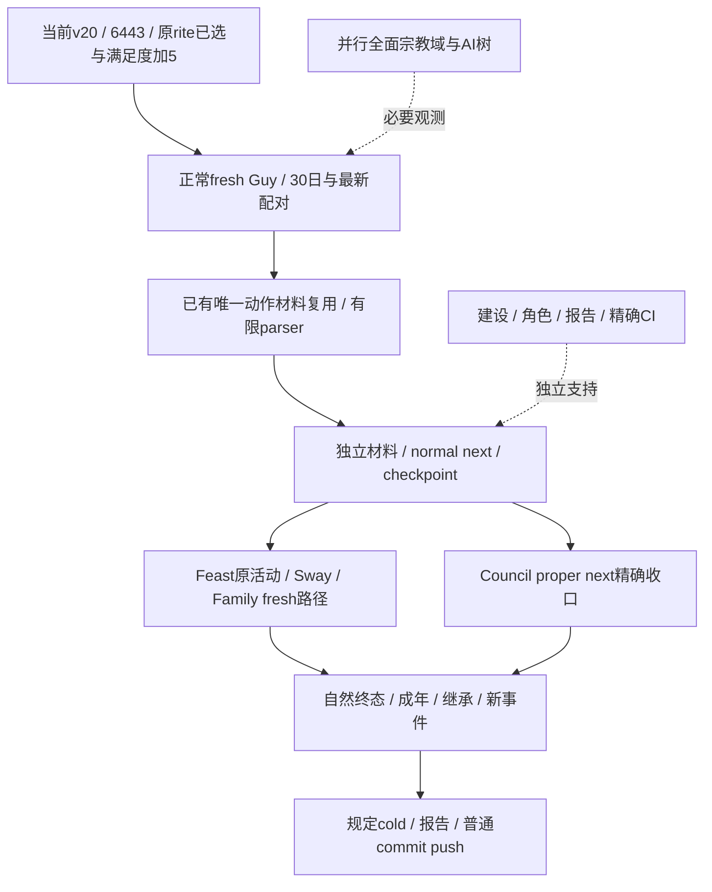

# G2 罗贝尔：当前现状与行动计划

更新截点：**2026-10-02 23:26（Asia/Shanghai）**，依据 ROOT 已闭合实机回执与项目所有者最新授权。较晚 actual 回执覆盖本文会话定位信息，历史失败和配对保留。可复制的执行文本见[接续 prompt](2026-10-02-g2-robert-continuation-prompt.md)。

**2026-10-03实际增量**：functional/live Python已为 `6443a5160c1369b5e64b2d22e3a27f87902ec256`，native/environment仍4ee/v20/PID94488。原event13 `rite_growth.0010`已唯一native0/API1；独立宗教MCP同日精神满足度0→500000/Q100000=+5，actor29829/faith23/rite152保持。generic event material不能代替独立满足度材料。ROOT已更新选择后的sourcepair，旧h4130/旧hash只作下方历史基线；下一normal fresh Guy/30日及后续v21，不重选原event。宗教全面开放与G2/NW资格不变。

## 最新授权与运行边界

项目所有者最新指令：“**从现在开始，允许全方位深入宗教领域研究，全局搜索打破类似宗教暂缓禁令**”。该授权覆盖旧 AGENTS、handover、native README、路线图、计划和 prompt 的宗教暂缓/仅窄例外安排。Faith、Rite、Religion、doctrine、tenet、fervor、改宗、改革、神职/教廷、宗教组织、holy order，以及原生 AI、bridge、MCP、策略和实机矩阵均可深入施工。历史“当时暂缓”保留事实，但不再约束现行任务。

执行顺序是 **冻结 exact build → 原生 AI/脚本调用树与 Mermaid → 必要实际观测 → counter-policy → 罗贝尔生产实机闭环**。这是功能施工顺序，不是新的审批门禁。缺字段确实阻断决策时继续补口；原rite blocker现已取得唯一选择和独立满足度材料，下一正常消费与完整循环继续，其它宗教包并行。开放权限不等于宗教full readiness完成。

**罗贝尔仍是当前唯一测试入口。** 保持原 ordinary campaign、同一高层 intent 与自然 successor，不创建 Murchad、rogue、Clan、Tribal 或新 seed。用户已释放 CK3、Steam 离线；继续最小化后台，不抢游戏/Steam/其它窗口焦点，不用物理输入。ROOT 独占 Game、window、process、SDK、pipe、state 和 Git。

当前运行仍用现有 nonwar 模式、`WAR_CASH/PREWAR` OFF；这些开关状态不能被解释为宗教研究禁令。不要为填并发数重开已完成历史战争矩阵或重复广审计。

## 当前可接续基线

| 项目 | 已闭合事实 |
| --- | --- |
| 游戏 | CK3 **1.20.0.3 / Steam build25652598** |
| EXE SHA-256 | `94b55397abb687a3dcd436805a5d885e6be90fa6c693feb44a9e3bbeeade02a6` |
| 身份 | actor29829，episode `native-29829-2bc2d599f7f9`，`ordinary_campaign_succession / xar_off` |
| 目标 | `dynasty_continuity`，同一 campaign，本轮 `reconciled_successions=0` |
| 现有实例 | **v20 / PID94488 / 最小化**；ROOT 已有 managed session，不另启游戏 |
| 当前functional/live Python/MCP | `6443a5160c1369b5e64b2d22e3a27f87902ec256`，HERE/production-source-6443a516 |
| Native/environment | `4ee2e7558dbc32c69cfa1caaeaf232a287a5ee34`；与 Python 身份分开记录 |
| State | `Z:/ck3_mod_rewrite_process_assets/g2-robert-mainline-12003-v20-20261002/state` |
| Pipe | `\\.\pipe\xar-g2-robert-1066-seed-66f926d`；ROOT 正式客户端唯一持有 |
| 10-02历史完整配对 | **h4130 / raw53222280 / paused**；save85,736,985 bytes，driver49,851,154 bytes；6443选择后较晚current配对以ROOT回执为准 |
| Save SHA-256 | `ed1bf0fb76915ffda910121a83b327780d5b94352d4388ab6592129c1d6e6e23` |
| Driver SHA-256 | `1f81968a0434dd4e610d6ce13cb1386b4903a6b19cefbdf1ad67bd601e5e3842` |
| DLL SHA-256 | `008ac31847c16de15fe6985f087a5c75f0d6d8f6a3da7701045644230dcbcac7` |
| Manifest SHA-256 | `9977d9da497c8285672b9e1d2bea87fb1319c675c8ffb7be1e9d78656a2e58d3` |

HERE=`Z:/ck3_mod_rewrite/artifacts/g2-maintainer-2026-10-02/resume-12003`。当前 [MCP plan](Z:/ck3_mod_rewrite/artifacts/g2-maintainer-2026-10-02/resume-12003/MCP-ROBERT-RELIGION-RITE-6443a516-PLAN.json)已实际attach6443 Python到4ee native/environment；生成时`live_executed=false`不覆盖后续actual。[唯一宗教event选择](Z:/ck3_mod_rewrite/artifacts/g2-maintainer-2026-10-02/resume-12003/m2-events/robert-rite0010-6443a516-actual-select-01/result.json)为event_selected_material_recorded，独立宗教before native23/after26同date53222280证明满足度+5，0新日/0焦点输入。[v20 ROOT packet](Z:/ck3_mod_rewrite/artifacts/g2-maintainer-2026-10-02/resume-12003/m7-robert/robert-mainline-v20-current-review-01/ROOT-PACKET.json)与cold证明复用。旧b03/h4130只留历史配对，不硬绑定新current。

6443的官方CI37030378149保留真实RED：Python-only Windows automation文档扫描1项违规；本次只修prompt执行措辞，执行相关文件scanner一次。没有重复L0/CI，不把该文档RED改说成游戏宗教capability失败。

## 进度与资格

[机器合同](../autonomous-agent-progress/g2-requirements-v1.json)固定八个可见 OODA 里程碑，`percent_reporting_allowed=false`。**G2为4/8，NW为1/4**，不写成全项目完成百分比。罗贝尔历史3153持久日，本 resume 新增95日，共 **3248/36524，约8.89%**；该比例只表示百年持久日覆盖，不是工程或能力完成率。未保存推进、ACK、fixture、schema、CI不增加整项 credit。

| M | 当前状态 | 当前罗贝尔材料与剩余原合同 |
| --- | --- | --- |
| M0 三路退出 | 历史 `complete` | 原退出/材料/next/cold复用，不为占槽重审。 |
| M1 实体/core bundle | 历史 `complete` | 基础root/政府/alert/维护费已读。新增宗教域各自闭合 exact/live，不自动算全域完成。 |
| M2 自然事件 | `in_progress` | fowl3材料已闭合；6443原rite event已唯一选择、独立满足度+5，normalnext待实际接续。原三个自然事件/两个多选/材料/续跑整项门槛保持。 |
| M3 自然继承 | 历史 `complete` | 原goal/继承预测保留，本轮没有新自然死亡/继承。 |
| M4 两年治理 | `in_progress` | Steward窄loop完成；Chancellor已有ACK、独立applied receipt及6日，proper following消费待解释。建设与真实干预未全过门。 |
| M5 选定家庭路径 | 历史成人路径 `complete` | Guy原提议gone_unmaterialized已retire，不是成婚/拒绝/联盟；下一fresh家庭路径尚未实机提交。 |
| M6 谋略/制度/法律/活动 | `in_progress` | CA1窄loop完成；Sway未有已证明终态收益；Feast已Start、ongoing cold保持，尚无完整terminal。 |
| M7 长期/身份矩阵 | `in_progress` | v20同intent/六ledger冷恢复与95新增持久日；跨ruler/seed/government广资格未完成。 |

状态区分 `research`、`static-ready`、`fixture-live`、`production-live primitive`、`production-live loop`、`complete`。宗教全面开放是授权，不是 full readiness。[原visible_outcome](../autonomous-agent-progress/g2-requirements-and-execution.md)与[路线图](../autonomous-agent-progress/goal-and-roadmap.md)不降门槛，不自行增加第九个分母。

## 已闭合成果与真实下一项

| 工作线 | 当前事实 | 下一价值 |
| --- | --- | --- |
| CA1/Steward | 唯一动作→独立材料→next→cold窄loop已完成 | 直接复用，不重发法律或任命。 |
| Chancellor | **43696 diplomacy13替34867/7**，onceACK，正常独立receipt applied，之后正常6日；proper next输出 `NO_APPLIED_ASSIGNMENT_CONSUMED` | Council owner解释已有消费标记或当前modal gate；未解清不称loop complete，不重发assign。 |
| fowl3 | 独立health+0.5和后续正常6日已闭合 | 复用，不重选；不自动增加整个M2完成数。 |
| 宗教event增量 | 原event13 `rite_growth.0010`由6443唯一native0/API1，独立宗教满足度+5、faith/rite不变 | 复用实际材料，normalnext和有限parser继续；不重选、不认generic material为fulfillment、不增加整M2。 |
| 全面宗教 | 深入研究已授权，旧.2专题可作账本，不能套旧地址或称.3全域live | 并行.3原生树→只读bridge/MCP→paused验收→counter-policy→Robert live。 |
| Guy | v20 properconsumer GREEN，`gone_unmaterialized/not_observed`；pending=null，resolved保留完整source_pending和attempted37909，无婚约/配偶材料 | 不盲等、不重发37909、不猜拒绝/timeout；按现有正常child-default fresh候选/合法性/费用/价值路径继续。 |
| 第一继承人 | 原38822↔38718双向订婚，最近实读双方14、阈值16 | 正常观察真实成年与CanSend，不从天数推成婚/联盟。 |
| Feast | **full83886111，同ongoing活动在v20cold保持**，唯一Start已发生，未闭合terminal | 当前modal解除后继续stock被动事件/终态/材料/next/所需cold，不重Start或付费。 |
| Sway | 原134217986/gen8→34333；v20cold4/rings已闭合，无已证明收益/terminal | 普通batch按需target+opinion；rings仅phase/material/terminal/prestop增量，不每turn全口、不重Start。 |
| 派系/建设 | 最近冻结liberty50331692为watch，旧188不在当时完整vector | 空county不追失败、不认旧派系消失为收益；建设读取自己的keyed材料/原预算，不复制Murchadtype572。 |

Family入口：[v20原Guy消费者字段](Z:/ck3_mod_rewrite/artifacts/g2-maintainer-2026-10-02/resume-12003/m5-family/robert-Guy-v20-original-consumer-01/REPORT-FIELDS.json)，[fresh正常路径recipe](Z:/ck3_mod_rewrite/artifacts/g2-maintainer-2026-10-02/resume-12003/m5-family/fresh-child-default-b03/ROOT-RECIPE.md)是准备方案，尚无新proposal/material/alliance credit。Council边界见[actual applied字段](Z:/ck3_mod_rewrite/artifacts/g2-maintainer-2026-10-02/resume-12003/m4-council/chancellor-configured-formal/actual-v20-live-fields-01/REPORT-FIELDS.json)与最近formal结果。

Feast历史fresh预算曾实际证明maintenance5.886/月×18=105.948gold分配额、200floor、100fee，当时wallet1206.59426/pending reserve0。该帧支持那次Start，不改称当前钱包，不是未来军费上界或完整战争cash。当前进入ongoing lifecycle，不再重建Stage5重复启动。

## 行动依赖与顺序

原rite modal已唯一选择并取得独立满足度材料，当前沿正常回合接续；原生研究、编写、判读和文档并行。Guy、建设或全面宗教矩阵不能成为全部normal额外前置。

1. **P0已选rite接续**：复用6443唯一native0/API1与独立满足度+5，M2继续有限parser/normalnext字段；ROOT正常fresh Guy/30日和最新paired checkpoint，不重选event13。全面宗教继续树→必要观测→策略→Robertlive，不猜效果、造触发、套旧地址或新seed。
2. **P0 Council收口**：解释proper next精确输出，依据实际ledger/receipt/正常下一回合一次收口；需要cold按本包约定一次。不得重发43696或重测Steward/CA1。
3. **P1活动与家庭**：续Feast83886111/Sway原实例；Guy已retired，用child-default正常fresh路径比较，保持event/Council等优先序。无新提案前不认婚配信用。
4. **P1全面宗教**：身份/关系、组织/成员/领袖、doctrine/tenet/fervor、改宗/改革、神职/holy order等各自原生树、数据口、策略、实机独立推进。历史.2输入不替代.3版本/RVA/receiver闭合。
5. **P2长期循环**：现有normal nonwar服务、finite外置记录器、原1/7/30策略与完整配对。自然机会按本次实例唯一动作、材料、next、规定cold验收；新actual RED仅修真实生产支路，不扩理论安全门禁。

## 八个M与64并发安排

64槽位服务独立getter/DTO/consumer/原生树/实际artifact判读，native `--parallel64`。Game/pipe/SDK/state/Git由ROOT串行；共享bridge.cpp/CMake/driver/service单owner，其它交patch。已complete的M复用历史，不为占槽重复广审计。每包明确输入、输出、独占文件和一次必要验证。

| 槽位 | 独立交付 | Owner边界 |
| --- | --- | --- |
| M0 | 历史proof复用 | 无新故障不重审，不把宗教授权变成重审M0要求。 |
| M1 | 全面宗教native/query/DTO/MCP | native owner指定独占模块；必要event字段交M2，bridge/CMake由ROOT集成。 |
| M2 | event13 exact leaf/registry/material | M2独占leaf，不抢宗教query文件。 |
| M3 | 原goal/预测/自然successor | 原Robert唯一入口，不强制死亡。 |
| M4 | Council proper next、建设自己baseline、宗教治理 | Council/construction/领域专题各owner；宗教治理不再受旧非宗教限制。 |
| M5 | Guy retirement后fresh家庭路径 | Family独占；原pair不重发，宗教判定全面可深入。 |
| M6 | Feast/Sway终态、宗教决议/活动/神职/holy order | lifecycle与宗教模块独立；原实例不重Start。 |
| M7 | 长局/身份、全仓旧禁令清理、报告 | inventory owner清现行指令而保留历史；requirements owner唯一写8中央报告；ROOT唯一Git。 |

宗教可拆身份关系、组织、doctrine最终约束、tenet/数字、改宗成本结果、改革AI选择、神职/holy order、当前event八组。原生树落盘后可先最小确定策略，不等待照抄全原生；未采用输入记录质量差距。当前leaf只依赖必要输入，不将全部矩阵加前置。公开source、运行Python、native/env、docsHEAD分列。

性能成果复用：finite实际881,867,199→608,110bytes、减少99.931%，完整history保留；planning root静态3→1已进入后续Python来源。没有同类actual计时对照不虚构速度收益，不改1/7/30或跨动作缓存材料。

## 相对时间节点与阶段收口

T0为最新接续开始。工程范围可估，完整宗教深度、自然事件/Sway成功/成年/死亡/百年终局不能承诺墙钟截止。

| 窗口 | 可控交付 | 调整条件 |
| --- | --- | --- |
| T0～20分钟 | 已选rite独立材料有限parser与next字段；normalfresh Guy/配对接续 | 已有唯一选择不重复，宗教其它包继续。 |
| T0＋20～90分钟 | 必要宗教query/native候选、Council next解释、30日正常窗口 | 多scope/新modal可延长，不等full宗教矩阵。 |
| T0＋1～3小时 | 原Feast/Sway/Family与宗教后续真实业务续跑 | 新actual故障最小修复，不再请求已授宗教权限。 |
| T0＋3～6小时 | 多批normal与paired checkpoint；独立宗教查询/树图；报告与普通push | 不保证自然terminal或M2/M6整项在该窗口完成。 |

下轮报告记宗教授权、leaf/query真实readiness、event13材料/next、Council消费、Feast/Sway原实例、Family fresh结果、持久日与配对、各自source/native/docs commits。G2/NW仅在原整项合同过门后增加。

这两份docs只更新授权、现状和施工顺序，不新增游戏动作/live credit。完成包默认普通commit/push，保留dirty现场和失败artifact；日报周报字段交中央owner合并。已验证proof/CI/fixture复用，不重复同一结论。
