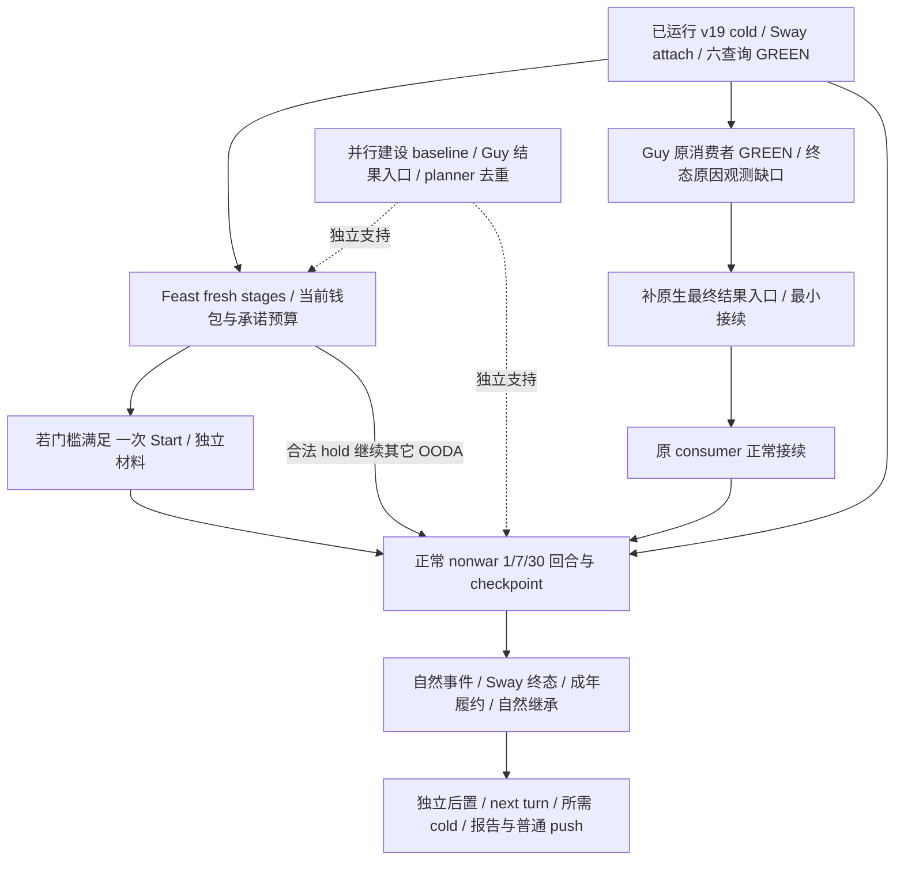

# G2 罗贝尔：当前状况与下一步行动计划

本文按 **2026-10-02 晚间 v19 当前查询收口**的已闭合证据记录：包含 20:41 新 PID cold，以及随后六项 Sway/派系/finance 查询和 Guy 原结果消费者；具体 UTC 时间见各实际回执。当前重点是让最新版 CK3 上的罗贝尔普通战役持续完成有用的游戏循环：消费已经发出的动作，完成宴会 fresh 预算与合法 Start，再推进家庭、治理和自然事件。工程构建、冷恢复和首批新 DLL 观测已经过门，下一轮主要交付应来自游戏结果。

可直接交给接续执行者的文本见[接续 prompt](2026-10-02-g2-robert-continuation-prompt.md)。原[休假交接](2026-10-02-g2-r11-maintainer-vacation-handoff.md)保留历史价值；本文依据最新用户指令与 AGENTS，覆盖其中旧版本、旧 PID、旧权限和旧进度安排。

## 当前会话与可恢复基线

**罗贝尔是当前唯一测试入口。** 保持原 ordinary campaign 及自然继承，不创建 Murchad、独立 rogue、Clan、Tribal 或新 seed。用户已释放 CK3 并确认 Steam 离线；继续最小化、后台执行，不抢占游戏或 Steam 窗口焦点，不使用物理输入。通用宗教研究暂缓，战争研究停止；仅消费已经存在的战争/军队字段作为非战争动作与时间策略的依赖，`WAR_CASH/PREWAR` 保持 OFF。

| 项目 | 当前已验证事实 |
| --- | --- |
| 游戏 | CK3 **1.20.0.3 / Steam build 25652598** |
| EXE SHA-256 | `94b55397abb687a3dcd436805a5d885e6be90fa6c693feb44a9e3bbeeade02a6` |
| 战役身份 | actor `29829`；episode `native-29829-2bc2d599f7f9`；`ordinary_campaign_succession / xar_off` |
| 高层目标 | typed `dynasty_continuity`，同一 campaign；尚无本轮自然继承，`reconciled_successions=0` |
| 当前托管实例 | v19，PID `70968`，HWND `4333808`，最小化；ROOT 的 managed session 已运行 |
| 当前 source/native | `716acfecc6c487e2b48942c6a6030c8b7012e5d5`；不可变 runtime 为 `artifacts/g2-maintainer-2026-10-02/resume-12003/production-source-716acfec` |
| 下一 Python 候选 | planning root 复用已发布 `41291bf2315f11b6748affce318e1e456a6f8918`，runtime `production-source-41291bf2`；`static-ready`，尚未正式 MCP attach 或 live 对照；native 仍为716 |
| 当前 state | `Z:/ck3_mod_rewrite_process_assets/g2-robert-mainline-12003-v19-20261002/state` |
| Pipe | `\\.\pipe\xar-g2-robert-1066-seed-66f926d`，仅 ROOT 的正式客户端持有 |
| 最新已保存时间 | `date_raw=53220456`；checkpoint anchor `h4075`，新 PID 冷恢复 full history `4076` |
| 当前 save SHA-256 | `dd4d3f772147778e7308a85f0e09336b491f00ad4f6e067e1d11564dfb5d23ec` |
| v19 DLL SHA-256 | `677d2e195ee55e8000f3a6313353aa64cb843f8bda2f3e0dbec150b07dde2a8a` |
| v19 manifest SHA-256 | `b4a6b8eb51fc5d4dd5184f2c223cb0d5472995c6a190bbc2a4865372d8827447` |

v19 的官方 prepare、verify、九份 opaque streams 的配对复制、rebind、preflight 与**真实新 PID 暂停地图冷恢复**均已 GREEN。原目标、五份 Council/Sway/Family ledger 和历史 source prefix 已核对；恢复的是最新 h4075 配对，不是归档 h4031 的重放。文件准备包中的 `live_executed=false` 是其生成时状态，实际 live 资格以[新 PID cold 结果](Z:/ck3_mod_rewrite/artifacts/g2-maintainer-2026-10-02/resume-12003/m7-robert/robert-mainline-v19-716acfec-current-review-01/actual-candidate-cold-goal-01/result.json)为准。

入口文件为 [ROOT-PACKET.json](Z:/ck3_mod_rewrite/artifacts/g2-maintainer-2026-10-02/resume-12003/m7-robert/robert-mainline-v19-716acfec-current-review-01/ROOT-PACKET.json) 与同目录 [MCP-CURRENT-CANDIDATE-PLAN.json](Z:/ck3_mod_rewrite/artifacts/g2-maintainer-2026-10-02/resume-12003/m7-robert/robert-mainline-v19-716acfec-current-review-01/MCP-CURRENT-CANDIDATE-PLAN.json)。当前游戏已经运行，接手时先消费现有客户端与回执，不重新启动第二个游戏。

v18 的完整严格构建使用 64 jobs、931 个实际 source/header pins，耗时约 75 秒。v19 基于该已验证缓存，只重新严格编译实际改变的 bridge TU（约 10.56 秒）并复用 485 个 TU；不能称为 v19 全源重新编译。候选选定开关为 63 ON / 6 OFF。source `716acfec` 的[官方 CI #37006646983](https://github.com/XenoAmess/ck3_eternal_recurrence/actions/runs/37006646983)于 20:31:28 SUCCESS，代表静态资格。已发布文档 HEAD `dec8265ce7c537d83dacbb812d2adb506dee9d62` 与运行 source 不同，分别记录即可。

## 进度口径与实际能力

机器合同 [g2-requirements-v1.json](../autonomous-agent-progress/g2-requirements-v1.json)固定八个可见 OODA 里程碑，并明确 `percent_reporting_allowed=false`。因此 **G2 报 4/8，NW 报 1/4**；不把它们包装成整个项目完成百分比。罗贝尔历史持久 3153 日，本轮新增 19 日，共 **3172/36524**，约 **8.69%**。这个比例仅表示百年目标的持久日覆盖，不能表示自动游玩能力、迁移完成度或工程剩余时间。

| 里程碑 | 当前资格 | 本轮罗贝尔材料与剩余门槛 |
| --- | --- | --- |
| M0 三路战争退出 | `complete`，历史 | 复用既有完整证明。战争研究已停止，不重开广矩阵。 |
| M1 实体与 core turn bundle | `complete`，历史 | 当前人物、政府、资源和基本 alert 已可读；v19 维护费 actual available。派系 actual 查询 GREEN、county rows 合法为空，新县领 getter 的非空实读仍未发生。 |
| M2 自然事件 | `in_progress` | 原门槛仍为三个真实自然事件，其中两个为多选，独立材料变化与正式续跑。当前有限续跑无新自然 modal，不制造 fixture、事件或控制台触发。 |
| M3 自然继承与生存 | `complete`，历史 | 本轮保留罗贝尔目标、预测和真实 successor 接续入口；目前没有新自然死亡，不能给本轮继承增量。 |
| M4 两年和平治理 | `in_progress` | Steward 窄循环已完成；罗贝尔建设仅有公共资源与 war/army hold，尚无自己的 private baseline。还需同一两游戏年窗口的建设和真实封臣/派系干预。 |
| M5 选定家庭/外交路径 | `complete`，历史成人路径 | 历史 Murchad 的五候选/成人成婚等证明保留。罗贝尔未成年订婚、Guy 待结果不能算本轮新的成人完成，不扩战争研究。 |
| M6 谋略、制度、法律、活动 | `in_progress` | CA1 法律窄循环完成；Sway 已运行但没有终态收益；Feast 尚未 Start。仍按原 scheme、囚犯或制度、非宗教决议/法律、完整活动门槛验收。 |
| M7 身份适配与长期整局 | `in_progress` | 同一罗贝尔 intent 的 next-turn/checkpoint/新 PID cold 窄链已闭合。跨 ruler/seed/government 的完整资格仍未完成，本轮限定入口不变。 |

原始验收合同见[需求与执行](../autonomous-agent-progress/g2-requirements-and-execution.md)，能力账本见[完整路线图](../autonomous-agent-progress/goal-and-roadmap.md)。`research`、`static-ready`、`fixture-live`、`production-live primitive`、`production-live loop` 和 `complete` 分别记录；ACK、CI、schema 和单场 fixture 不能替代完整 OODA。

## 已闭合的成果与真正未闭合项

| 工作线 | 当前事实 | 下一次有价值的动作 |
| --- | --- | --- |
| CA1 | 一次动作、207 prestige 扣款、生效、资源/继承材料、next-turn 与新 PID cold 均完成 | 复用证明，不重发法律命令。见[法律材料专题](../ck3-native-ai/ck3-1.20.0.2-realm-law-crown-source-and-receipt.md)。 |
| Steward | `32716/skill11 → 43706/skill14`，保留 Collect Taxes，独立 holder/task、next-turn/cold 完成 | 保持现任；Chancellor/Spymaster 仅在新查询证明有价值时比较，不为了岗位覆盖重复任命。见[角色覆盖](../ck3-native-ai/ck3-1.20.0.3-council-role-coverage.md)。 |
| Sway | 原 full ID `134217986 / generation8`，target `34333`；v19 新 PID cold 四查询 GREEN，exact join、CanContinue=true、chance55%，三 rings available/attached、seq0/rows0/no gap。**19/353、opinion -10、两 modifier 合法缺席属于旧 v16 同日期 warm 实读**；新 completion 未发布进度/好感 | cold attach 已完成，沿原实例正常回合；仅实际 phase/material/terminal 或停机归档时拉 retained 增量，不每回合重读全部六口、不重发 Start。见[Sway 状态](../ck3-native-ai/ck3-1.20.0.2-sway-state.md)。 |
| Guy 原提议 | `38988↔37909`，recipient `34332`；v19 唯一 proper consumer **GREEN**，child 合法、双方物质关系合法 absent，receipt pending/material=false、cold_absent_relation_unresolved=true；outbound absent，id/age/cutoff 全 null。正常 ledger 已更新 last_checked 为新 PID/native4，resolved=null | 旧 child-subject 两次 RED 保留历史，当前不再修不存在的错误。实际缺口转为原提议终态/原因不可观测；优先研究现有原生最终结果入口或最小只读接续，不以天数/outbound 消失判拒绝、不重发。其它循环继续。见[Family](../ck3-native-ai/ck3-1.20.0.2-family.md)。 |
| 第一继承人 | `38822↔38718` 双向订婚；双方14岁、阈值16，最终 complete CanSend=false，无成人婚姻/联盟 | 保留 minor 合法 hold，按普通回合重新观察自然成年。不要从已过天数推算履约或联盟。 |
| Feast | 罗贝尔 host，capital `2619`；历史 fresh guest `37265`、join93、travel0；曾到 Stage5，CanStart=true、100 gold，尚未 Start/扣费/full activity ID/terminal | 新 PID 冷恢复后重新建立当前 planner stages，读当前 native maintenance 与共享承诺，重新评估预算；合法且预算足时只 Start 一次，再走到 terminal/next/cold。见[Feast finance](../ck3-native-ai/ck3-1.20.0.3-robert-feast-finance.md)。 |
| 当前派系 | v19 actual 完整 targeting vector 只有 liberty `50331692`，power32.455%、threshold80、不满0、月增-3、dangerous=false/watch；county rows 与 exposures 均合法空。旧 populist `188` 当前不存在，旧县 `2111/2115` 不借作当前材料 | 当前没有实际 county 威胁，不追空 getter、不据消失认干预收益。县领 getter 尚待未来自然非空实例；真实人物/派系机会沿正常回合观察。见[县领材料](../ck3-native-ai/county-faction-material-12003.md)。 |
| 建设 | 罗贝尔只有自己的公共 gold/war/army 帧；没有 private construction keyed baseline | 通过同一个 ROOT SDK owner 调现有 `capture_baseline(service.driver, out)` 一次，保留支出 hold，读取自己的亲持地产、key、候选、有效 cost、active/completed 和收益 baseline。不得复制 Murchad 的 type572 或 tuple。见[建设](../ck3-native-ai/ck3-1.20.0.2-construction.md)。 |

Feast 的 finance observer 已在 v19/native3/raw53220456 实际 available：最大月维护量 `588600/Q100000 = 5.886` gold，明确 **18 个月分配额为 105.948 gold**，加原 200 gold floor 为 **305.948 gold**，尚未加本次真实 pending commitments。本帧 root DTO/finite projection 没有当前 wallet；当前 gold、fresh Stage5 quote、owned commitments 和预算 provider 的完整实际调用仍待采集，不能借旧 1206.59426 gold 填值。105.948 是政策分配额，不能解释为未来军费上界、完整战争 cash、M5 门槛或对建设的自动授权。财务输入生产者的实机观测缺口已解除，完整活动预算/Start 尚未过门。

两次 Guy RED 保留为历史实际 capability 故障；本次 v19 正常消费者 GREEN，无诊断错误可修。当前 `accepted=true` 只说明查询处理成功，双边关系 absent/outbound absent 不能证明对方拒绝、超时或原生取消。下一 Family 包针对这个**已经影响原结果消费的观测缺口**，先查原生最终结果/原因与现有查询可否补齐，再做最小只读 bridge/consumer 接续；不继续围绕旧 RED 研究，不新加门禁，不阻断全部普通 OODA。

本次首批实际材料可直接复用：[六查询结果](Z:/ck3_mod_rewrite/artifacts/g2-maintainer-2026-10-02/resume-12003/m7-robert/actual-v19-sway-county-finance-01/result.json)、[Sway cold 字段](Z:/ck3_mod_rewrite/artifacts/g2-maintainer-2026-10-02/resume-12003/m4-sway/robert-v19-cold-70968-01/REPORT-FIELDS.json)、[县领当前字段](Z:/ck3_mod_rewrite/artifacts/g2-maintainer-2026-10-02/resume-12003/m4-sway/robert-county-material-dto-01/V19-ACTUAL-REPORT-FIELDS.json)、[finance actual](Z:/ck3_mod_rewrite/artifacts/g2-maintainer-2026-10-02/resume-12003/m6-feast/robert-budget-finance-01/actual-v19-readiness-01/ACTUAL-V19-FINANCE-READOUT.json)、[Guy actual 字段](Z:/ck3_mod_rewrite/artifacts/g2-maintainer-2026-10-02/resume-12003/m5-family/robert-Guy-v19-actual-diagnostic-01/REPORT-FIELDS.json)。它们都没有新增游戏日、Feast Start 或 G2 整项 credit。

## 性能与并发判断

旧三回合导出重复历史，turn+snapshot 文件共 **881,867,199 bytes**。新 finite 外置记录器在真实正常续跑中降到 **608,110 bytes**，减少 **99.931%**，完整持久 history 4075 仍在 driver 中。它没有修改 production planner、目标、动作、rollback 或时间策略。实际请求为 1/7/7 日、速度1/5/5，实际推进 1/5/9 日，共15日保存；不能把请求 horizon 等同实际日数。见[正常时间与记录成本](../ck3-native-ai/robert-normal-time-and-capture-cost.md)及[实际 finite 结果](Z:/ck3_mod_rewrite/artifacts/g2-maintainer-2026-10-02/resume-12003/m7-robert/finite-normal-7day-actual-01/result.json)。

当前主要成本移到 planner：三回合累计约 **80.471秒**，同一个 paused planning frame 中三份 root 查询结果完全相同。针对这个真实热点的最小 **planning-only root 去重候选已发布、static-ready**：五项 focused 生产链检查 GREEN（约1.06秒），root 调用3→1、plan material 相同，stale fallback 与 receipt fresh 通过。public source 为 `41291bf2315f11b6748affce318e1e456a6f8918`，不可变 runtime 为 HERE/production-source-41291bf2，freeze 为 HERE/robert-planning-root-reuse-source-freeze.json。当前 live MCP 仍为716；候选尚未正式 attach 或实际 live 对照，不能预报游戏运行收益。下一步复用 focused 结果，由 ROOT 使用已生成的 `HERE/MCP-ROBERT-PLANNING-REUSE-41291bf2-PLAN.json`，以412 Python正规 attach 现有716 prepared environment/native；该新 plan 仍是 file-only/live_executed=false。另记 Python/native 两身份，native 无需重编或重启。实机验收比较 plan、实际 query 数与同类回合计时，动作/时间/独立验证之后仍 fresh，不能跨动作缓存或减少物质后置。见[planning root 复用专题](../ck3-native-ai/robert-nonwar-planning-root-reuse.md)与[候选字段](Z:/ck3_mod_rewrite/artifacts/g2-maintainer-2026-10-02/resume-12003/m7-robert/nonwar-query-cost-01/REPORT-FIELDS.json)。

64 并发可同时服务多个独立交付和 native `--parallel 64` 编译；游戏、pipe、SDK、现场与 Git 必须串行持有。高并发要提高独立产出与缩短等待，不重复跑 102 ABI/L0/旧 fixture，不派理论安全审计。已 complete 的 M0/M1/M3 复用历史，八个 M 不等于必须同时重开八场游戏。

## 下一轮交付顺序

图中的并列分支由不同 owner 离线处理；所有实际游戏查询和操作仍由 ROOT 顺序执行。

### P0：fresh 预算与有价值的当前材料

1. 复用当前 v19 cold 证明、plan 与最小化会话，确认实际 endpoint 所报 PID/actor/episode/date。它们是当前会话定位信息；若 ROOT 已继续推进，用更新后的真实回执，不回滚到本文日期。
2. 复用已经 GREEN 的 Sway cold 四查询、公共派系/finance 两查询与 Guy proper consumer；不重复它们以证明相同结论。Sway 原实例沿正常回合，当前无县领威胁不追空 getter。
3. 为 Feast fresh planner 取得当前 quote、wallet、owned commitments，传本次 actual finance 到预算 provider，得到明确可 Start/hold 结论。一次 ROOT SDK owner 可附带自己的首次 construction material capture，避免第二客户端和重复收入 facade。
4. 并行 Family 包补 Guy 原提议最终结果/原因的原生入口，依据本次 pending/outbound absent 的实际缺口施工。保留正常 ledger 与原提议；未观测终态时不标接受/拒绝/timeout，不把本包设为全部回合的前置 blocker。

**验收**：当前身份保持；Feast 取得实际完整预算结论，建设自己的 baseline 冻结；Family 原结果的可观测入口明确或接续已解锁。合法零、false、absent 与失败区分，原提议零重复动作。获得一次可核验结论即继续，不扩广审计。

### P1：宴会可见结果与治理输入

1. 冷恢复不保留旧 GUI planner stages；使用当前 actor/episode 的 Robert wrapper 重新 fresh guest、location、资格、费用、共享承诺和维护费。
2. 若当前原生 CanStart、预算与动作门槛均成立，执行唯一 Start，独立读取扣费与 full activity identity；后续 stock passive routing 和普通时间推进至自然事件/terminal。若出现新的真实 hold，记录具体字段与可解除依赖，转做其它当前可执行项。
3. 当前 liberty 只是 watch，不从旧188消失归因干预收益。真实派系/人物机会出现后，先以实际输入建立原生树与最小 response，再实现有材料价值的动作或只读观测。Sway/gift 只用于真实人物目标，县领不能套人物路径。
4. 建设 baseline 先观测，支出门槛沿当前正式策略。若仍 war/army hold，保留明确 held 原因，继续其它功能；不要用宴会分配口冒充未交付战争现金。

**验收**：Feast 至少先闭合一次合法 Start→扣款/activity identity；完整资格继续要求 terminal、物质后置、next turn 与规定 cold。治理仍按原 M4 两年窗口，不因新材料口增加完成数。

### P2：持续普通循环，修真实自然阻点

恢复现有 `plan_nonwar_turn/auto_nonwar_turn` 和有限记录器，保持 1/7/30 的原时间策略。正常循环应处理已有 Family/Council/Sway/goal 消费并持续保存完整配对。自然 M2、Sway phase/terminal、成年与继承出现时，读取本次实例、做唯一合法动作、独立后置、下一回合消费和必要冷恢复；没有出现时只记 observed state，不制造测试入口。

planner 去重候选已发布并完成一次 focused 等价验证，ROOT 用 `MCP-ROBERT-PLANNING-REUSE-41291bf2-PLAN.json` 将412 Python正规 attach 现有716 prepared environment/native，finite runner 传该 `--mcp-plan` 后做一轮 actual 对照；不重复静态检查或为纯 Python 候选重编/重启 native。若有 modal、query 或 ledger 实际 RED，保留失败 artifact，围绕真实生产路径修复后接续最新配对；不删除历史、不把未保存的天数计入持久进度。

## 八个 M 与并行 owner 安排

以下是工作槽位和文件所有权，不要求为无增量工作占满槽位。已有 agent idle/completed 时用 `followup_task` 接续；共享文件由单一 owner 写，其他人提交 patch/字段给该 owner。

| 工作槽 | Owner / 独立工作 | 允许独占文件或输出 | 依赖与串行边界 |
| --- | --- | --- | --- |
| M0 | ROOT 复用历史退出证明 | 无新 war 文件 | 无实际新故障则不派新审计/研究。 |
| M1 | 县领 native/DTO 与 finance reader owner 已完成当前 actual 判读；复用结果 | `county-faction-material-12003.md`；独立实际判读 artifact | county 合法空不重读、不称 getter 非空 live；新增真实字段缺口才交 patch。 |
| M2 | natural-event owner 准备当前 registry consumer，收到真实 modal 再补精确分支 | 对应 event 专题/独立 producer 或 consumer 模块 | 无自然实例则完善已有确定性接续入口，不制造 event。共享 driver/service 文件由 ROOT 指定 owner。 |
| M3 | continuity owner 分析真实 successor prediction 与 goal 接续 | `robert-1066-ordinary-seed.md`、独立对照 artifact | 等自然死亡；不为了历史 complete 重跑旧矩阵，不改 live state。 |
| M4 | council、construction、county-response 三个独立 owner | 各自角色/建设/派系专题，独立模块与 artifact | 不共享编辑；Council/建设/派系实际动作统一 ROOT。Steward 窄循环不重复。 |
| M5 | Family owner 处理 Guy 原结果终态/原因观测缺口与未成年履约 | `ck3-1.20.0.2-family.md`、独立原生入口/最小接续包 | v19 consumer 已 GREEN，不再修旧 subject error；不重发提议，原 ledger 正式 consumer 写。 |
| M6 | Feast owner、Sway owner 分开推进 lifecycle 和终态解释 | Feast finance/lifecycle 专题；Sway 专题；不同模块 | Start 与 scheme/活动动作 ROOT 唯一执行，CA1 不重复。 |
| M7 | time/performance owner、native build owner、requirements owner 分开 | `robert-normal-time-and-capture-cost.md`；新 build 包；统一报告由 ledger owner | planning-only 候选由 ROOT 接入；build 64 jobs；所有 Git/SDK/进程/配对 ROOT。 |

可并行细分有直接收益的 native getter、DTO、Python consumer、实际 artifact 解读、角色候选、construction keyed baseline 解读、事件材料定义与精确 CI 观察。每个子包必须先写明确输入/输出、独占路径、依赖和一次验收；若缺实际输入，准备读取说明后回报，不在同一问题上派多组重复研究。每项交付返回 source/证据/测试/剩余边界与日报周报字段，协调者合并。

## 时间节点与调整条件

**T0 指下一轮实际接续开始时。** 以下是投入与交付范围，不是对自然游戏结果的承诺；新 actual RED 或用户重新占用游戏时按依赖更新。

| 相对窗口 | 预期可控交付 | 不确定条件 |
| --- | --- | --- |
| T0～15分钟 | 复用 v19 首批 actual；开始 Feast fresh quote/wallet/commitments 与自己的建设 baseline 可读取部分 | 新实际 RED 才最小修复，已有 Sway/finance/Guy GREEN 不重读。 |
| T0＋15～60分钟 | Feast 完整 fresh 合法性/预算结论；正规 attach 已发布 static-ready 的412 Python候选、开始 actual 对照；Guy 原生最终结果入口账本 | 去重尚未 live；不能预先报运行收益。 |
| T0＋30～120分钟 | 若 Feast 合法，闭合唯一 Start 的独立材料；若原结果入口可局部补齐，交 Guy 最小接续与必要 native 增量 | 新原生终态观测可能延长窗口；合法 hold 不强开活动，不挡全部回合。 |
| T0＋1～3小时 | 持续 finite 正常回合与配对；至少一个本轮新增可见业务材料交付；实际热点对照、文档和普通 push | 游戏装载/查询成本与真实 modal 会影响推进率。活动终态另按旅行/活动自然日期。 |
| T0＋3～6小时 | 稳定接续多个批次、消费真实 phase/结果、阶段报告收口；按实际 readiness 安排下一次 cold | 不承诺自然多选事件、Sway 成功、成年或死亡在这个窗口发生。 |

Sway 当前 19/353 不能线性换算墙钟 ETA；未成年履约依赖自然生日，事件与死亡依赖实际游戏。百年、完整一局、多身份政府矩阵没有足够实际吞吐和覆盖证据估算完成日，不给虚假的截止承诺。每完成一批持久回合，更新新增日、真实每回合耗时、可见业务与剩余门槛，再重估后续工程窗口。

## 本次计划的收口标准

这份计划交付两份可复制、可执行 docs；后续工作按上面的 P0→P1→P2持续执行。下次阶段收口至少记录：复用的新 PID 首批 actual、Guy 原提议最终结果/原因的观测增量、Feast 当前完整合法预算与业务材料、正常回合/最新完整配对、Sway/Family 自然状态、source/native/docs 的各自 commit 以及精确 CI 终态。G2/NW 数字只在原合同整项过门后变化。

单一结论采用一次与风险相称的验证，已验证 old loops 与 ABI/fixture 直接复用。任务包完成后默认 `git commit` + 普通 `git push`，保留原 dirty workspace 和失败 artifact，不 reset/stash/clean/force。每天/每周报告由专职 owner 合并 actual 字段，月报能力视频另依当月截止要求，不把视频制作插入当前主线。
