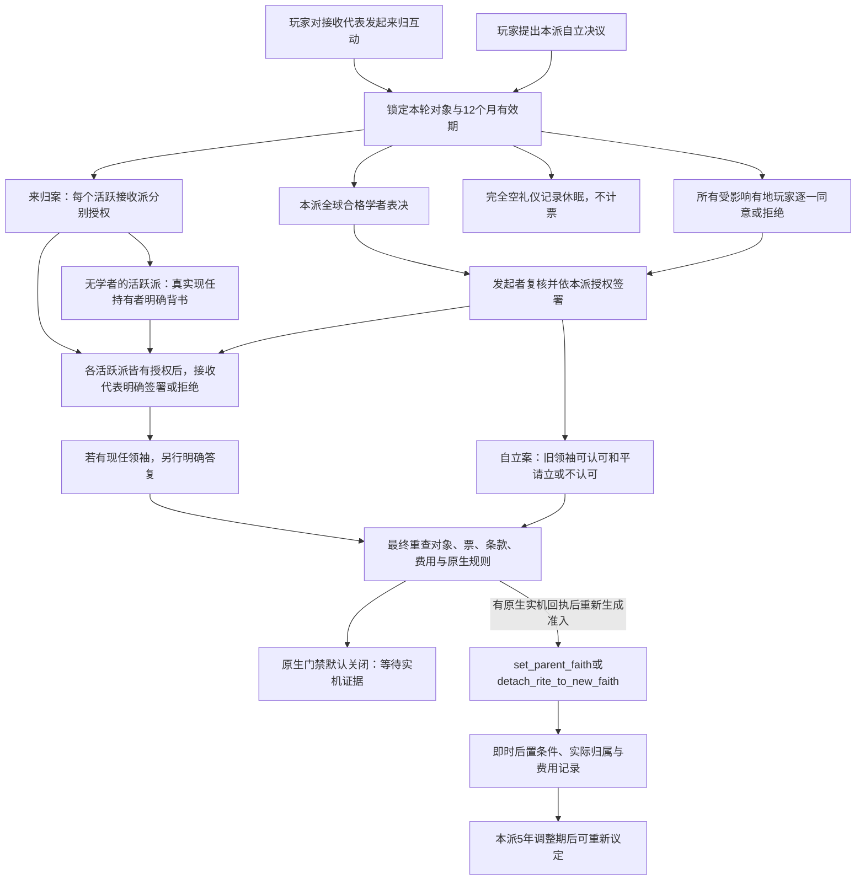

# 《礼与道》迭代二：学派授权与接收同意候选

2026-10-04。候选根目录：`C:/workspace/ck3_lyd_runtime_20261004/iteration2-candidate/`。
仓库基线冻结于 `7fd082eab7626239ecb88702d0ebae71f938b259`。本包只在外置目录写入，未修改受管仓库，也不操作正在运行的 CK3、Steam、MCP 或画面。

**本候选仍为 `NOT_YET_LIVE_VERIFIED`。** 本包有实际原生脚本候选、生成器、中英文本地化和授权模型；离线通过不等于游戏中已能交付分合体验。`lyd_c2_native_admitted_trigger` 默认生成 `always = no`。根代理完成独立原生试验后，可提供 `--native-evidence` 绑定的原生准入回执，重新生成 `always = yes`；没有永久闭门限制，也没有无证据的强制解锁参数。准入只采用根代理对原生操作的实机签注，不会把本包的新授权事件链标成 live GREEN。

## 交付文件与集成合同

数据：[school_consent_data.py](../tools/school_consent_data.py)。生成器：[gen_school_consent.py](../tools/gen_school_consent.py)。独立授权测试模型：[school_consent_model.py](../tools/school_consent_model.py)。离线测试：[test_school_consent.py](../tools/test_school_consent.py)，回执保存器：[run_offline_checks.py](../tools/run_offline_checks.py)。

`source/` 保存 10 个可修改的脚本模板，`generated/mod_li_yu_dao/` 生成以下 **12 个增量文件**，全部 UTF-8 BOM。生成文件不得手改。

| 类别 | 文件 |
| --- | --- |
| 玩家互动 | `common/character_interactions/lyd_c2_consent_interactions.txt` |
| 玩家决议 | `common/decisions/lyd_c2_consent_decisions.txt` |
| 表决阈值 | `common/script_values/lyd_c2_consent_values.txt` |
| 授权与资格 | `common/scripted_triggers/lyd_c2_consent_triggers.txt` |
| 建议案、选民与序号 | `common/scripted_effects/lyd_c2_setup_effects.txt` |
| 票、签署、领袖答复 | `common/scripted_effects/lyd_c2_vote_effects.txt` |
| 条款与选民集合复核 | `common/scripted_effects/lyd_c2_snapshot_effects.txt` |
| 撤回、拒绝、届期 | `common/scripted_effects/lyd_c2_close_effects.txt` |
| 有条件的原生分合 | `common/scripted_effects/lyd_c2_commit_effects.txt` |
| 事件 `lyd.200/210/211/212/213/220/221/222/223/224/228/229` | `events/lyd_c2_consent_events.txt` |
| 中英文本地化 | `localization/{simp_chinese,english}/lyd_c2_consent_l_<language>.yml` |

依赖一期现有 `lyd_can_use_school_trigger`、8 个样板 rite 和 `lyd` namespace。本包不新增宗教、faith、rite、宗主头衔，不覆盖一期内容文件或 candidate2 原生夹具。根代理在实机退出后才可审阅并应用增量，扩展 builder 的明确 allowlist、生成检查与验收矩阵；本包不能直接当成独立 mod 挂载，不能把整个外置证据目录放入 production staging。

当前生成器拒绝写入 `C:/workspace/ck3_eternal_recurrence/`；正式集成时应移植数据、模板与生成器，按仓库实际路径审阅其保护约束和生成头标记，而非直接取消冻结保护继续在运行中改仓库。

## 本次明确缩小的范围

每轮只议定**一个共享全球 rite**的整派迁移，`include_derived = no`。接收方可以是具有**至少一个 rite 的儒家 faith**，包括一期的八礼仪 `lyd_common_faith`；它的所有实际活跃礼仪分别授权，不用汇总票数压过某一派。接收主派的一位真实合格人物被提名为共同接收代表，逐派选票明确授权这位指定代表，本派发起者和接收代表仍须分别签署。后续多礼仪来源整体合流、部分阵营另建分支不由本包实施。

完全没有在世人物、且 `rite_counties = 0` 的接收礼仪保留目录模板，但列入 `dormant_rites` / `no affected followers`，**不计作赞成或反对，也不要求空组织投票**。一个活跃主派加七个空模板可以协商来归。活跃礼仪有合格学者时仍须本派三分之二授权；若零合格学者，只允许真实现任 `head_of_rite` 本人通过 `lyd.213` 明确背书，而且仍须所有受影响玩家同意。该持有者须存活、成年、非无能且仍属于本派；没有有效持有者则复核显示缺少教师或组织条件，不能假造零比零通过。这是设计明确允许的替代背书渠道，不冒称学者多数。

若一个接收共同体完全无人、连主派也没有真实可签署者，则须先建立接收代表。候选不让来源代表代签接收方，不自行创造“已经同意”的 NPC。实际创建、承认学派教师或持有者的流程需后续明确实现；本包只采用现有原生持有者指针。出生、死亡、转派、县数及持有者变化会使旧快照失效，须新议。

来源方若只有一个 rite，允许就整体来归议案协商；若有多个，只允许迁出非主流 rite，不撤去留存 faith 的主流安排。主流及最后一项 rite 不能从其现有 faith 直接“再自立”；主流更替须有另案及原生验证。脱离只处理已有附属礼仪，并暂限于 `doctrine_no_head`：需要新宗主的信仰不能靠本包暗中创建领袖。

## 真实输出事件链



互动的 `auto_accept = yes` 只表示**送达议案**。接收者仍在 `lyd.221` 中明确同意或拒绝；现任接收领袖在 `lyd.222` 中单独答复。自动送达、提名、相同信仰、牵制、出资及保护者身份均不计为接纳同意。

合格表决者的候选规则为：本派实际存活、成年、未被囚禁、非无能、学识至少 15 的人物。按全球 `every_faith_character` 筛选，不只取发起者的廷臣或封臣。这是 mod 的临时章程，不能冒称古代各派存在统一选民法。每人对**指定代表和本轮条款**只投一票；每个活跃派的赞成票须满足 `3 × 赞成票 >= 2 × 本派全部合格选民`。未答复者仍在分母中，不通过删除反对者制造授权。接收方汇总数字仅供界面展示，最终触发器逐一检查全部接收礼仪，休眠排除与持有者背书分别保存。

所有受影响且存活、有地的玩家另收 `lyd.212`，包括学识低于 15 的玩家。任何一人拒绝就结束该轮；无人明确同意不自动等于同意。NPC 只有对玩家创建且仍有效的本轮事件作回复，不新增 NPC 自主发案、周期吞并或分裂循环。NPC 赞成与拒绝目前采用 60/40 的候选权重，仅是待调试的平衡输入，尚未按性格、教义和意见细分。

## 保存、过期与重复规则

| 状态 | 候选保存方式 | 效果 |
| --- | --- | --- |
| 本轮所有者与锁 | 移动 rite 与每个接收 rite 保存 owner、lock serial，365 日有效 | 防止同一对象同时参加两轮；只清理本轮自己的锁 |
| 提案世代 | 移动 rite 持久 `proposal_serial`；actor 保存本轮 serial | 新案递增；旧事件的 saved serial 不能给新案投票或签署 |
| 条款 | 本轮 revision、faith/main/head 指针；每个接收 rite 单独保存各 status 的 tenet 集合、doctrine、县数及持有者 | 对象、领袖、接收目录或内容改变后必须重议 |
| 选民与玩家 | 保存逐派实际名单及数量、在世接收信众与受影响玩家；最后对当前集合复查 | 相同人数换人、跨派对换、新增玩家、死亡或资格改变仍可失效 |
| 休眠与替代背书 | 保存无信众无县的礼仪清单，另记现任持有者明确背书 | 休眠不是授权；持有者背书不是虚构学者票 |
| 每人票与玩家同意 | owner + serial + affirmative 数据 | 防重复计票，不跨轮继承 |
| 被拒绝 | 移动 rite 保存 365 日 retry cooldown | 拒绝后一年可新议，不永久关门 |
| 成功调整 | 移动 rite 保存 1825 日 transition cooldown | 限制本派再次迁移约五年，不随赞助者更换消失；不限制其为其他来归学派表决 |
| 届期事件 | `lyd.229` 对 saved serial 与未实施 result 复查 | 届期结束旧案，不把已经实施的一轮再写成过期 |
| 历史 | 本轮结果、最近 faith、人物计数、rite serial | 不用于 once-only 门禁；完整可跨主持者检索的历史账簿尚未实现 |

这里用 365/1825 日作为候选定时输入，模型使用相同天数。正式朝代模式及自然五年实机验收时，应决定使用原生 `years` 还是确切天数，并记录实际届满日期。模型跳到冷却届满只验证重复规则，不证明游戏中时间自然流逝、事件到期或存档重读正确。

同一学统可以经历 B→A、从 A 自立成动态 faith、再并入 A、再次自立。对象取自当轮实际 faith，不要求旧预设 faith ID 有效。门禁不使用全局“已统一过”标记，不修改全局偏离度定义，也不把完成次数当成永久禁止条件。

## 原生规则保留与执行边界

来归最终检查来源与接收方仍属于 `confucianism_religion`，保留 `faith.has_same_core_doctrines = other_faith` 的比较及**当前宗教领袖相同**条件。两边均无 head 可以匹配；只有一边缺 head 不匹配，两个不同 head 的签字也不把原生规则变成可绕过。这里的 core doctrines 比较不等于强迫三张学派核心 tenet 完全相同。

迁入前检查移动 rite 对**接收方主流**的实际参数化 `divergence(...) < 100`；迁入后再读实际归属、接收主流与 pair divergence。保留接收方主流，`main = no`，不修改 core、head 教义或隐藏扣偏离度来凑条件。现有领袖绑定只在来源成为空 faith 且迁移成功后尝试移除，不销毁其头衔，不夺其世俗地产，不改政体、独立或封臣关系。多礼仪来源仍有领袖时保留其安排。

自立由发起角色作用域调用 `detach_rite_to_new_faith`，要求返回新 faith scope，并核对移动 rite 成为新主流、旧主流仍保留。旧领袖不认可只影响和平请立记录，不永远否决经本派授权的自主自立；本轮尚无无宗主共同体的和平请立大会，所以这种情况按自主自立处理，不能伪称旧 faith 大会已经批准。

费用只在即时后置条件成立后扣除：来归 300 金币、1500 虔诚；自立 200 金币、1000 虔诚。执行前复查余额。原生 effect 不保证原子性：后置条件失败时保留实际状态、记录 `LYD_C2_NATIVE_POSTCONDITION_FAILED`、停止该轮并保留本派调整期，不制造回滚或成功结果。后续 D+1/D+30、人物与伯爵领迁移、头衔绑定、偏离度稳定均须根代理的外置原型和实机验收。

本轮不创建 rival head，不调用完整原生反教宗、代理人或扶正战争效果；也没有宗主继承、军会、圣物、国礼祀产审批、多代表制度大会或局部追随者分支玩法。当前已具备逐个接收礼仪授权的输出图，不等于后续完整议礼会制度。若这些实际安排要变化，应另加对应批准，不用本轮归属授权冒充全部授权。

## 原生准入回执合同

`--native-evidence <receipt.json>` 接受以下字段的外置 JSON：

```json
{
  "schema": "lyd.native_primitive_admission.v1",
  "status": "LIVE_VERIFIED",
  "game_version": "1.20.0.3",
  "baseline_commit": "7fd082eab7626239ecb88702d0ebae71f938b259",
  "scope": "native-primitives-only",
  "admission_decision": "allow-native-primitives",
  "attested_by": "root",
  "observed_at": "<actual UTC observation time>",
  "primitives": ["set_parent_faith", "detach_rite_to_new_faith"],
  "evidence_refs": [{"path": "<actual live artifact path>", "sha256": "<actual SHA-256>"}]
}
```

此处只有 schema 示例，未创建成功回执。根代理只有在真实试验完成后才可签注；生成器检查版本、冻结基线、两项原生操作、明示准入和证据字节绑定，拒绝缺字段或 hash 不符。生成报告保留回执与证据 SHA，并标 `LIVE_VERIFIED_AS_ATTESTED_BY_ROOT`；这不是生成器独立审阅游戏画面，也不是本授权流程已通过。默认未提供回执的本包仍生成 `always = no` / `NOT_YET_LIVE_VERIFIED`。单元测试只在临时目录验证合成数据的绑定规则，不保存伪造实机证据。

## 离线检查与尚未证明之处

`test_school_consent.py` 当前有 53 项离线检查：独立模型检验八派各自授权、七个空模板排除、零学者实际持有者背书与所有玩家同意、无人但有县的活跃派、接收名单变化、锁冲突、接收派自身调整期不否决别派来归、拒绝、届期、陈旧世代、同人数换人、费用、领袖/教义变化及三次动态 faith 循环；生成图检验 BOM、结构 AST、12 个事件可达性、双语占位符、默认闭门及有证据的可配置准入、原生调用保护、无全局 once flag/defines/标题副作用、可重现输出与 drift。模型的原生回调是显式测试替身，绝不能作为 CK3 验收证据。

```text
C:\Users\Administrator\AppData\Local\Programs\Python\Python313\python.exe -B -X utf8 tools\run_offline_checks.py
C:\Users\Administrator\AppData\Local\Programs\Python\Python313\python.exe -B -X utf8 tools\gen_school_consent.py --check
```

执行工作目录为本候选根。回执按新目录追加到 `evidence/offline-<UTC>/`，保存测试 stdout/stderr 原始字节、输入与输出 SHA-256、执行前后的冻结 checkout 身份。使用 `-B` 避免只读导入仓库结构解析器时写入仓库 `__pycache__`。

2026-10-04 本版最终离线回执：[offline-20261004T025058421306Z/offline-report.json](../evidence/offline-20261004T025058421306Z/offline-report.json)，`PASS_OFFLINE`、53 tests、生成复验无 mismatch；冻结 checkout 前后仍为精确 `7fd082eab7626239ecb88702d0ebae71f938b259`，tracked diff 为空。此前回执按原样保留。这份回执不包含 CK3 或画面操作。

**未证明**：原生字段/作用域类型、列表和 tenet status/doctrine 迭代的精确语义、角色事件同意送达、NPC 回复与保存 scope/serial 生命周期、迁入前后偏离度、人物/伯爵领/领袖绑定、自然冷却、存档重读、DLC 与 UI。因此本包只标离线检查结果，原生 primitive 仍为 `NOT_YET_LIVE_VERIFIED`，无 live GREEN。

依据复用只读的[可重复分合设计](C:/workspace/ck3_eternal_recurrence/docs/ck3-confucian-repeatable-reunion-and-schism-design.md)、[原生机制研究](C:/workspace/ck3_eternal_recurrence/docs/ck3-1.20.0.3-rites-split-and-reunion.md)与 `candidate2/mod_li_yu_dao_native_prototype/` 的 triggers/effects。经师、本派代表、faith 领袖与国家礼制批准仍是不同职能；当前制度是 CK3 抽象，不能包装成中国历朝都存在的统一教会。
