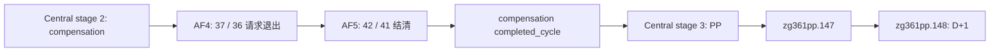

# R400 AF5 路线勘误与独立终态观测

记录日期：2026-09-11（Asia/Shanghai）。本记录承接[方法论评估](../autonomous-agent-progress/retrospectives/2026-09-11-t0-methodology-review.md)，用户已授权执行。初版为源码归因；01:11 更新：R402 已完成真实 AF5 终态与保存，gameplay 日志及受管清理 GREEN。完整 P1 仍待组合签收，P2 LOCKED。

## 已闭合的归因

R400 的 driver-state 已证明真实 `.147` instance 272 被读取，option 1 被提交，事件随后消失。失败点是等待 `zg361comp.1`，不是源事件未加载。更根本的问题是验收把当前生产阶段顺序写反了：

权威调用链：

- [Central stage 1–3 effects](../../mod_zhongguo_style/common/scripted_effects/zg361_phase2_central_005_stage01_03_effects.txt)：stage 2（159 起）完成 compensation 并核对 completed_cycle；stage 3（242 起）才进入 PP。
- [Central dispatch](../../mod_zhongguo_style/common/scripted_effects/zg361_phase2_central_003_dispatch_control_effects.txt)：完成当前 stage 后自增 stage，D+2 pump。
- [PP event](../../mod_zhongguo_style/events/zg361_feedback_promotion_pip_runtime_events.txt)：`.147` option 1 调用 m147 与 T stage 1 dispatcher；[T stage 1](../../mod_zhongguo_style/common/scripted_effects/zg361_feedback_promotion_pip_003_t_stages_01_effects.txt) 安排 D+1 `.148`，没有反向调用 compensation。

因此旧 split-acceptance 与 choreography 中的 `.147 → comp.1/AF5` 不能作为执行路线。不能通过加长等待、仅推进一天或修改生产业务来迎合它。此处未读取 `.147` 存档的 AF 内部状态，源码阶段顺序不冒充该存档的 native 实测。

## 本轮最短真实路径

选用 `Z:/p2r185promo_a_native_state/profile/save games/autosave.ck3`，77,071,385 bytes，SHA-256 `538175DAE47982CF50623288A4B39738D12A973D6FD61EA3220527D979067000`。

历史 `Z:/p2r192promo_resume/report.json` 记录 AF4 authored/native 37/36 于 date_raw 53183256、AF5 旧 route 1 的 40/39 于 53183280。该输入 header 的同字段为 53181960，距首次 AF5 约 55 游戏日；header 仅作选档诊断，加载后仍通过真实 snapshot/query 确认状态。历史 route 1 循环已由当前产品修复，本轮执行 route 3。

复用既有生产时间线驱动与前十三个 compensation 阶段的 route 1 合同，目标改为 `zg361comp.1` 且 authored 42/native 41 可见、可选。不能只按重复 event key 停靠，也不使用会把 AF4 改为 snooze 的 clean-review recovery override。抵达后读取 AF5 前态，执行 42/41，再独立读取终态并保存 checkpoint。失败保留完整阶段 evidence，健康 paused PID 可继续用于 Python 修复后的重试。

## 为何新增独立 AF5 查询

旧 promotion/compensation 查询要求较晚的 `.147` receipt，并要求 portfolio domain 1–3；AF5 关闭立即将 domain 变成 4，D+1 还会移除 volatile subject/stage/domain。它无法独立证明本轮 AF5 结果。这是已有验收故障的观测缺口。

新增只读 `query_zhongguo_compensation_af5_snapshot_v1`，复用 exact-build character-variable ABI，使用仍保留的 `portfolio_result_subject` 解析 subject；volatile subject 存在时交叉核对。仅发布本次判断所需状态，readiness 表示可观测性，terminal 表示业务终态，二者分别判断。

| 对象 | 终态语义 |
|---|---|
| AF case | state=6、active=0；owner/subject/cycle/case 与前态相同，revision 前进 |
| 最后操作 | operation=300、route=3、repurchase_resolved=1、unit_conserved=1 |
| m299、m300 receipts | active=1、consumed=1、route=3、receipt_state=5；四项 identity 匹配 AF case |
| Portfolio | 即刻 domain=4、visible_pending=0；或 D+1 volatile domain 不再存在且 completed_cycle 对应同一 cycle |

终态依据为 [AF barriers](../../mod_zhongguo_style/common/scripted_effects/zg361_compensation_24_af_stage_barriers_effects.txt)、[AF kernel](../../mod_zhongguo_style/common/scripted_effects/zg361_case_kernel_033_domain_af_lti_grant_effects.txt)、[portfolio apply](../../mod_zhongguo_style/common/scripted_effects/zg361_compensation_07b_portfolio_apply_stage_effects.txt)、[portfolio closure](../../mod_zhongguo_style/common/scripted_effects/zg361_compensation_07e_portfolio_closure_effects.txt)。

身份口径：AF case serial 来自独立 kernel cursor，不等于 portfolio result case serial。查询另读 subject `comp_result_case` 与 portfolio result case 对齐；AF receipts 的 case serial 与 AF case 对齐。两组 identity 的 owner/subject/cycle 一致，但不能错误地把两个 case 编号直接判等。

## 交付边界

本轮不改变产品业务顺序，不扩展 361/626 矩阵。AF5 receipt 按现有独立 P1 gate 签收，不附加 `.147` 源动作。整体业务结果、checkpoint 保存与 cleanup 分别保留；cleanup 成功不覆盖业务 RED。实际 live 结果将在取得后追加，之前只报告源码归因与实现进度。

## R401/R402 实机结果（01:11 追加）

代码 `262026d325e3d137e1cf03c46d723aad8bd57f3a` 已提交并推送；执行冻结于 `Z:/ck3_mod_rewrite/_runtime/r401-af5-code-20260911`。产品仍为上文 88076DBF 投影，新 DLL 为 `42149B9A9308812673E002FA193D203AE5C573AEDEEA6F12C89F42AE8CDBDE84`。MCP job `579bc3c4-fad6-49ea-bab7-8db3d4de4d97` 的 preflight 证明 CK3 数量为零；R401 warmup PID 69348 受管退出后，R402 gameplay PID 166928/generation 1 独占执行。

实机从 date_raw 53181960 到 53183280，恰好 55 游戏日；复用原生合同处理 `befriend_outcome.0002` option 3，再执行 AF4 option 37/native 36，并停在 AF5 instance 85。没有回到 `.147`，没有控制台、fixture、OCR 或坐标动作。

| 观测 | 选择前 | 42/41 选择后 |
|---|---:|---:|
| owner / subject / cycle | 32904 / 27448 / 2 | 相同 |
| AF case / result case | 1 / 58 | 相同 |
| case state / active | 5 / true | 6 / false |
| case revision | 19 | 22 |
| last operation / route | 298 / 1 | 300 / 3 |
| portfolio domain | 3 | 4 |
| m299 与 m300 | 尚无 receipt，consumed=false | receipt_state=5、route=3、active=true、consumed=true |

终态 `repurchase_resolved=true`、`unit_conserved=true`，新 provider 的 readiness 与 terminal 均 true。结果来自独立 native 读回；选择 ACK 单独保留，不用于代替业务后置。

证据统一目录：`Z:/ck3_mod_rewrite/_runtime/r401-af5-mcp-20260911/live-artifacts/`。

| 文件 | SHA-256 | 结果 |
|---|---|---|
| `af5-terminal-green.json` | `9408A0962A4A227FA859FF2A36291F0C8BF4B3A5A900C85DF98F98613BE6D6C8` | AF5 GREEN |
| `af5-terminal.ck3` | `FE5BD1D76DE4D0A8B30B1DF58FCCC484693DB58C6BCFC03DB164B5A68B00625C` | 77,617,651 bytes，原生保存并归档 |
| `af5-gameplay-error-scan.json` | `0174D54B530EBB616A99D75E7A64607B1B6DBFF2DEBE4405BD5DB934AA774581` | 本轮完整日志从 byte 0 扫描，blocking diagnostics=0 |
| `09_phase2_native_session_cleanup.json` | `69C841671FAF09FDF730E6F707561180D285307CE7C43E4DCAC19293B7A447B3` | canonical cleanup GREEN |
| `af5-managed-cleanup.json` | `EE76F328CA5640815BEEC37824CF104C29401B10B91AB120FD969DD06E65ABAE` | product GREEN、cleanup GREEN、ck3_pids_after=[] |

本轮完成一个真实 AF5 观察→选择→操作→验证循环。尚未证明该终态存档的冷恢复，也不把本轮 scan/cleanup 冒充全部 P1 的最终收口。下一实机从 R403 递增；由于后续使用不同旧档和新观测候选，R402 已正常受管清理。

组合清单勘误：交接沿用的 L0 计数尚未绑定当前88076DBF候选。已找到的718a60d差异L0为旧8A260E2E产品，旧 assembler引用更早5fad产品；因此暂不直接把交接1/9加成2/9。AF5单项已满足现有门字段，当前候选的L0证据正在按真实增量刷新。

准备阶段出现一次延迟；主线程导入探针 1.2 秒、工作线程导入探针 3.2 秒完成，当前任务随后正常进入 loader。两次短探针没有稳定复现故障，未为此修改导入框架。原始输出保留在本轮 runtime，未改写 R400 失败记录。
