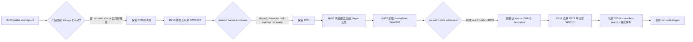

# R408–R414 存档 lineage 准入与多人存档 RED

记录日期：2026-09-11（Asia/Shanghai）。本记录解释为什么 R408 的末端 partial checkpoint、R410 的原始
`SAV0102` 多人存档、R411 的离线单玩家化副本都没有继续充当 P1 输入，以及 R414 为什么改用 R375 的已知
单玩家 `SAV0101` checkpoint。结论只约束存档准入与验收编排，不把失败归因到产品脚本。

## 结论

存档能被 CK3 打开、header 能被解析、离线文本中只剩一个 `played_character`，都不足以证明它是可执行的产品
验收输入。正式准入必须在 exact build 的暂停帧同时取得：

1. `map_ready=true`；
2. 非空且符合预期的 `played_character`；
3. 主线程 mailbox installed/ready、executor enabled、stamp/date 一致；
4. 产品所需事件、角色与阶段 lineage 仍可继续；
5. 后续由原生 MCP 保存成可哈希的 `SAV0101` checkpoint。

R410 与 R412 都停在第 2、3 项之前。R411 只改变了容器里的多人记录，没有生成任何 live admission；R412 的复验
证明这种离线 normalization 不是 local-player restoration。R414 改用已被历史 live artifact 绑定到玩家 `32904` 的
单玩家 checkpoint 后，首次运行即恢复出非空玩家并进入真实事件 drain，证实更换 lineage 是有效变量。

## R408：技术上可续跑，业务 lineage 已失效

R408 从 `96867F547FE1F4FE7C1E4EEAF94E7BB370444930D0644F219EAE830392267D32` 的 partial checkpoint
启动，产品树仍是 `88076DBF403A34427327D0972E4422FBF31365C0F393D02B7DFE3666F75BD3CF`。同一 PID 经过四次
事件合同热恢复后，在 attempt 5 到达 `date_raw=54014184`，玩家已经是 `33596113`，活动事件为
`tgp_dynastic_cycle.0082` instance `2188`。该通知表示 dynastic-cycle chaos 已经打碎本轮 promotion 场景的产品
lineage；runner 正确地分类为 scenario-invalidating interrupt，没有点击唯一按钮后继续伪造原场景。

这个 RED 证明 checkpoint 仍可加载、bridge 仍健康，却已不适合验证原定 P1 终端路线。两者必须分账。

## R410：原始五玩家 `SAV0102` 没有恢复本地玩家

候选源为 26,315,688 bytes，SHA-256
`2C9278D4F5A2707AD23E577D6677EE69673E77876E2F6232349972657CC02261`，metadata 声明日期
`918.10.15`、目标 CharacterID `37884`，并包含五名玩家。R410 使用无自定义 mod 的 exact-build 迁移启动，CK3 到达
`map_ready=true / paused=true / local_player_id=1`，但 snapshot 为：

- `date_raw=51848568`；
- `played_character=null`；
- 主线程 mailbox 未安装、未 ready，executor、stamp 与 application state pointers 均不可用；
- 因而没有调用 save-checkpoint，也没有产出迁移后的 `SAV0101`。

这是 local-player restoration/native-readiness RED。它没有进入产品加载或产品业务动作，不能记成 parser、loader 或
天朝二期产品 RED。

## R411–R412：离线 normalization 不构成准入

R411 对原始压缩 payload 做了有界离线变换：保留 `(CharacterID 37884, local player 1)`，删除另外四组
`played_character` 与 `player_owner`，把 `currently_played_characters` 从五人缩到一人，并把
`meta.number_of_players` 从 `5` 改为 `1`。输出仍是 `SAV0102`，25,091,763 bytes，SHA-256
`F3DAB788081013A757AE1436EB76AC23FFC250A0F7CC5323C0B8D5479F78EBF5`。该操作只产生 derivative，报告本身
明确标记 `not product evidence`。

R412 随后在 exact build 中加载这个 derivative。它再次到达 `map_ready=true / paused=true / local_player_id=1`，但
`played_character` 仍为 `null`，mailbox 与 application-main readiness 同样全部未建立，最终仍没有原生 `SAV0101`
输出。R412 还观察到 `date_raw=43808760`，与源 metadata 声称日期不一致；在玩家身份尚未恢复的前提下，这个读数不能
被解释为成功装载目标 campaign。

因此，header 保持合法和五条记录缩成一条，只能证明离线编辑器完成了预期文本变换。它不能证明 CK3 已把那条记录认作
当前本地玩家，也不能作为再次启动同源字节的理由。

## R414：回退到已知单玩家 lineage

R414 选择 R375 的 145,743,979-byte `SAV0101` checkpoint，SHA-256
`9EB23DAC667190D908EA937A94FAA79E307A0CF38FAFA5EA29A3A875FD9BA35C`。历史 provenance 把它绑定到
CK3 `1.19.0.6`、玩家 `32904`、已确认的 dynastic-chaos acknowledgement 和更晚 live park。

R414 首次 gameplay attempt 在 PID `202268` 恢复玩家 `32904`，并在 `date_raw=53639352` 暂停于真实
`yearly.0003` instance `1064`。这不是 P1 完成证据，但足以证明该 checkpoint 越过了 R410/R412 的 local-player 与
mailbox 准入边界；之后的失败均按实际事件合同逐项处理，而不再归因于存档载入。

## 后续工作流规则

- 先按 source-save SHA-256 去重。`2C9278...2261` 与它的 R411 derivative 已由两次 exact-build live 证明不具备
  local-player admission；没有因果相关的游戏、bridge、恢复算法或存档内容变化时，不再占用 CK3 串行槽。
- `SAV0102` 只表示容器格式。多人元数据、离线 normalization、`local_player_id=1`、`map_ready=true` 都不能单独签发
  玩家身份。
- 迁移成功的最小产物必须是 live `played_character`、健康 mailbox/date binding 与 MCP 原生保存的 `SAV0101` 三者
  同时存在；任何一个缺失都保留 RED。
- scenario-invalidating lineage 与 loader/readiness 分开分类。R408 属于前者，R410/R412 属于后者；清理 GREEN 只证明
  进程回收，不覆盖业务或准入 RED。
- 选择替代 lineage 时，优先使用已有 live provenance 的单玩家 checkpoint。新轮仍需 fresh PID 复核身份与产品状态，不能
  仅凭历史文件名或 header 放行。

## 证据索引

| 证据 | SHA-256 | 说明 |
|---|---|---|
| `p1-terminal-stages-r408-mcp-20260911/live-artifacts/terminal-stages-red-attempt-05.json` | `A21D218B4737B6480791F766A8553859F28222AA919B4104062CB1E85D691F92` | dynastic chaos 使 promotion lineage 失效 |
| `p1-chaos-seed-migration-r410-20260911/live-artifacts/migration-red.json` | `0220734D392AEA9B285E26632F2FC0E13B68336FDDECBF0F423AD90CAEC909EE` | 原始五玩家 source 的 native-readiness RED |
| `p1-chaos-seed-normalization-r411-20260911/single-player-normalized-source.json` | `DAD38C449A24E2A73547E9ED3644D688785B2875A1B74AA4F3431258386F4A0D` | 离线变换 receipt |
| `p1-normalized-seed-migration-r412-20260911/live-artifacts/migration-red.json` | `EA7D202B01875365E1A26475DE34B92158406902A7EAD699C2CF8DFFB2EF5A84` | derivative 的同类 native-readiness RED |
| `p1-post-chaos-terminal-r414-20260911/historical-checkpoint-provenance.json` | `544E08917D1A8F9EA865C5CD0FF347083E3125F8466C2A47C59FE48CA3DADC22` | R375 单玩家 lineage 准入来源 |
| `p1-post-chaos-terminal-r414-20260911/live-artifacts/terminal-stages-red-attempt-01.json` | `7C41E07DA8BD1ACA6F3DB14EF208E35030A63EEAD99D86B7179638FB1A328279` | R414 成功恢复玩家后遇到的首个真实事件 |

R408、R410、R412 与 R414 的 canonical cleanup 均为 GREEN；它们只证明各自受管进程已经回收，不改变上表的
scenario/admission 结论。
