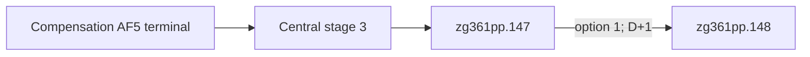

# R564-R567 promotion paused-wait RED and P2 choreography correction

## Result

The third P2 capture attempt remains a failed take. It closed three clean spans,
then selected option 1 on the real `zg361pp.147` source and timed out while
waiting, still paused, for `zg361comp.1`. No continuous eight-span take exists,
so P2 remains **`0/8` accepted clean spans** and the final promotional-video
lock remains in force.

This RED is an acceptance-orchestration defect, not a mod business defect.
The production order had already been closed by the R400 source analysis and
the R402 AF5 live artifact:

`zg361pp.147` option 1 invokes the m147 manager effect and the T-stage-1
dispatcher. That dispatcher schedules `zg361pp.148` for D+1; it has no reverse
edge to compensation. Waiting longer while paused cannot reach `zg361comp.1`,
and advancing the clock to manufacture that obsolete expectation would still
misstate the production stage order.

## Live evidence

Attempt directory:
`Z:\ck3_mod_rewrite\_runtime\p2-capture-r564-r571-c0bb9dc-20260913`

- R564 warm-up was terminated with managed cleanup GREEN.
- R565 was the initial gameplay session. Loader, seed, and the first two clean
  spans were GREEN.
- R566 restored the Stage 10 source. The action cell reached real
  `zg361mg.120`, independently read the terminal native provider, and closed
  clean span 3 GREEN.
- R567 restored the registered promotion source, independently queried real
  `zg361pp.147` instance 272 for played CharacterID `32904`, and submitted
  option 1. The event closed, then the obsolete paused wait timed out with no
  active event.
- R564-R567, FFmpeg and the injector were all terminated. Canonical cleanup is
  GREEN and the current process inventory is empty.

| Artifact | SHA-256 |
| --- | --- |
| top report | `780A4CAE12B5FA2F2A6F90E69184DB13A44F5099DB11E1BCE0E06031B7109173` |
| capture-cell report | `0687728046A77318C5EEDDAF021C31F077E7D8D66ACC9C5F7AD7C0391D720081` |
| Stage 10 GREEN artifact | `661C79D71F00B7FD5E2F63F7FAE6734379AE17FAD05A32179F72349289339314` |
| cleanup | `3BB31706537E6524DBC3A10D8F6C17D4E1E438D1D5E4FE4CE2DFAACF7CA02D64` |
| raw failed MKV, 323,129,193 bytes | `B7E34111CB897830E23E43E078CAEB4B82C7A5B3C8922BB5FBE1686B3656B216` |
| capture manifest | `F1DD3B994E90B29648F31D4916C4BEFDFE3641B562F5BAF01D3EAC22C7EBC2BE` |

The three closed spans in this failed file are diagnostic progress only. They
are not counted as accepted P2 footage.

## Minimum correction

The stable editorial span ID remains `phase2_promotion_compensation`, but its
executable product edge is corrected to the real PP route:

1. restore and independently query exact `zg361pp.147`;
2. select authored/native option 1 with the bound event instance and revision;
3. wait for the source instance to close;
4. set speed 1 and resume the real map;
5. within at most 48 game hours, pause and independently query exact
   `zg361pp.148`;
6. require the same CK3 PID/generation, played owner and saved subject, with
   increasing public/native revisions and a different event instance.

Any unexpected event, player/PID/generation drift, rejected command, date
escape or missing native event identity remains RED. The selection ACK is kept
only as transport evidence. The result event and same-subject saved scopes are
the postcondition.

The P1 AF5 gate remains independent and unchanged. Its accepted R402 native
provider artifact proves the real `zg361comp.1` authored 42/native 41 terminal;
the P2 PP successor does not recreate or weaken that proof.

Focused verification after the correction:

- promotion action-cell tests, runner plumbing, capture choreography and event
  choreography: **43/43 GREEN**;
- Python compilation and `git diff --check`: GREEN.

No mod script, DLL source, public MCP interface, open_kaishek API or dependency
changed. One bounded live retry is required to promote the corrected PP edge
from static-ready to production-live and continue the remaining P2 spans.
