# 《project因果律》系统架构图册

> 副标题：伪天司的辉煌愿景  
> 图册版本：v1（2026-09-19）  
> 权威叙述：[《project因果律》：咒、术、道与辉煌愿景](../project-system-overview.md)

这套图册把项目总纲中的结构和因果关系变成可维护的视觉资产。每张图都同时保存 Mermaid 源文件、适合文档与后期动画的 SVG，以及适合
快速预览、剪辑和社交媒体的 3× PNG。图是总纲的投影，不替代产品合同、ABI 文档、实机 artifact 或 readiness 报告。

## 阅读约定

- 蓝色：制造、协议、MCP 和工具能力；青色：真实产品或实机结果；金色：权威合同、研究与裁决规则。
- 紫色：证据、开发者产品和发布媒介；橙色：循环入口、冲突裁决或下一轮演进；红色：禁止项或必须保留的 RED。
- 实线表示当前体系中已经存在的结构或规定；虚线表示反馈、限制、失败回路或目标态关系，不代表对应能力已经完整实现。
- `open_kaishek` 只承担离线语义加速与认证账本；它的 GREEN 不会自动升级为 CK3 live。
- MCP 的 ACK 不等于动作成功；真实后置状态才是成功。OCR 证明玩家看见了什么，不替代 typed world state。

## 图册目录

| # | 架构图 | 回答的问题 | Mermaid | PNG |
|---:|---|---|---|---|
| 01 | 整体系统 | 咒、术、道、辉煌愿景以及人类如何组成一套系统？ | [源文件](src/01-overall-system.mmd) | [高清图](rendered/01-overall-system.png) |
| 02 | Loop A：玩家产品 | 一项玩法怎样从假设变成真实反馈并进入下一版？ | [源文件](src/02-loop-a-player-products.mmd) | [高清图](rendered/02-loop-a-player-products.png) |
| 03 | Loop B：智能体能力 | 自动玩家怎样由真实 blocker 驱动能力增长？ | [源文件](src/03-loop-b-agent-capability.mmd) | [高清图](rendered/03-loop-b-agent-capability.png) |
| 04 | Loop C：工具与语义 | `open_kaishek`、Runtime、MCP 和差分认证怎样降低成本？ | [源文件](src/04-loop-c-tooling-semantics.mmd) | [高清图](rendered/04-loop-c-tooling-semantics.png) |
| 05 | Loop D：证据与发行 | GREEN 怎样变成可信宣传、可复现发布和外部反馈？ | [源文件](src/05-loop-d-evidence-release.mmd) | [高清图](rendered/05-loop-d-evidence-release.png) |
| 06 | 自动玩家 + MCP | CK3、bridge、MCP、智能体与独立后置验证怎样分层？ | [源文件](src/06-agent-mcp-architecture.mmd) | [高清图](rendered/06-agent-mcp-architecture.png) |
| 07 | 自动化验收 | 从源码到 `open_kaishek`、CK3、智能体、artifact 和发布门怎样闭环？ | [源文件](src/07-automated-acceptance.mmd) | [高清图](rendered/07-automated-acceptance.png) |
| 08 | 权威与证据 | “文档高于测试”如何与“实机事实高于文档”同时成立？ | [源文件](src/08-authority-and-evidence.mmd) | [高清图](rendered/08-authority-and-evidence.png) |
| 09 | 产品族与共享底座 | 多个 Mod、智能体和开发工具怎样共享工程能力而保持产品隔离？ | [源文件](src/09-product-family.mmd) | [高清图](rendered/09-product-family.png) |
| 10 | 权威源与投影 | 为什么改数据源和生成器，而不是手补 generated files？ | [源文件](src/10-source-of-truth-projections.mmd) | [高清图](rendered/10-source-of-truth-projections.png) |
| 11 | 四环飞轮 | 四个 Loop 怎样互相喂养，以及人类为什么始终位于系统内？ | [源文件](src/11-four-loop-flywheel.mmd) | [高清图](rendered/11-four-loop-flywheel.png) |

## 01｜整套系统



这张图用于总览或影片第一张“地图”。从上到下是人的价值判断、道的裁决、术的生产与验证、咒的可见产物；四个 Loop 把产物重新变成
下一轮结构化输入。它刻意不把“辉煌愿景”画成已经完成的无人系统。

## 02–05｜四个无限演进 Loop

### Loop A｜玩家产品



### Loop B｜智能体能力


### Loop C｜工具链与语义认证



### Loop D｜证据、宣传与发行


## 06｜自动游玩智能体 + MCP



核心不是“智能体能调用多少命令”，而是观察、动作和独立验证是否都绑定同一 exact build、generation 与 stable identity。查询先于动作；
动作返回的 ACK 只描述执行阶段；Verifier 必须从下一 paused frame 或玩家可见结果重新判定。

## 07｜整套自动化验收


`open_kaishek` 在 CK3 启动前尽早淘汰确定性错误。它无法覆盖的语义被明确记为 `NOT_APPLICABLE` 或 `UNSUPPORTED`，然后交给真实 CK3、
Official MCP、智能体或产品 runner 裁决。无论 GREEN 还是 RED，流程都必须受控回收现场并保留可复核证据。

## 08–11｜支撑理解的补充架构

### 权威与证据的双序关系


### 产品族与共享工程底座



### 单一权威来源与派生投影



### 四环咬合飞轮



## 修改与渲染

只修改 `src/*.mmd`、`mermaid-config.json` 或 `architecture.css`。渲染物由脚本统一生成，不直接修补 SVG/PNG：

```powershell
py tools/render_project_causality_architecture.py
py tools/render_project_causality_architecture.py --check
```

渲染器固定为 `@mermaid-js/mermaid-cli@11.12.0`。`render-manifest.json` 记录主题、源文件、SVG、PNG 的 SHA-256 和画布尺寸；`--check`
用它发现 Mermaid 源与图片不同步。视频后期优先使用 SVG，剪辑软件不兼容 SVG 时再使用对应 PNG。
