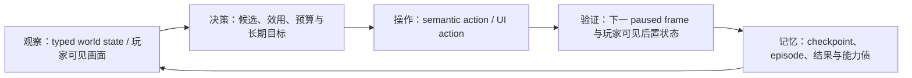
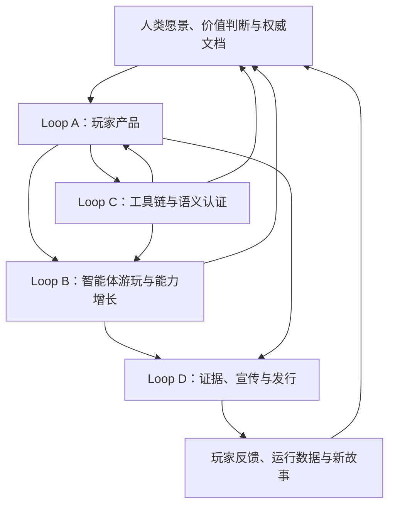

# 咒、术、道与辉煌愿景：CK3 项目体系总纲

> 状态：项目级总纲
> 覆盖范围：本仓库及 `open_kaishek`、Promo 等附属工程
> 最近整理：2026-09-18（Asia/Shanghai）

## 0. 本文回答什么

这不是某一个 Mod 的功能说明，也不是某一次版本发布的进度报告。本文描述的是整个项目体系：它正在生产什么、依靠什么方法生产、
用什么原则判断真伪，以及最终要演进成怎样的一套自动化内容工业。

整套体系可以分为四层：

| 层次 | 回答的问题 | 主要内容 |
|---|---|---|
| **咒** | 最终用户现在能看见、使用或运行什么？ | Mod、自动玩家、开发者工具、实机素材、发布包 |
| **术** | 这些产物如何被设计、制造、测试和操纵？ | 文档组织、生成器、MCP、智能体、OCR、验收、发布方法 |
| **道** | 为什么要这样做，发生冲突时以什么为准？ | 文档先行、证据等级、版本边界、价值优先、知识沉淀 |
| **辉煌愿景** | 当所有部分闭环后，项目最终会成为何物？ | 四个无限演进 Loop 驱动的自动化内容生产、测试、核验与发行体系 |

这里的“咒、术、道”不是成熟度高低，而是同一系统的三个观察角度：

- **咒是结果**：玩家和开发者能够直接调用的能力。
- **术是过程**：稳定重复地产生结果的方法。
- **道是约束**：让过程不会在规模扩大后失真、失控或失去目标的原则。
- **辉煌愿景是方向**：让结果、过程和原则形成能够长期自我增强的飞轮。

本文不会替代任何产品专题、ABI 合同、测试报告或冻结 artifact。涉及精确版本、当前 readiness、命令和发布哈希时，仍以对应专题与
实机证据为准。

---

# 一、咒：直接可见的产品与能力

“咒”是工程已经投射到 CK3、开发者工具或公共发行渠道中的可见形态。最终用户不需要先理解状态机、生成器或 ABI；他首先接触到的
应当是一个能玩的 Mod、一项能执行的智能能力、一段真实的演示，或一个可以运行的工具。

## 1.1 《琉焰卿的永恒轮回》：旗舰 Roguelite / New Game+

《琉焰卿的永恒轮回》把 CK3 的一段统治者人生改造成有明确开始、成长、终点和跨局积累的挑战：

> 一位统治者，一条命，一次结算；死亡不是读档，而是下一次轮回的资本。

玩家在开局接受琉焰卿的“终末之契”，随后围绕一整套轮回机制游玩：

- 选择绝对或本世成长赛道，以及余烬继承比例；
- 通过“琉焰之视”成长特质观察当前分数并获得累积能力；
- 周期性从祝福中选一项，再从诅咒中承担一项；
- 接受征服、织网、圣徒、家主、蓄王或享乐者等本世契约；
- 在“琉焰账簿”中查看当前分数、历史余烬位阶、下一阈值和契约纪录；
- 在轮回当铺中购买属性、资源、借命、重抽、封印及高阶强化；
- 使用付费廷臣定制器生成符合当前宫廷、文化、信仰和家族要求的角色；
- 在签约统治者死亡时完成逐项计分和最终结算；
- 将量化后的余烬位阶写入跨存档存储，在下一世导入并消费。

该产品的设计重点不是让一个普通 CK3 存档无限延长，而是让“一生”成为可比较、可复盘、可再次挑战的完整 episode。有继承人时，
结算后进入观察者模式；没有继承人时，通过原生继承窗口投影展示结算并回到主菜单。玩家不能把后代当成同一局继续扮演。

### 使用方式

- 通过 Steam Workshop 或正式 release staging 安装。
- 在游戏规则中启用本 Mod；接受契约后功能才进入玩家角色链路。
- 必须开启 CK3 教程（reactive advice）。跨存档持久化利用 `tutorial.txt` 中的课程完成位；关闭教程后可以读取已有记录，
  但无法可靠写入新纪录。
- 正式产品只面向真人玩家；AI 没有入口。

主产品的权威玩家说明在
[`docs/products/eternal-recurrence.md`](products/eternal-recurrence.md)，仓库根目录 `README.md` 作为整个项目体系的入口；
机制细节分别落在计分、契约、奖池、持久化、GUI 和发布专题中。玩家手册不放进 Mod 源目录，以免违反正式构建 allowlist。

## 1.2 《典造琉焰廷臣·白绮特供版》：独立廷臣创造产品

白绮特供版把旗舰 Mod 中的付费廷臣定制能力拆成一个完全独立的产品。玩家可以配置：

- 年龄与六项基础能力；
- 原版教育、人格、遗传、健康等特质；
- 文化、信仰和性别等身份；
- 出身卑微或归入玩家家族；
- 最终价格、交付位置和宫廷归属。

它只负责“配置、计价、创建、交付、扣费”这一条原子链，不包含轮回、契约、祝福、诅咒、分数、余烬、教程位或跨存档依赖。

### 使用方式

- 可以单独启用，也可以与旗舰产品同时启用。
- 拥有自己的 `ervc` 命名空间、独立 Workshop 身份、27 文件发布 allowlist 和验收矩阵。
- 双 Mod 场景会分别保留各自的窗口状态和扣费，不因加载顺序互相覆盖。
- 仅真人玩家能够使用，AI 没有决议入口。

详细合同见 [vivhite-courtier.md](vivhite-courtier.md)。

## 1.3 《天朝特色361制官员绩效考核》：大型制度模拟产品

“天朝 361”把现代组织里的强制分布、绩效校准、PIP、晋升、HC、申诉、组织政治和末位淘汰映射到 CK3 天朝官僚体系。

当前玩家可见的核心循环包括：

- 公爵及以上天朝制领主考核自己的直属官员；
- 按属地效率、贤能、成长、上级评价、忠诚、罪行、派系和玩家决策计算 KPI；
- 对成熟队列执行 30% / 60% / 10% 的 3.75、3.5、3.25 强制分档；
- 举办京察与绩效校准，处理边界名单；
- 对优秀者奖励、对末位者罚没并进入 PIP；
- 执行晋升、免费夺爵、致仕、降岗留用或再留一年；
- 通过持久考核榜查看名次、KPI、档位、连续次数和 PIP/晋升状态；
- 逐项配置编号 001–361 的政策卡，使选择进入共享组织账并回流到后续考核。

必须区分公开版与开发线：公开 0.3.0 中，361 张政策卡已经进入真实配置与账本链，但不等于 361 项各自拥有一套完整小游戏；master
的 v0.4.x 已接入首批案卷、送达、申诉、事实档和个人清算纵切，当前仍按各专题声明的静态/实机边界验收，不能提前宣传为 38 个领域
状态机全部完成。

### 使用方式

- 作为独立 Mod 启用，主要面向天朝制角色。
- 真人玩家通过京察、榜单、政策卡和结果事件参与；AI 领主走后台考核链。
- 这是主项目“AI 不得触发”的明确授权例外：符合条件的 AI 天朝领主也执行完整考核与处置。

该产品既是玩家内容，也是生成器、批量实机验收、Promo 和 `open_kaishek` 的首个大型业务客户。

## 1.4 《牛来》：小型趣味决议产品

《牛来》是一个范围很小、边界清晰的独立决议 Mod。统治者可以召来一名具有鲜明外观和高勇武的勇士，使其：

- 成为当前宫廷的廷臣与强制骑士；
- 在条件允许时担任零薪资勇士；
- 与统治者的成年配偶或侧室建立关系与秘密；
- 对决议发起者启动勾引阴谋；
- 通过带姓名和肖像的事件向真人玩家确认交付结果。

### 使用方式

- 满足统治者与已婚条件时，在独立决议组中使用。
- 真人玩家可直接选择招募或拒绝。
- 这是另一个明确的 AI 例外：所有层级 AI 每 12 个月检查一次需求，但招募权重很低；执行后的冷却严格为一年，不能扩大。

详细说明见仓库中的 `ox_here/README.md` 和 [court-position-mechanics.md](court-position-mechanics.md)。

## 1.5 《XenoAmess的体验优化》：独立实用工具 Mod

该产品把不适合塞进大型玩法 Mod 的高频操作改造成可选择、可关闭的玩家工具。当前开发树包括：

- **自动选择继任**：避免玩家本人被选为下属行政制领地的 appointment 继承人，其他候选、资格和分数保持原版规则；
- **别把封臣给我**：阻止行政制直属领主通过“授予封臣”把待转移角色塞给玩家，关闭后恢复原版行为；
- **自动召集防御援军**：被宣战时召集当下可免费加入的合法 AI 盟友和关系方；
- **批量要求改信**：按原版接受值门槛向领内合法目标发出请求并汇总结果；
- **批量牵制索款**：复用原版互动，按足额或现有资金模式批量结算；
- **批量赎囚**：对愿意付款且仍有能力付款的角色逐笔重验并结算；
- **批量附条件释放**：为每名囚犯选择牵制、招募、改信中数量最多的兼容组合。

### 使用方式

- 在“决议”面板的专用分组中开启、关闭或执行。
- 前两项只面向受支持政府的独立真人统治者；通用批处理向真人统治者显示，并逐个复用对应原版互动门禁。
- 它代表“小而明确、默认不侵入、随时可回退”的工具型产品路线。

当前开发树为 1.1.0；Workshop 公开版与开发版可能处于不同阶段，精确发布状态以产品 README、验收报告和下载缓存为准。

## 1.6 《自动升级建筑（XenoAmess维护版）》：上游维护与大规模原版投影

这是经原作者授权维护的独立 Mod。玩家开启后，唯一全局循环每 15 个游戏日检查一次玩家直属地产，对具有下一等级且满足原版条件的
建筑每轮最多即时升级一级。

当前产品覆盖 CK3 1.19.0.6 中 605 条普通建筑升级边，并提供：

- “只用国库”“只用个人金钱”“优先国库”三种资金策略；
- “超直辖暂停”或“超直辖继续”策略；
- 原版金币、威望、虔诚和 scripted cost 形状；
- 对住所、游牧地产、曼荼罗 Great Project、空槽、施工中或无下一等级建筑的明确排除；
- 对上游角色 flag 和旧存档行为的兼容。

它展示了另一类产品工程：先冻结并标明上游来源，再从 exact-build 原版建筑定义生成 43 条建筑链的完整升级图，而不是手工维护数百条
易漂移规则。正式使用通过独立 Workshop 项或 release staging，AI 不能启用。

## 1.7 《重整河山》：天命崩解与后朝复辟

《重整河山》修改《溥天之下》的中华霸权崩解循环。启用默认规则后，进入“群雄割据”时，旧天子失去中华霸权，但保留个人领地、
其他头衔和最终选择留朝的直属封臣，并以动态“后＋原朝号”霸权延续失国政权。

玩家可配置尊王诸侯是一律留朝，还是根据战争、私怨、朋党、好感、性格、实力、合法性和恐惧进行一次性判断。后朝持有者不能直接使用
原版“宣称天命”；重新控制足够的中华法理伯爵领后，才能“宣称复辟”，复用原版天命公共效果恢复霸权。三、四期进一步闭合了跨代继承、
三省六部留任、外交附庸和“新近自立”边界。

### 使用方式

- 依赖《溥天之下 / All Under Heaven》的天朝和王朝循环内容；
- 通过游戏规则选择“重整河山”或完全保留原版群雄割据；
- 0.4.0 已按产品合同完成发布，精确状态以产品 README 和 fresh-cache 证据为准。

## 1.8 《肃清曼荼罗伪信》：全图政府与地产清理规则

这是一个独立、规则驱动的 CK3 Mod。默认启用时，它在全图移除曼荼罗政府和 Temple Citadel 地产，并把之后成功发生的 AI 曼荼罗
转制重新导向公共政府变更钩子，同时保留周期 sweep 作为兼容回退。

### 使用方式

- 通过游戏规则决定是否启用；
- 它改变的是整张地图的制度环境，而不是只给玩家角色增加一枚决议；
- 正式发布必须使用专用 release builder 生成的 15 文件 staging，测试夹具和开发 README 不进入 Workshop 包。

## 1.9 《驱策朝贡国》：宗主向朝贡国下达扩张指令

该独立 Mod 允许玩家宗主选择一个直属 AI 朝贡国和相邻目标，下达单县扩张指令：

- 有效命令消耗 150 威望；
- 朝贡国可以拒绝，也可以接受并立即发动专用征服战争；
- 可选军费补贴为朝贡国十二个月收入，并限制在 50–500 金；
- 只有合法接受后才转移补贴，拒绝和非法路径不错误扣费。

### 使用方式

- 玩家通过正常产品入口选择朝贡国、目标和是否补贴；
- 正式运行树为 16 文件 staging；
- 发布状态、截图与公开回读以对应 acceptance、Workshop 和 release 文档为准。

## 1.10 CK3 自动游玩智能体：正在成长的玩家能力

自动游玩智能体的终极目标，是在 exact-build 原生桥之上长期、无人接管地游玩 CK3：从开局选择开始，跨和平、战争、事件、家庭、
统治、死亡和继承完成自然 campaign，并通过多局经验改善策略。

它不是固定脚本，也不是若干命令的集合。其基本闭环是：



### 当前真正具备的能力形态

当前工程已经拥有大量基础设施、若干 production-live primitive 和部分有界 production-live loop，包括但不限于：

- 隔离 profile、production 投影、进程监督和受控回收；
- 地图就绪、玩家、日期、暂停、调速和有界时间推进；
- checkpoint 保存、冷恢复和身份校验；
- 原生快捷键、OCR、模板与少量鼠标输入组成的视觉控制；
- campaign root、feature manifest、头衔地图导航等 typed query；
- 既有战争中的部分集结、路线、移动、围城、接敌、战斗观察、撤退和终局观察；
- 部分事件窗口、通知和人物互动的读取与有限处理；
- 婚姻关系和最小候选动作；
- 一代制死亡结算 snapshot、分数与纪录读取；
- action/result、checkpoint、artifact 和能力债的持续记录。

在完整寿命层面，固定 production seed 的第一代与第二个完整寿命已经 GREEN；第二次还完成了
`death-terminal → start-next-episode → exact seed reload → 新 episode gameplay → durable checkpoint`，进入第三个 episode。
这证明同一冻结条件下可以无人接管地重复完成全寿命循环，但不代表不同 ruler、政府、DLC 或普通 campaign 跨继承已经全面覆盖。
现行 G2 以八项可见 OODA 里程碑为固定分母，稳定状态为 `1/8`，其中实体发现与 core turn bundle 已完成双场景 production-live 验收。

### 当前不能宣称的内容

- 不能称为完整高智商 CK3 玩家；
- 不能称为已经覆盖所有事件、战争、经济、婚姻、继承、外交、谋略、活动和 DLC；
- 不能把单个 fixture、单次 ACK 或局部战斗循环扩大成完整 campaign；
- 不能把视觉固定剧本冒充通用世界发现；
- 不能把同一冻结 seed 的两个完整寿命扩大成多 ruler、多政府、多 DLC 或普通 campaign 跨继承自治。

精确现状以 [自动游玩智能体进度中心](autonomous-agent-progress/README.md) 和
[终极目标与路线图](autonomous-agent-progress/goal-and-roadmap.md) 为准。

### 使用方式

目前它首先是本机研发与验收系统，不是普通玩家双击即可使用的消费级发行物。开发者通过专用 runner、MCP server、operator MCP、
隔离 userdir、production bridge 和冻结 checkpoint 启动不同能力单元；正式计分局、工程调试局和 fixture 验收局具有不同权限和证据口径。

## 1.11 `open_kaishek`：开发者可见的独立开源脚本工具链

`open_kaishek` 的目标不是重写 CK3，而是提供一条可以独立运行的 Paradox 脚本工具链：

```text
原始字节
→ lossless CST
→ profile-aware validation
→ strict IR
→ finite world runtime
→ execution trace / state delta
→ CK3 MCP differential certification
```

它面向 Mod 作者和本项目自身，计划交付：

- 保留顺序、重复键、注释、BOM、换行和源码位置的 lossless parser；
- 按游戏、版本、目录、作用域和加载规则工作的 validator；
- 只接受白名单语义的 strict IR；
- 具有 typed scope、变量、事件队列、确定性时钟和 DrawTape 的有限 Runtime；
- snapshot、trace、read/write set 和 normalized delta；
- CK3 1.19.0.6 与 361 profile；
- 纯 Java CLI 和框架外层集成服务。

`open_kaishek` 现在按独立仓库和独立 `main` 演进，由父项目在真实 adapter、API、profile、fixture 或 Paradox corpus 发生变化时同步兼容
合同和 pin。它已经承担实际 parser/preflight、schema slice、CLI 与父仓兼容验证，但 certification 必须按 capability 单独声明；完整
361 corpus 中仍存在的未知 opcode 不能被静默加入宽松 allowlist，也不能据此宣称完整 CK3 Runtime 或普遍语义等价。未知 opcode、
版本不匹配或缺失字段必须显式返回 `UNSUPPORTED`。

## 1.12 CK3 家徽编辑器：面向玩家的独立 Web 产品

CK3 家徽编辑器是 Vue 3、Element Plus 与 TypeScript 实现的纯前端工具。玩家可以：

- 解析、编辑和确定性序列化 CK3 coat-of-arms render description；
- 编辑 pattern、三通道颜色、emblem、mask、instance、受限 texture 和已验证的 parent；
- 在浏览器本地导入 PNG/JPEG/WebP，并用 CK3 原生 DDS 元素拟合重建；
- 暂停、恢复、取消大预算搜索，比较质量与复杂度，导入导出项目；
- 将最终文本复制到 CK3 原版“从剪贴板粘贴”入口。

生产网页不安装、启动或连接 CK3，不依赖 MCP、Java、Python 或本机服务；用户图片和拟合内容不上传。GitHub Pages 在 master 变更后执行
素材包校验、单元测试、独立浏览器验收和 production build，再部署在线版本。Native bridge 与 MCP 只用于开发期验证 Apply/Copy、
大文本运输和原生渲染边界，不进入生产网页。

## 1.13 CK3 Workshop MCP：发布自动化产品

`ck3_workshop_mcp` 把 Workshop 发布拆成互相隔离的能力层：

- typed WAL 状态机与 fake provider，用于计划、幂等和恢复合同；
- Paradox Launcher UI Automation，通过可访问控件树调用语义控件，不依赖 OCR 和屏幕坐标；
- Steamworks flat API 通道，用于符号探测、当前 AppID/用户只读 probe，以及带 durable receipt 的创建和更新。

它不读取密码、Cookie、Steam Guard 或登录凭据，而是使用操作者已经建立的 Steam Client 会话。发布计划把 staging manifest、描述、预览图、
目标 ID、元数据和操作类型绑定进哈希；create 和 submit 的不可逆边界先写入 durable receipt，未知回调禁止自动重试。真实 native MCP 路径
已经成功创建并更新 Workshop 条目，但 UIA、WAL provider 和 native provider 的 readiness 仍分别声明，不能把其中一层的成功外推到全部。

## 1.14 Promo、Workshop、Release 与能力展示

项目的可见产物不止游戏代码，还包括：

- Steam Workshop 页面、描述、缩略图和媒体条；
- GitHub Release、deterministic ZIP 和 manifest；
- 产品宣传片、实机截图和双语字幕；
- 自动玩家月度全能力 show-off；
- 实机 acceptance 报告、JUnit、evidence index 和冻结 artifact；
- 日报、周报、月报和 capability roadmap。

Promo 不是开发结束后随意剪一段视频，而是将“真实完成的能力”转化为可传播、可核验、不过度宣称的公共成果。361 宣传工程维护权威
脚本、分镜、shot list、实机 marks、视觉审计和成片门禁；《重整河山》则通过可复用 `xar-promo` 工具链管理 project config、
音乐权利声明、全桌面实录、证据 bundle、连续 1× 人工观看和 release export。自动玩家的月度 show-off 用于汇总截止时的真实能力。

Promo 能力存在不等于当前自动获得录像或发布授权。项目所有者可以暂停某一周期的宣传工作；暂停期间保留脚本、工具和历史素材，
但不能自行启动录制、导出或发布。

---

# 二、术：生产、观测、测试与交付的方法

“术”回答如何把想法稳定变成产品，如何在 CK3 这个封闭且版本敏感的宿主中获得可用的观察和动作，以及如何证明这些能力真的存在。

## 2.1 文档如何组织

文档不是事后说明，而是不同角色共同施工时的共享状态和规范入口。各类文档职责如下：

| 文档类型 | 解决的问题 | 典型位置 |
|---|---|---|
| 项目总纲 | 整体为何存在、各子系统如何关联 | 本文、根目录 README |
| 产品合同 | 玩家得到什么、明确不包含什么 | 各产品 README、专题文档 |
| 机制权威定义 | 公式、池、状态机、命名与边界 | `docs/` 对应专题、数据 schema |
| 原生 AI 专题 | 原版行为、证据等级、unknown 分支 | `docs/ck3-native-ai/` |
| ABI / MCP 合同 | exact-build 对象、字段、查询、动作与错误 | native 专题与 research JSON |
| 测试流程 | 怎样运行、怎样判 GREEN/RED、保存什么 | `docs/testing-workflow.md` |
| 发布合同 | allowlist、staging、Workshop、素材和标签 | `workshop/`、release checklist |
| 进度报告 | 现在会什么、缺什么、下一步是什么 | `docs/autonomous-agent-progress/` |
| 现行状态投影 | T0/T1/T2、CK3 单实例、RED 与跨仓同步状态 | `docs/project-state/current-state.json` |
| 语法知识 | CK3/Paradox 语法和引擎踩坑 | `docs/grammar/` |

### 文档编写规则

一份可施工的文档至少应说明：

1. 目标与非目标；
2. 适用版本和 exact-build 身份；
3. 权威对象、字段和状态；
4. 输入、输出、权限和错误语义；
5. 已知证据等级；
6. 未闭合分支和绕开方案；
7. 验收条件与 artifact 入口；
8. 后续替换或扩展位置。

文档中的 `unknown` 不能被涂成成功，也不能成为无限延期的终态。它应当对应一个可以继续逆向、补观察口或构造实机样本的施工入口。

## 2.2 从权威数据生成内容

凡是大规模、重复或需要多处同步的结构，都应建立单一权威数据源：

```text
产品合同 / schema / 数据表
→ 生成器
→ CK3 脚本、GUI、本地化、测试向量和权威文档
→ 静态 parity 检查
```

本项目已有的典型模式包括：

- 计分 schema 同时生成死亡计分 effect 和 trait hover 预览；
- 奖池数据同时生成条目、dispatcher、权威表和冻结语义契约；
- 契约数据生成契约、PB、图鉴、里程碑事件和成长 trait；
- 原版 trait 快照生成廷臣目录、元数据和冲突关系；
- 361 DomainSpec 和机制选择数据生成成组 Runtime；
- 源 PNG 通过确定性投影生成 CK3 所需的 DDS 或发布 thumbnail；
- build 工具从开发树渲染 production-only staging。

生成结果带有 `GENERATED FILE` 标记时不得手工修补。否则下一次生成会覆盖补丁，并让代码、测试和文档重新分叉。

## 2.3 静态测试、离线执行与真实 CK3 的分工

可以把验收分成四层：

1. **静态层**：编码、BOM、路径、引用、schema、生成 parity、manifest、deterministic build；
2. **离线语义层**：纯模型、replay、property test、`open_kaishek` finite Runtime；
3. **实机能力层**：真实 CK3 loader、GUI、native query/action、存读档和后置状态；
4. **产品与长期层**：真实 production 投影、正常玩家路径、长跑、死亡结算、Workshop 下载物与宣传素材。

低层通过不能自动推出高层通过。例如：

- parser 能解析，不代表 CK3 会加载；
- validator 无错误，不代表 effect 语义正确；
- Runtime fixture 自洽，不代表与 CK3 等价；
- MCP 收到 ACK，不代表动作成功；
- fixture-live 不代表 stock production-live；
- 一次成功不代表跨场景、跨冷恢复或完整领域完成。

反过来，也不应该为一个已经由真实 artifact 回答的问题反复启动 CK3。已有证据没有改变时，直接复用并继续下一个工作包。

## 2.4 怎样构建 MCP

MCP 是智能体和验收系统的能力平面，不应退化为一组无类型的内存读写接口。

### 2.4.1 分层结构

```text
CK3 原生对象与调用链
→ exact-build C++ adapter
→ 主线程 mailbox / named pipe
→ typed wire schema
→ Python driver / service
→ MCP query 和 semantic command
→ planner、runner 或 operator
```

### 2.4.2 查询能力的最小合同

每个查询至少需要定义：

- capability 名称与 schema 版本；
- CK3 版本、EXE SHA 和 adapter 身份；
- 查询发生在哪一帧、哪一 generation；
- 返回对象的 stable identity 与 process-local identity；
- 字段是合法零值、不可用、读取失败还是尚未实现；
- readiness 的合取条件；
- 允许的空集合与真正缺失之间的区别；
- 超时、stale、版本不匹配和 unsupported 的错误语义。

查询首先应当是只读的。只有观察已经足以支持一个有价值决策后，才为对应动作增加写路径。

### 2.4.3 动作能力的最小合同

每个动作至少需要：

1. 在同一 generation 中重新验证 actor、target 和合法性；
2. 绑定明确的 semantic action，而不是暴露任意函数地址或任意内存写；
3. 在正确线程和引擎阶段执行；
4. 返回“已接收、已拒绝、已执行、待确认”等不同状态；
5. 通过新的 paused frame 或结构化后置状态确认结果；
6. 对 stale identity、重复请求和恢复后的旧 token 明确拒绝；
7. 把动作前后状态、错误和耗时写入可复现 artifact。

**ACK 不是成功。** 成功必须由游戏的新状态定义。

### 2.4.4 MCP 不应该成为万能后门

不应提供“任意地址读写”“任意 effect 执行”或“遇到未知就按默认值继续”的通用入口。这样的接口短期看起来方便，长期会让版本边界、
不作弊边界和语义证据全部失效。新增 capability 应对应真实产品或自动游玩 blocker，并以最小必要面发布。

## 2.5 怎样构建智能体

智能体采用可替换 backend、统一状态模型和分层 planner：

| 层 | 职责 |
|---|---|
| Supervisor | 启动、窗口绑定、进程回收、超时、隔离现场 |
| Perception | OCR、模板、GUI 状态、typed MCP query |
| World model | 角色、头衔、资源、战争、事件和长期目标的统一表示 |
| Candidate generator | 列出当前合法且可验证的动作 |
| Planner | 比较收益、风险、机会成本、不确定性和长期目标 |
| Executor | 选择 native semantic action、快捷键或鼠标路径 |
| Verifier | 读取新状态，判断成功、失败、阻塞或环境异常 |
| Episode manager | checkpoint、死亡、结算、下一局和冷恢复 |
| Memory / reviewer | 保存经验、反例、能力债和下一局假设 |

### 能力施工顺序

当智能体因为缺少 CK3 内部状态而无法做出高价值决策时，默认顺序是：

```text
冻结 exact build
→ 阅读原版 AI 数据并逆向对应调用链
→ 画出原生决策树和 unknown 分支
→ 增加只读 native observation
→ paused snapshot 实机验收
→ 增加最小 semantic action
→ 接入 planner
→ production OODA 验收
```

原生 AI 树是输入账本，不是必须照抄的策略。树落盘后，可以先实现足以解除整局 blocker 的确定性策略；未采用的原生输入和质量差距
必须进入能力债，之后再依据真实 outcome 校准。

## 2.6 OCR 与 MCP：何时使用、何时互证、何时禁止

OCR 与 MCP 解决不同问题：

- OCR 回答“玩家实际看见了什么”；
- MCP 回答“游戏中可被正式 capability 表达的结构化状态是什么”；
- 两者互证时，可以回答“结构化对象是否正确投影成了玩家界面”。

### 2.6.1 必须或优先使用 OCR 的情况

- 验证窗口、按钮、tooltip、文本、图标、布局、遮挡和 modal；
- 验证 localization 在当前语言中是否真实渲染；
- 验证 MCP 导航或动作是否把正确对象展示给玩家；
- 验证同名角色、头衔等 identity 与画面选择是否一致；
- 验证宣传素材中出现的是正常产品 UI，而不是 fixture 或测试入口；
- native observation 尚未存在时，临时获得玩家可见状态；
- 正式无隐藏信息计分局中读取只能由玩家界面获得的内容。

### 2.6.2 必要时用 OCR 测试 MCP 的情况

以下能力仅有结构化回执仍不足，必须增加视觉侧证：

1. **地图导航**：MCP 报告 camera settled 后，用截图确认目标头衔确实居中或被正确选中；
2. **打开窗口或切换面板**：查询到 window/context 不足以证明玩家可见实例、层级和文字正确；
3. **事件选项**：native index、shown/enabled 与界面顺序、按钮文案需要对齐；
4. **角色和头衔身份**：stable key 与实际肖像、姓名、徽章或地图位置需要独立对应；
5. **玩家可见后果**：MCP 可以证明底层状态改变，OCR 负责证明结果被产品正确展示；
6. **公开信息边界**：若计划让正式智能体通过 MCP 读取某字段，应先证明它与玩家可见信息等价，而非隐藏信息泄漏。

OCR 在这里不是第二套权威世界状态，而是对“呈现与映射”进行独立验收。

### 2.6.3 应优先使用 MCP、避免依赖 OCR 的情况

- 精确日期、CharacterID、Title key、WarID、CombatID 和 generation；
- 同名对象消歧；
- 大列表、边界值和批量状态组合；
- paused frame 的精确前后差分；
- checkpoint 冷恢复后的对象重新绑定；
- OCR 难以稳定读取但属于合法 observation 的数值；
- 需要快速重复执行的回归矩阵。

此时仍可保留少量视觉 smoke，但不应让像素识别承担 typed state 的全部职责。

### 2.6.4 必须严禁 MCP 的情况

- 正式有效计分局中，MCP 会泄露玩家无法正常获得的隐藏 scope、随机结果、AI 内部权重或未来状态；
- 使用 debug、selftest、acceptance 或 fixture command 改变正式游戏结果；
- 通过任意内存写、控制台或直接 effect 绕过玩家正常合法性、费用或时间；
- 用 MCP ACK 代替真实后置状态；
- 用结构化查询声称 GUI、字体、文本或画面已经正确渲染；
- 用测试专用数据、临时角色或验收规划器伪装成宣传片中的正式玩法；
- 在 capability 尚未证明只暴露玩家可见信息时，把它接入不作弊 benchmark 策略。

### 2.6.5 运行模式必须隔离

| 运行模式 | MCP | OCR/UI | 能否进入正式成绩或宣传 |
|---|---|---|---|
| 逆向/开发诊断 | 允许广泛诊断能力 | 按需 | 否 |
| Fixture 验收 | 允许测试 capability | 需要时互证 | 只能作为 fixture 证据 |
| Production 能力验收 | 只允许正式 capability | 玩家可见结果必须验证 | 可证明对应窄能力 |
| 正式不作弊计分局 | 仅允许已证明不泄露隐藏信息的 surface | 正常玩家界面和动作是边界 | 可以 |
| Promo 实录 | 可用于编排和证据采集，不能进入画面或改变产品结果 | 必须证明最终画面干净 | 通过审计后可以 |

## 2.7 `open_kaishek` 的方法

`open_kaishek` 将 Paradox 脚本能力拆成互不冒充的证据层：

| 状态 | 含义 | 不能推出什么 |
|---|---|---|
| `parsed` | 可以生成并回放 CST | CK3 会加载或语义正确 |
| `validated` | 已知 profile/schema 检查通过 | effect 会产生目标结果 |
| `runtime-fixture` | synthetic snapshot 执行通过 | 与 CK3 等价 |
| `differential-certified` | exact build 同场景 delta 一致 | 其他版本、输入和组合也正确 |
| `product-live` | 真实产品路径通过 | 整个 Runtime 可以取代 CK3 |

每个受支持 opcode 都需要定义 scope、输入、状态转换、错误、trace 和读写集；随机由有限 DrawTape 显式提供；同一输入和 draw tape 必须可
重放。原生金币、modifier、职位或不可离线重现的候选物化通过显式 port 处理：测试注入、真实 MCP 或
`UNSUPPORTED_NATIVE_OPERATION`，只有这三种合法结果。

361 是首个业务 profile，因为它同时包含状态机、权限、期限、收据、资源、配额、HC、晋升和跨周期逻辑，足以证明有限 Runtime 的
价值，又不要求先模拟整个 CK3 世界。

## 2.8 实机验收的方法

正式实机验收遵循以下模式：

1. 冻结 CK3 版本、EXE SHA、playset、Mod tree、配置和 runner；
2. 构建 production-only staging，而不是直接加载开发树；
3. 创建一次性 `-userdir`，不读写真实玩家存档和工坊缓存；
4. 串行启动 CK3，完成场景动作并保存原始日志、截图和结构化结果；
5. 用实际后置状态而非 debug marker 或 ACK 判断能力；
6. 区分 harness RED、environment RED 和 capability RED；
7. 退出后确认进程回收和保护现场不变；
8. 保存 report、JUnit、hash manifest 和必要的 live artifact；
9. 已有证据足以回答问题后停止重复验证。

CI 只执行静态、生成、构建和离线测试。官方 runner 没有真实 CK3、Steam 授权和可靠交互桌面，不能声称完成实机等级。

## 2.9 Promo 的方法

宣传与能力展示从一开始就被当成结构化产品：

```text
权威文案与能力边界
→ storyboard
→ shot list
→ GREEN 实机集中录制
→ timeline marks / evidence index
→ 素材哈希和来源绑定
→ OCR 与画面污染审计
→ 配音和双语字幕
→ 编码
→ 媒体、字幕和内容抽检
→ 正式发布
```

Promo 必须满足：

- 实机镜头来自声明的游戏版本、角色和产品路径；
- 测试 UI、fixture 标记、验收规划器和假角色不得进入正式时间线；
- 占位卡可以用于 draft，但正式候选必须零占位；
- 标题卡和边界卡必须明确标记，不得冒充实机；
- 字幕按实际字体宽度换行并留在安全区；
- 成片、sidecar、抽帧和来源素材需要哈希绑定；
- 画面与旁白只能声明当前证据实际支持的能力。

月度自动玩家 show-off 采用同一原则：视频是展示层，不替代 ABI、artifact 或 production-live 证据。

## 2.10 发布与版本管理的方法

每个独立产品都应拥有：

- 独立 namespace 和资源路径；
- 独立 source root；
- 独立 release builder 和 allowlist；
- 独立 manifest、ZIP 和 tag 约定；
- 独立 Workshop identity；
- 独立 acceptance matrix；
- 明确的兼容和加载顺序合同。

Workshop 的 `remote_file_id` 只存在于用户目录外层 `.mod`，不能预埋进仓库内层 `descriptor.mod`。上传成功后重新构建 staging，恢复
无 ID 的正式树。版本升级必须重新检查下载后的 Workshop cache，而不能只相信本地上传回执。

---

# 三、道：整个体系遵循的设计哲学

“道”不是一句口号，而是当文档、测试、代码、实机、进度和宣传相互冲突时的裁决规则。

## 3.1 文档先行，文档高于测试，测试高于代码

在**规范权威**上，顺序是：

```text
所有者明确意图与项目级约束
> 权威产品/机制/ABI 文档与 schema
> 测试合同
> 实现代码
```

含义是：

- 先定义想要什么，再写测试；
- 测试负责执行文档，而不是偷偷改写文档；
- 代码通过测试，不代表它符合最初产品意图；
- 代码的偶然行为不能因为已经存在就自动成为规范；
- 需要改变需求时，先显式修改权威文档和数据，再修改测试和代码。

但在**经验事实**上，顺序不同：

```text
真实 CK3 exact-build 行为与冻结 artifact
> 可复现的实机测试
> 静态测试与源码推断
> 进度摘要和宣传表述
```

文档高于测试，不意味着文档可以否定现实。如果 CK3 实机推翻文档，正确做法是保留 RED、修正文档和测试，再调整代码；不是为了让
旧文档继续“正确”而改写测试预期，也不是让代码的当前行为静默夺取规范权。

## 3.2 真实状态高于成功回执

项目拒绝以下等式：

- ACK = 成功；
- 有字段 = 有观察；
- `null` = 合法未知且无需继续；
- 测试数量多 = 功能完整；
- fixture GREEN = production GREEN；
- 单次成功 = 通用能力；
- 有视频 = 有证据；
- 文档写了 = 已经实现。

动作是否成功，由下一真实状态决定；能力是否存在，由对应证据等级决定。

## 3.3 能力必须分级，不准用语言升级

统一状态词汇是：

`research → static-ready → fixture-live → production-live primitive → production-live loop → complete`

状态升级需要新增证据，不能只修改表述。失败 attempt 应保留，并区分：

- harness 是否正确运行；
- 环境是否满足前提；
- capability 是否真的失败；
- 产品是否真的失败。

## 3.4 Exact build 是能力的一部分

CK3 native 能力不能脱离版本存在。每项 ABI 和实机结论都绑定：

- 游戏版本和 Steam build；
- `ck3.exe` SHA-256；
- 原版数据与加载内容；
- adapter 和 capability schema；
- Mod tree、配置和 checkpoint；
- 实机 artifact。

EXE 或关键原版脚本变化时，旧认证默认失效，必须由新 profile 重新建立边界。

## 3.5 原生事实先于我方策略

凡是会依据 CK3 原生 AI 行为制定 counter-policy 的工作，先完成原版数据和 exact-build 调用链研究，绘制原生决策树，再设计我方策略。

这不是要求复制原版 AI，而是避免用想象代替输入。完成研究后，可以为解除真实游玩 blocker 先交付最小策略；未采用的原生分支进入能力债。

## 3.6 观察优先于反复宣称不可知

如果缺少字段导致智能体不能决策，下一步通常不是继续返回 `unknown`，而是补 observation：

- 找到原生字段或最终判定函数；
- 建立只读 bridge；
- 暴露 typed query；
- 用 paused live snapshot 验证；
- 让 readiness 真实变为 `true`。

只有 ABI 尚未闭合且已经记录下一施工入口时，才允许暂时 fail-closed。

## 3.7 离线穷举，实机裁决

离线系统负责便宜、快速、大规模地验证我们真正拥有的业务语义；真实 CK3 负责裁决加载、GUI、原生 effect、调度、存读档和 native ABI。

目标不是消灭实机测试，而是让一次昂贵启动只承担它真正不可替代的工作。

## 3.8 未知即未知，不猜成功

无法认证的语义必须返回 `UNSUPPORTED`、`unavailable` 或明确 RED。不得通过默认值、silent no-op、宽松 scope、跳过分支或刷新 golden
来制造表面闭环。

保留诚实的未知，使下一次施工有入口；伪造成功只会让缺口在更昂贵的阶段爆炸。

## 3.9 产品、Fixture、开发工具与宣传必须隔离

- 开发树不是发布树；
- acceptance effect 不进入 release staging；
- debug 运行不进入成绩榜；
- fixture-live 不写成普通玩家能力；
- 测试按钮不进入宣传片；
- 原生桥不能通过测试捷径改变正式局结果；
- 失败素材不能在没有标注时包装成正式演示。

隔离不是洁癖，而是让“这项能力到底从哪里来”始终可回答。

## 3.10 单一权威来源，生成优于复制

同一个公式、池、状态机或目录不应由五份手写文件各自维护。权威数据生成代码、文档和测试；无法统一生成的部分才保留手写适配层。

当不同投影分叉时，应修复来源或生成器，而不是逐个补丁维持暂时一致。

## 3.11 可复现、可观测、可记录、可回退

每个重要结果应能够回答：

- 用的是什么版本？
- 从什么输入生成？
- 运行了什么动作？
- 结果如何验证？
- artifact 和哈希在哪里？
- 失败时能否定位第一个真实 blocker？
- 是否能恢复到受控 checkpoint？

项目追求相对安全和明确回退，不追求用无限门禁证明“绝对安全”。

## 3.12 功能价值和交付节奏优先

只有真实故障、可复现失败、运行日志或现有数据能够证明必要性时，才扩展新的保护和审计。不能让理论风险、重复验证或完美主义替代玩家
功能、自动游玩闭环和发布结果。

已有证据足以回答问题时立即收口、提交并进入下一工作包。

## 3.13 一切内容默认只对玩家生效

旗舰产品和一般附属 Mod 默认只允许真人玩家触发。on_action、事件、决议和 GUI 都必须具有玩家限定链。

只有所有者明确授权的窄例外可以允许 AI：

- 《牛来》的低意愿、年度检查与一年冷却；
- 天朝 361 中符合条件的 AI 官僚考核。

例外不能外推到其他产品。

## 3.14 宗教域遵守明确暂缓

在所有者解除暂缓前，不建设通用 faith、doctrine、tenet、fervor、改宗、宗教改革或 holy order 自动玩家体系。允许的窄例外只有：

- 战争 OODA 中圣战/大圣战必需的最小合法性与结果判定；
- 婚姻候选和结果确实依赖信仰时的最小判定。

这两类也优先复用原生最终结果，不借机扩展为通用宗教系统。

## 3.15 知识必须在施工现场沉淀

新发现不能只留在聊天、日志或某个执行者的记忆中。语法坑进入 `docs/grammar/`，工具流程进入测试文档，原生 AI 行为进入对应决策树，
机制定义进入专题文档，进度和 readiness 进入统一报告体系。

知识库本身是项目产品：它降低下一次开发和下一位执行者重新理解世界的成本。

## 3.16 最终尺度是用户价值

文档数量、测试数量、ABI 数量和代码规模都不是最终目标。每一轮工作最终应回答：

- 玩家是否得到新的可见体验？
- 自动玩家是否真正多完成了一个 OODA？
- 新内容是否更快、更可靠地到达用户？
- 发布和宣传是否更诚实、更可复现？
- 工具链是否切实减少了昂贵的重复工作？

---

# 四、辉煌愿景：四个无限演进 Loop

项目的最终愿景，不是堆出越来越多互不相关的 Mod，也不是造一个只能展示技术的自动玩家。最终要形成的是一整套自动化内容产出、
测试、核验、游玩、学习、展示和发行的全流程闭环体系。

## 4.1 Loop A：玩家产品无限演进

```text
玩法假设
→ 权威产品合同与 DomainSpec
→ 生成 Mod、GUI、本地化和素材
→ 离线与实机验收
→ 玩家和智能体真实游玩
→ 体验、平衡、故障和新故事
→ 下一轮玩法假设
```

### 这个 Loop 交付什么

- 新 Mod、新机制和新角色；
- 对既有玩法的平衡与可用性改进；
- 可独立发布、可组合验证的产品线；
- 来自真实游玩而非纯想象的设计输入。

### 为什么可以无限演进

每个产品都会创造新的状态、决策和用户反馈；这些结果会产生下一批内容需求。旗舰轮回模式提供可重复 episode，361 提供大规模制度状态机，
小型 Mod 则提供快速验证和新机制试验场。

## 4.2 Loop B：智能体能力无限演进

```text
自动玩家遇到第一个真实 blocker
→ 原生 AI 与 exact-build 逆向
→ 新 typed observation
→ 新 semantic action
→ planner 接入
→ production OODA
→ checkpoint、结果与能力债
→ 更长运行暴露下一个 blocker
```

### 这个 Loop 交付什么

- 从 primitive 到完整领域的自治能力；
- 越来越长的无人接管游戏时间；
- 跨事件、和平、战争、家庭、统治和继承的长期策略；
- 可从失败中恢复、可跨局复盘的玩家智能体。

### 为什么可以无限演进

CK3 的状态空间、DLC、政府、角色和随机事件不会被一次性穷尽。智能体每多活一年、每多处理一个领域，都会遇到更深的资源权衡和长期目标。
能力增长不是“把命令列表填满”，而是让 OODA 覆盖更广、持续更久、决策质量更高。

## 4.3 Loop C：工具链与语义认证无限演进

```text
新产品和真实 RED 暴露新语义
→ parser / validator 扩展
→ strict IR 与 finite Runtime
→ 离线穷举、mutation 和 replay
→ CK3/MCP exact-build 差分
→ certified semantics
→ 进入 CI、生成器和下一轮开发
```

### 这个 Loop 交付什么

- 更完整的 Paradox 脚本解析和验证；
- 更多可离线执行的已知语义；
- 更快的回归、更小的实机矩阵；
- 可供其他 Mod 复用的 profile、CLI 和服务能力；
- 对每项能力适用范围的认证账本。

### 为什么可以无限演进

新内容会不断引入新的 opcode、scope、时序和组合；真实 CK3 更新也会使旧认证失效。工具链因此不会“最终写完”，而是随着真实客户和真实
成本扩展。每次扩展又会降低下一批内容的验证成本。

## 4.4 Loop D：证据、宣传与发行无限演进

```text
真实 GREEN 能力与游玩结果
→ artifact、录像、截图和 trace
→ 来源绑定、视觉审计和内容核验
→ 报告、show-off、宣传片与 Workshop
→ 下载、反馈和外部使用
→ 新需求、新故障和新的能力目标
```

### 这个 Loop 交付什么

- 可下载的 release；
- 可信的 Workshop 页面和宣传素材；
- 对外可理解的能力展示；
- 对内可复核的 artifact 和进度记录；
- 来自玩家与外部使用者的真实反馈。

### 为什么可以无限演进

每次产品和智能体能力增长都需要重新回答“现在真正会什么”；每次发布又会产生新的运行环境和用户反馈。证据与宣传不是终点，而是把
内部能力送入外部世界，再把外部现实带回下一轮设计的接口。

## 4.5 四个 Loop 如何咬合



它们不是四条互不相干的流水线：

- 玩家产品为智能体提供真实世界和评价目标；
- 智能体通过长期游玩暴露产品、观察口和策略缺口；
- `open_kaishek` 与验收工具把这些缺口转化为可重复测试和已认证语义；
- 证据与 Promo 把真实成果交付给外部用户；
- 外部反馈和新的游玩结果返回权威文档，成为下一轮内容输入。

## 4.6 最终全流程

四个 Loop 完整咬合后，一项新内容可以经历如下自动化链路：

1. 人类给出主题、价值取向、叙事风格和不可突破的产品边界；
2. 系统将其整理为权威文档、DomainSpec、状态机和验收条件；
3. 生成器产出 Mod 脚本、GUI、本地化、数据、测试和文档投影；
4. 静态工具检查编码、引用、scope、加载顺序和发布闭包；
5. `open_kaishek` 对已支持语义进行离线执行、mutation 和状态空间探索；
6. 差分调度器只把仍需引擎裁决的最小矩阵送入 CK3；
7. MCP、native bridge 和 OCR 分别验证底层状态、语义动作和玩家可见呈现；
8. 自动玩家在 production 路径中长期游玩，发现平衡、交互和策略问题；
9. 系统区分产品 RED、capability RED、harness RED 与环境 RED，并生成下一施工入口；
10. GREEN 结果形成不可变 artifact、报告、截图、录像和哈希；
11. Promo 工具从合格素材生成双语字幕、宣传片、Workshop 媒体和能力 show-off；
12. release builder 生成可复现 staging、manifest 和 ZIP，并核验线上下载物；
13. 玩家反馈、自动玩家 episode 和实机 outcome 回流到下一版权威文档。

## 4.7 人类在最终体系中的位置

自动化的目标不是消除人类，而是把人类从重复劳动中释放出来。最终由人类负责：

- 决定什么值得被创造；
- 设定玩法价值、叙事人格和伦理边界；
- 对重大机制取舍作出判断；
- 审核工具无法替代的审美与玩家体验；
- 批准能力声明和正式发布。

机器负责：

- 扩展和投影结构化内容；
- 执行重复校验和状态空间探索；
- 驱动真实 CK3 场景；
- 保存证据、定位首个 blocker；
- 从长期游玩中提出可验证的改进假设；
- 生成可复现的发布与展示候选。

## 4.8 最终定义

最终要建成的不是一个“会自动写 Mod 的工具”，也不是一个孤立的“会玩 CK3 的机器人”。

它是一座完整的自动化内容工坊：

> 文档定义世界，生成器铸造世界，Runtime 推演世界，CK3 裁决世界，智能体生活于世界，证据记录世界，宣传把真实的世界交付给玩家；
> 玩家与智能体产生的新故事，又成为下一轮世界的材料。

这套体系的成熟标志，不是某一天宣布所有内容已经完成，而是四个 Loop 能够持续运转：每一轮都交付新的玩家价值，同时让下一轮内容
生产更快、验证更准、智能体更强、公开声明更可信。

---

## 5. 权威入口

- 项目总入口：[`README.md`](../README.md)
- 旗舰 Mod 玩家手册：[`docs/products/eternal-recurrence.md`](products/eternal-recurrence.md)
- 产品与技术路线：[product-technical-roadmap.md](product-technical-roadmap.md)
- 现行 T0/T1/T2 状态：[project-state/current-state.json](project-state/current-state.json)
- 自动玩家总入口：[autonomous-agent-progress/README.md](autonomous-agent-progress/README.md)
- 自动玩家终极目标：[autonomous-agent-progress/goal-and-roadmap.md](autonomous-agent-progress/goal-and-roadmap.md)
- 原生 AI 研究入口：[ck3-native-ai/README.md](ck3-native-ai/README.md)
- MCP 路线：[ck3-local-api-mcp-feasibility.md](ck3-local-api-mcp-feasibility.md)
- 测试与实机验收：[testing-workflow.md](testing-workflow.md)
- 发布流程：[workshop-publishing.md](workshop-publishing.md)
- 白绮独立版：[vivhite-courtier.md](vivhite-courtier.md)
- 自动升级建筑：[mod_auto_upgrade_buildings/README.md](../mod_auto_upgrade_buildings/README.md)
- 重整河山：[mod_reclaim_the_motherland/README.md](../mod_reclaim_the_motherland/README.md)
- 肃清曼荼罗伪信：[mod_remove_mandala/README.md](../mod_remove_mandala/README.md)
- 驱策朝贡国：[mod_tributary_expansion_directives/README.md](../mod_tributary_expansion_directives/README.md)
- 体验优化：[mod_xenoamess_quality_of_life/README.md](../mod_xenoamess_quality_of_life/README.md)
- CK3 家徽编辑器：[coat_of_arms_editer_of_ck3/README.md](../coat_of_arms_editer_of_ck3/README.md)
- Workshop MCP：[ck3_workshop_mcp/README.md](../ck3_workshop_mcp/README.md)
- 重整河山 Promo：[promo/reclaim_the_motherland/README.md](../promo/reclaim_the_motherland/README.md)
- `open_kaishek` 独立仓库：<https://github.com/XenoAmess/open_kaishek>
- 语法知识库：[grammar/README.md](grammar/README.md)
