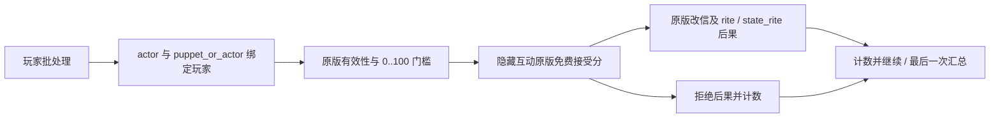

# 二期原版 1.20.0.2 兼容候选合同

本文件冻结二期实现依赖的原版入口，升级 CK3 时必须逐项重审。当前对应 Steam build `25588574`，EXE SHA-256 `ae1ba6ff060ba603842f6f4a2ded0af4b7d3666b3dd271f75fb01b0da8e81b2d`。冻结文件清单与 SHA-256 位于 `tools/xqol_vanilla_1_20_0_2.json`；静态校验拒绝游戏源文件漂移。该合同是代码迁移依据，新版实机结果尚未取得。上一版 1.19.0.6 合同保留在 Git 历史及历史发布证据中。

| 功能 | 原版入口 | 本 Mod 的使用方式 |
|---|---|---|
| 防御召集 | `on_war_started`、`call_ally_interaction_event_effect` | 战争开始次日，用明确的免费关系白名单和原版战争加入条件过滤，再调用原版共同的 `set_called_to + add_defender` 核心；不依赖声明当刻尚未稳定的互动缓存，不进入会读取互动专属 `scope:hook` 的包装层，并排除一切付费调用 |
| 改信筛选 | `ask_for_conversion_courtier_interaction`、`demand_conversion_vassal_ruler_interaction` | 用 `is_character_interaction_potentially_accepted` 和 literal `ai_accept=0..100` 过滤 |
| 改信答复 | `celestial_hierarchy_acceptance_modifier`、两项 `religion_demand_conversion_*_modifier`、`demand_conversion_interaction_effect`、`demand_conversion_vassal_ruler_interaction_effect` | 内部异步互动镜像原版免费选项的接受率；直接玩家 scope 明确绑定 `puppet_or_actor`；接受后复用原版 unity、state_rite、斗争及两项 tenet 后果，二元累计接受/拒绝 |
| 牵制索款 | `demand_payment_interaction`、`golden_obligation_value` | `run_interaction execute_threshold=accept`，由原版 effect 扣款和消耗牵制 |
| 赎囚 | `ransom_interaction`、`ransom_interaction_effect` | 保留原版付款人 redirect、金钱价格、劫掠传承加价与付款释放后果；普通足额门禁迁移到 `normal_ransom_cost_value`，不自动选择 herd 支付 |
| 条件释放 | `release_from_prison_interaction` | 七个隐藏互动镜像 H/R/C 可用条件、接受分及对应后果；包括天朝等级、head_of_rite、禁止改信标记及 `rite_has_tenet` 奖励门禁；不启用其他原版释放选项 |

已知必须实机验证的边界：滑条点击与拖动在 0、1、49、50、51、99、100 的精度；异步批量改信最后一条答复是否只产生一次汇总；战争开始 scope alias 与全部免费候选去重；连续共享付款人的赎金余额重验；七种释放组合的原版等价后果。

## 2026-10-05：1.20.0.3 防御合同方向勘误

真实 Steam 1.20.0.3 原版 `00_alliance.txt`、`00_interaction_effects.txt` 与 `war_on_actions.txt` 均与上述 1.20.0.2 SHA 合同逐字节一致。重新审阅发现产品反向朝贡白名单把宗主援助朝贡者的保证条款误用为朝贡者援助宗主的义务。非盟友、非同家系、非摄政的向下召集现只认可目标实际合同的 `tributary_contract_tributary_forced_war_override`；向上的宗主保证分支保持原样。

原版 `special_contracts.txt` 的 `suzerain_war_participation_guarantee` level 1 给出向上保证，`tributary_war_participation_obligation` level 1 给出向下强制参战义务。普通 `call_ally_interaction.is_shown` 的向下朝贡路径仍有法规与虔诚资格；本产品不能把宗主保证当作绕过这些资格的理由。原版防御 helper 本身不扣虔诚，因此这次勘误不声称发现实机扣费。强制合同可能先由原版自动参战，验收应检查真实参与人与去重，不能强求本产品调用次数为 1。

这项源码与静态输入勘误尚未获得 .3 实机信用。原 regular/overlap/paid 三类旧矩阵保持原样；宗主保证=1、强制=0 的反向负例与强制=1 的正例使用独立新增夹具。19 项全部 stock 合同比较为 17 项 raw 相同、2 项不同，`pam_effects.txt` 与 `00_religious_triggers.txt` 的漂移未由本防御合同外推为语义相同。当前准备与边界见 [1.20.0.3 防御维护记录](../../docs/xqol-1.20.0.3-defense-maintenance-2026-10-05.md)。
