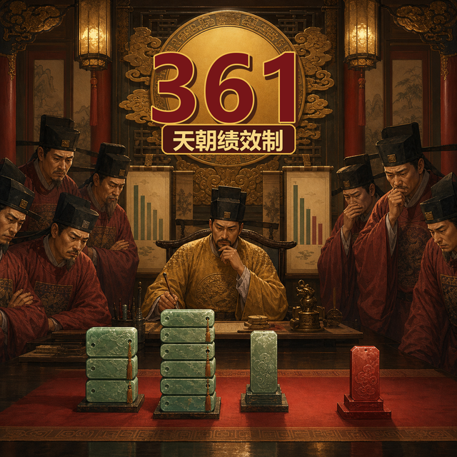
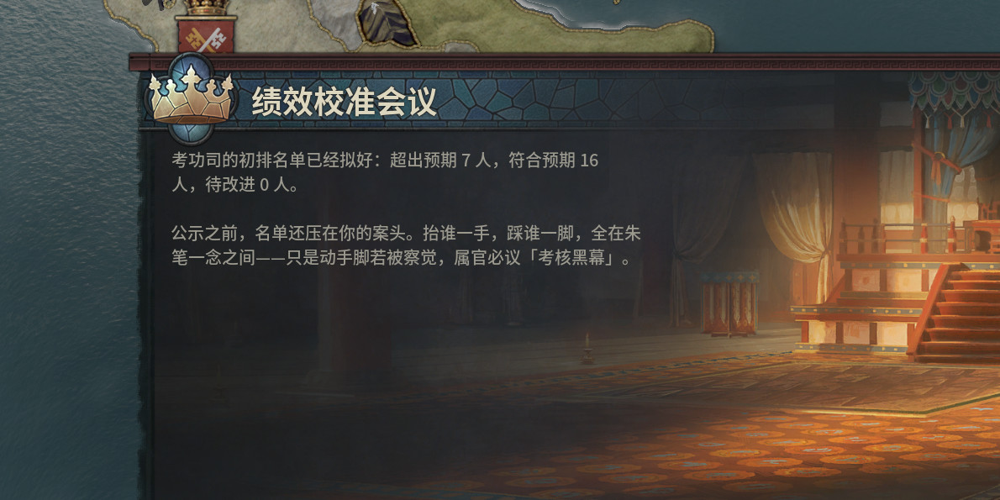
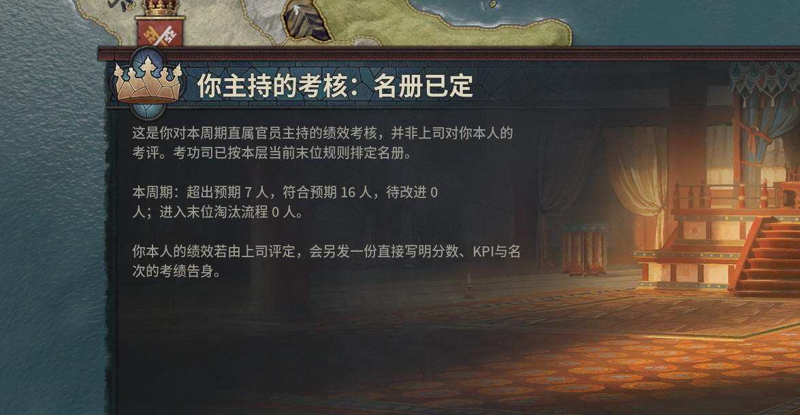
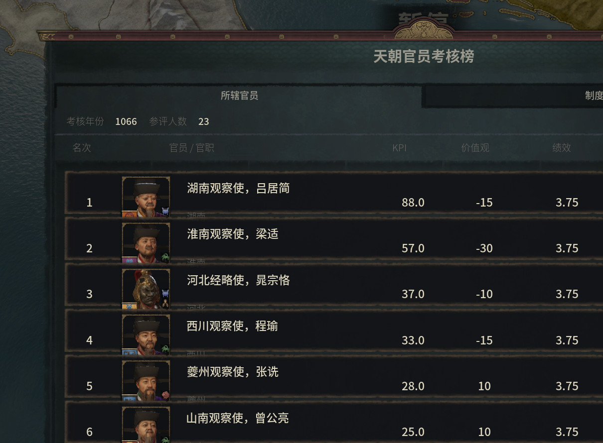
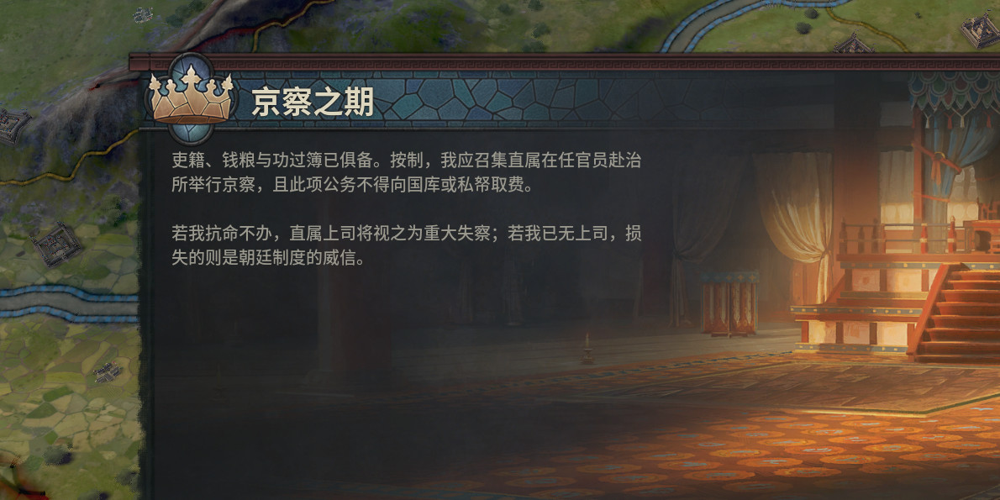
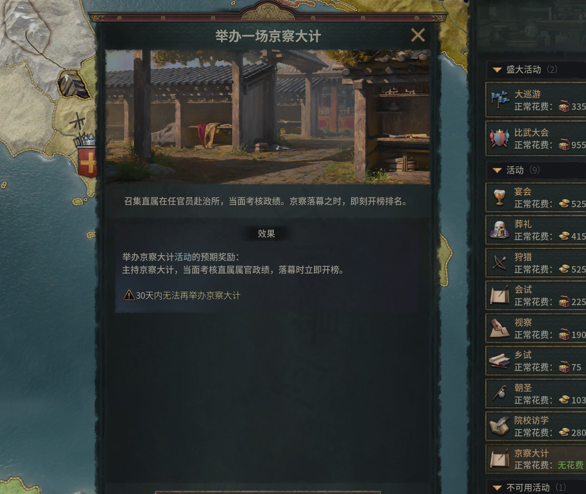
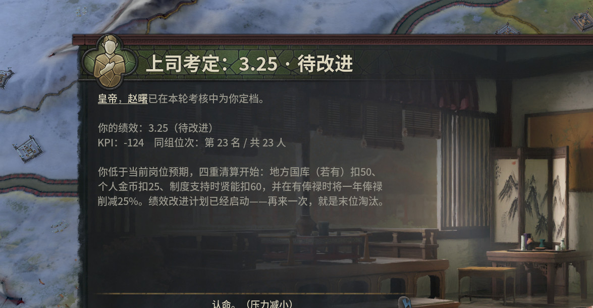

# 天朝特色361制官员绩效考核（ZhongGuo 361 Style）

这是一个 CK3 1.19.0.6 独立 mod：把“头部 30% = 3.75、中间 60% = 3.5、尾部 10% = 3.25”的
361 强制分布考核，嵌入天朝制的逐级官僚体系。

一句话：在这里，打下江山只是入职；真正决定你能不能过年的，是上司有没有给你背 C。

## 权威范围

- 所有在任、在世的**天朝制公爵及以上领主**都是考核者，不要求独立；每人只考核自己的直属官员。
- 天朝总督不分爵位均可受评；所有直属**伯爵和男爵**也明确纳入。
- 伯爵和男爵**只被考核，不能考核别人**。公爵及以上角色可同时在上司榜中受评、并管理自己的下属榜。
- 本 mod 是 AGENTS.md 默认“AI 不得触发”规则的**第二个所有者授权例外**：AI 天朝制公爵及以上也执行完整考核、奖惩和末位处置。

## 现有玩法

考核按属地总督效率、贤能品级与成长、上级评价、忠诚/罪行/派系、玩家选择等计算 KPI，
横向排名后强制分档：

- **3.75 超出预期**：贤能奖励、地方国库奖金、原版任命候选分加成；连续两次进入晋升通道。
- **3.5 符合预期**：小额贤能奖励，连击归零。
- **3.25 待改进**：地方国库 -50（有国库时）、个人金币 -25、贤能 -60（有贤能制时）、一年俸禄 -25%（有俸禄时），并进入 PIP；连续两次后进入末位淘汰。

常规成熟队列按 30/60/10 执行；首轮新人受 3.25 保护；只有一至两人的直属小组仍会稳定排名、全员按 3.5 正常结算，
只是不会硬凑强制分布、校准或末位，因此个别榜单会依法缺档，
不会为了让比例好看而把新人或两人小组硬塞进末位。

末位处置包括免费夺爵、强制致仕、降岗留用和再留一年。玩家封臣可申诉、认命、摆烂或奋发；
玩家领主可在公示前校准边界名单。申诉改判会同步退回本次固定财政罚没并修正榜头统计。

一轮绩效季大致是：确定直属参评名单 → 计算并冻结 KPI / 价值观证据 → 横向排队 → 校准边界 →
按 30/60/10 公示 3.75 / 3.5 / 3.25 → 奖金、罚没、PIP、晋升与末位处置 → 把结果镜像进上司榜和个人榜。
同一领主同一年只能结算一次，旧榜按轮次冻结，不会因官员调任或下次考核而漂移。

## 京察与考核榜

- 京察是**免费、定期弹出的半强制活动**。玩家天朝制公爵及以上只要有至少一名合法直属官员，到期就默认应举办；1–2 人小组也不豁免。拒办会降低直属上司好感，并成为上司下次考核你时的一次性重大 KPI 扣分理由；若签发后因失能、在押或来宾归零而无法合法集会，只豁免活动，官员考核仍会结算。
- 独立最高领主没有上司，拒办时只承担制度威信后果，不伪造“自己考核自己”。
- AI 领主默认履责，用后台考核结算，不走活动 UI。
- 每次结算在淘汰前发布持久榜单。右上角“考核榜”面板展示名次、人物/官职、KPI、价值观分、档位、连续次数和 PIP/晋升状态。
- 公爵及以上玩家可切换“我考核的官员”与“我所在的受评队列”两个视角；被 AI 领主考核的玩家也可看到所属公示榜。
  极端超大队列保留完整分档统计，面板展示前 80 名，并在表头明确写出“显示人数 / 总人数”。
- 主持考核时收到的是“你主持的考核”汇总；本人被上司考核时收到独立的“上司考定”告身，直接写明上司、个人档位、KPI 与同组名次。

## 不只是三个数字：361 条制度选择

完整清单不是把 361 个互联网热词贴到事件标题上。开发树为编号 001–361 的每项制度都提供独立的玩家政策卡、
A/B/C 路线、AI 决策入口、持久选择变量和组织后果；正常考核逐次抛出一张未配置政策卡，另有用于快速开局的
“下一项制度”与参考宪章决议。

这里必须区分“政策卡已接入”与“领域玩法已完成”。当前 361 张卡已经全部进入真实 CK3 的配置与共享账本链，
但底层仍只有 17 类 A/B 后果 profile 和一类通用暂缓后果，共 35 种账本 payload。PIP 案卷、HC 槽、晋升包、
贡献争议、事故时间线等 38 个领域对象和状态机正在补做；在它们逐项通过状态、期限、资源和可见反馈验收前，
不能把“361 张卡都能点”写成“361 条语义机制全部实现”。

它们覆盖 OKR/KPI、背靠背互评、校准会、PIP、末位、晋升包、HC/编制、薪酬倒挂、向上管理、跨部门抢功、
技术债、数据指标、加班与会议、招聘和外包、内部活水、重组、需求治理、绩效申诉，以及最终的《三六一绩效宪章》。
361 张卡共用 17 类后果 profile，而不是伪装成 361 套互不相干的小游戏。选择会共同改变 14 本组织账：
证据可信、互信、行政负担、申诉风险、交付、稳定性、技术债、数据质量、倦怠、人才、HC 压力、薪酬债、
制度债和预算压力；这些账再回流到团队与管理者 KPI，所以“流程拉满”与“业务交付”并不总能同时最大化。

完整设计见 `docs/361-expansion-options.md`；逐号实现入口、AI 路径和同批逻辑覆盖组见
`docs/361-mechanism-implementation-manifest.md` 与机器可读的 `docs/361-mechanism-manifest.json`；领域对象、
38 个状态机和分阶段施工门见 `docs/361-domain-runtime-architecture.md`。

## 实机画面

| 绩效校准会 | 冻结考核名单 |
|---|---|
|  |  |
| 天朝官员考核榜 | 半强制京察 |
|  |  |
| 免费京察活动 | 上司考定 3.25 |
|  |  |

当前六张 JPEG 是首轮整批 GREEN 实机证据 PNG 的确定性裁切；无损原图、失败 attempt、日志和完整一次性 userdir 均保留在
验收 artifact。正式候选采用的最终批次与替换图会另行锁定，来源、裁切、尺寸与 SHA-256 见 `workshop/media.md`。

## 安装与兼容性

- 需要 CK3 1.19.0.6，并依赖该版本的天朝制内容；推荐新开局、单人游戏。
- 手动安装时，将本目录注册为独立 mod；正式发布后应优先订阅 Steam Workshop 版本。
- 本 mod 新增自己的 `zg361_` / `zg361m` 命名空间，不主动覆盖原版文件。其他 mod 若定义同名键、替换相同
  scripted widget，或重写相同年度 on_action 链，仍可能冲突。
- 伯爵和男爵只受评；只有天朝制公爵及以上领主主持考核。宗教系统不在本 mod 的机制范围内。

## 当前交付状态

版本 0.3.0 是开发线，不再称为发布候选。当前状态分层如下：

- 361 项目录与中英文政策文案：`complete`；
- 361 项参考政策配置与 14 本共享账本投影：`fixture-live`；
- 38 个领域对象/状态机：整体仍为 `not-implemented`，少数现有考核、校准、清算与申诉内核可复用；
- 玩家可见语义闭环：`partial`。

既有真实 CK3 批次准确证明了 361 个参考选择、唯一状态、共享账本、校验和与幂等性，也覆盖了非独立 AI 天朝公爵、
首轮新人、考核榜、免费京察、拒办扣分、3.25 四重处分与申诉退款；它没有证明 361 个领域机制或 1,083 个 A/B/C
分支已经完成。只有全部编号进入相应领域状态机，并逐项验证对象、期限、资源守恒和可见反馈后，才能重新进入发布候选。

## 工程与测试

- 详细机制与历史偏差：`docs/zhongguo-361-plan.md`
- 361 条权威清单：`docs/361-expansion-options.md`
- 361 领域运行时与诚实完成定义：`docs/361-domain-runtime-architecture.md`
- 逐号实现清单：`docs/361-mechanism-implementation-manifest.md`
- 当前批量实机报告与证据边界：`docs/testing-report-2026-08-29.md`
- 目标内静态校验：`py mod_zhongguo_style/tools/validate_local.py`
- 隔离 CK3 实机验收：`& "tools\.venv\Scripts\python.exe" "tools\run_zhongguo_acceptance.py"`
- release builder 单元测试：`py tools/test_build_mod_zhongguo_style_release.py`
- release 可复现检查：`py tools/build_mod_zhongguo_style_release.py --check`
- 正式构建：在干净、已提交且带 `zhongguo-361-v<版本>` tag 的候选上运行
  `py tools/build_mod_zhongguo_style_release.py --release`

正式上传只能使用 `dist/mod_zhongguo_style/` staging，禁止直接上传开发树。该投影仅包含
`descriptor.mod`、`thumbnail.png` 与 `common/events/gfx/gui/localization` 运行文件；README、docs、tools、
fixture、原始素材和过程 artifact 均不进入 Workshop 内容包。`remote_file_id` 只能留在用户目录外层 `.mod`，
仓库、正式 staging 和正式 ZIP 都不得包含该字段。

工坊文案草稿与逐项发布签核分别在 `workshop/description.bbcode` 和 `docs/release-checklist.md`。

脚本、GUI 和 YML 必须为 UTF-8 BOM。发布版包含简体中文、英语、法语、德语、日语、韩语、波兰语、俄语和西班牙语；
简中与英文为逐条创作/审阅文本，其余七语是按发布流程生成并经自动化检查与独立抽检的发布译文，不等同于完整母语审校签字。
AI 授权仅限本 mod 的 361 考核系统，不得外推。

## English summary

ZhongGuo 361 Style turns Chinese internet-company performance culture into a CK3 celestial-government game loop.
Every eligible duke-or-higher ruler reviews direct officials; counts and barons are reviewees only. Reviews freeze a ranked
30/60/10 board, apply 3.75/3.5/3.25 consequences, drive PIP, promotion, compensation and headcount politics, and let the
player navigate 361 individually tracked policy dilemmas. Simplified Chinese is the primary presentation and English is fully
authored. Release localizations are included for all nine supported languages; the other seven are machine-assisted and passed
automated checks plus an independent stratified review, but they are not represented as full native-speaker sign-off.
