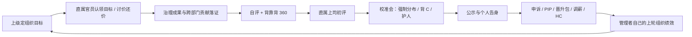

# 361 绩效文化扩展：现实语境、CK3 机制与施工批次

更新：2026-08-29

本文只讨论把中国互联网公司的绩效文化翻译为 CK3 决策系统，不扩张成泛化的“中国官僚 mod”。

固定边界：

- 只有天朝制公爵、国王、皇帝考核自己的直属官员；伯爵和男爵只受评，永远不能考核别人。
- 公爵及以上既是下属的考核者，也可能是上司榜中的被考核者。
- AI 天朝制公爵及以上完整运行后台考核；这是项目所有者授权的第二个 AI 例外。
- 京察是免费、定期、半强制的绩效季活动；拒办是上司下轮扣分的重大理由。
- 3.25 保留地方国库、个人金币和一年俸禄三账本问责，不被任何新功能替换。
- 独立最高领主没有虚构的“自我上司考核”；只承担制度威信或组织后果。
- 不涉及宗教域。

## 一、现实语境中真正有机制价值的矛盾

公开资料并不完全等价于各公司的现行内部制度，媒体访谈和厂商案例尤其只能作为文化原型。这里采用的不是“某公司一定如此”的断言，而是多类资料反复出现、能转成游戏矛盾的共同结构。

1. **361 的核心是稀缺档位和连锁兑现。** 典型公开口径是 30% / 60% / 10%，低档影响奖金、晋升、转岗，连续低绩效可能进入 PIP 或退出；后来又出现保留分级、取消刚性末位比例的争论。这给游戏提供了“严格配额还是松绑”的制度路线，而不只是三个数字。[经济观察网](https://www.eeo.com.cn/2020/1228/450768.shtml)、[钛媒体低绩效访谈](https://www.tmtpost.com/5995803.html)
2. **完整绩效是循环，不是年末抽奖。** 目标制定、跟踪辅导、自评/全面反馈、上级与组织评审、结果反馈、申诉、改进发展构成闭环。[腾讯 ESG 报告](https://static.www.tencent.com/uploads/2025/04/08/7ef7e3b3749bfcbbeccbcc837b794e60.pdf)
3. **业绩与价值观是两张表。** 阿里公开资料把目标、业绩、价值观、团队绩效、发展对话、晋升、短长期激励联系起来；公开案例还给出了业绩与价值观 50/50、“野狗/小白兔/明星”式矛盾原型。[阿里巴巴员工发展](https://www.alibabagroup.com/zh-HK/esg-employee-development)、[36Kr 价值观考核案例](https://www.36kr.com/p/1724803563521)
4. **OKR 是方向和证据，不应机械等于绩效。** 公开案例明确区分目标完成度与最终绩效：探索性目标若与奖金一比一绑定，会诱导所有人只报保守目标；实际组织贡献仍需校准判断。[飞书 OKR 说明](https://okr.feishu.cn/blog/okr-performance)、[店匠案例](https://okr.feishu.cn/customers/shoplazza)
5. **360 能补跨部门盲区，也会制造互评政治。** 自评、同级、下级和上级反馈能让直线经理看见协作，但会出现互相抬轿、恶意低分、评估人“手松手紧”、匿名黑箱和填表疲劳，因此必须有限权、证据、可信度和权限设计。[来也科技案例](https://okr.feishu.cn/customers/laiye)、[理想汽车案例](https://okr.feishu.cn/customers/li-auto)、[绩效黑箱访谈](https://www.thepaper.cn/newsDetail_forward_16378353)
6. **校准会是权力场。** 统一分布迫使经理横向比较、为自己的人争档位；隔级上级、HR/政委和历史数据用来限制“人人优秀”与护犊子，但最终仍需要管理者承担判断责任。[清华经管案例](https://www.sem.tsinghua.edu.cn/info/1171/37305.htm)
7. **软指标会诱发向上管理。** 做事与让领导看见并不相同；汇报、占资源、抢曝光可以提高短期主观评价，却可能降低真实产出和协作信用。[36Kr“阿里味儿”访谈](https://www.36kr.com/p/3570963880115328)、[清华经管案例](https://www.sem.tsinghua.edu.cn/info/1171/37305.htm)
8. **晋升不是高绩效自动领奖。** 绩效只是门票，还要有合法空缺、晋升材料、价值观、同事反馈和跨部门评委；材料表达与实际贡献之间又会产生新的博弈。[阿里巴巴员工发展](https://www.alibabagroup.com/zh-HK/esg-employee-development)、[界面晋升答辩访谈](https://m.jiemian.com/article/7158323.html)
9. **HC 是组织资源，不是角色数量按钮。** 编制同时受人数和预算约束，团队负责人要证明投入产出，业务收缩时 HC 会冻结或被重新分配。[HC 预算产品复盘](https://www.woshipm.com/pd/6181693.html)、[腾讯降本增效报道](https://finance.sina.cn/tech/2022-04-08/detail-imcwipii3072639.d.html)
10. **PIP 与申诉必须有证据和期限。** 单纯“你是末位，所以你不胜任”无法形成公平或有趣的系统；目标是否合理、公司是否提供支持、员工是否完成改进、原评分是否有依据，才构成可复核的过程。[PIP 劳动案例](https://www.7-dimension.com/index.php?id=1182)

## 二、CK3 中的总循环

要点：皇帝不能越级改伯爵的个人分；他只能考核直属公爵的团队结果、校准质量和履责情况。HR/政委或复核席可以判定流程/证据是否成立，但改分仍回到直属考核链，避免破坏“谁管理谁负责”。

## 三、候选功能包

以下每项都必须同时有玩家决策、AI 后台决策、可见后果和实机验收；只有文案而没有状态变化的不立项。

### A. 目标、证据与评分

1. **KPI 分项证据单（P0）**
   - 决策：考核者能看见治理成果、效率、成长、协作、价值观、京察履责、奖惩和政治修正分别贡献多少。
   - 后果：高低分必须附具体事例；申诉、PIP 和晋升包复用同一份冻结证据，杜绝事件窗口读取下一年的 live 值。
   - 验收：各分项之和严格等于落盘 KPI；转封、存读档和下一轮开始后旧案卷不漂移。

2. **年度目标责任书：OKR 方向 + KPI 结果（P0）**
   - 决策：京察时为直属官员选择财政、治安、军备、发展或跨部门协作方向；官员可接受激进目标、协商普通目标或报保守目标。
   - 后果：激进目标提高 3.75 与“高潜”上限但失败风险更高；保守目标容易完成但不能只靠完成率获得头档。原生治理成果承担主要分值，目标只决定权重与证据上下文。
   - 验收：同一成果在不同目标下解释不同但有硬上限；全员报保守目标不能自动挤进 3.75。

3. **期中 Check-in 与目标重置（P1）**
   - 决策：每轮一次，管理者可辅导、加压、补资源或不干预；战争、叛乱等明确外部冲击允许一次 rebaseline。
   - 后果：提前救回风险官员，或留下“上司早已预警/从未提供支持”的 PIP 与申诉证据。
   - 验收：每人每轮至多一次；无真实危机不能洗目标，同一危机不能重复重置。

4. **自评与认知差（P1）**
   - 决策：官员先报 3.75 / 3.5 / 3.25 并提交代表成果；可诚实、邀功或故作谦逊。
   - 后果：自评不会直接定档，但巨大高估会伤价值观/可信度，低估会错失曝光，高质量证据能进入校准案卷。
   - 验收：自评与终评分开保存；同一轮只提交一次，AI 性格产生稳定而非随机乱跳的策略。

5. **岗位化记分卡（P1）**
   - 决策：地方治理、军务、财政、管理岗使用不同证据权重，但仍在直属 cohort 中横向校准。
   - 后果：避免所有人都堆同一属性；转岗可以成为救济，也会失去原岗位优势。
   - 验收：同属性文武官在对应岗位得到不同分项；换岗只影响下一轮，不重写历史。

6. **起点与难度校正（P2）**
   - 决策：接烂摊子换取更低基线，或守富庶地但承担更高目标。
   - 后果：考核改善量而非只看绝对繁荣；校正只能小幅封顶，不能成为长期失败豁免。
   - 验收：期初状态被冻结；战争结束或上司更换后不永久保留借口。

### B. 背靠背互评与校准政治

7. **背靠背 360 邀评（P0）**
   - 决策：被评人、上司和系统各可邀请少量真正有共同任务/战争/治理关系的同侪或下属；评价业绩、协作、价值观并附事例。
   - 后果：补足跨部门贡献的可见性；360 总权重封顶 10%–15%，不能单独跨越两个绩效档。
   - 验收：无协作证据者不能邀评；匿名反馈不暴露作者，但底层案卷可供复核。

8. **评价者“手松手紧”与同侪信用（P1）**
   - 决策：系统按历史均值、离散度、举荐准确率和翻案率显示“宽松/严苛/可信/惯犯”。
   - 后果：互相抬轿会逐轮贬值，恶意低分可能反噬评价者自己的价值观和管理信誉。
   - 验收：新评价者有中性先验；归一化不改变原留言，且修正值有硬上限。

9. **校准会驾驶舱（P0）**
   - 决策：按 KPI、价值观、目标、360、历史趋势和申诉风险筛选；点名抬一人时必须点名同档边界的承担者进行配额中性交换。
   - 后果：玩家真正做“为什么是他，不是别人”的人事决定；AI 经理会按数据、关系、性格和财政争档位。
   - 验收：三档总人数不变，只结算被交换者；并列、重复点击、延迟一天和旧轮 scope 均不串账。

10. **“背 C”与护人（P0，严格 361 核心戏）**
   - 决策：当所有人都达标但仍有末位名额时，管理者必须指定承担者；可以牺牲新人/边缘人、按硬证据选末位，或消耗自己威望与下轮管理 KPI 保护一人。
   - 后果：背 C 者产生怨恨、申诉和流失风险；护人会让上司认为管理者“分布失真”，但提高团队忠诚。
   - 验收：新人保护与现有首轮快照豁免不冲突；所有路线仍保持当轮配额或明确产生管理者代价。

11. **隔级校准 / HR 政委席（P1）**
   - 决策：隔级上司只审查直属管理者的分布、极端证据和流程，不直接给孙级官员打分；政委可要求补证、回避或重开校准。
   - 后果：压制护犊子和恶意打压，同时制造“业务经理 vs 政委”的权力矛盾。
   - 验收：皇帝能退回公爵榜但不能点改伯爵档位；最终结果仍由公爵重新发布。

12. **利益冲突与回避（P1）**
   - 决策：亲族、挚友、情人、仇敌或恩主关系在校准前暴露；管理者可回避、公开坚持或暗箱操作。
   - 后果：不回避可短期保人/踩人，但提高申诉翻案率和管理者自身被扣分的风险。
   - 验收：冲突关系只影响本轮一次；小 cohort 没有替代评分者时走抽象复核席而非卡死。

13. **透明 / 半透明 / 黑箱公示制度（P2）**
   - 决策：选择公开完整名次与理由、只公开档位，或只让本人看结果。
   - 后果：透明提高公平感但加剧竞争和羞辱；黑箱减少公开冲突却加剧猜忌、向上管理与申诉。
   - 验收：三种制度严格控制 GUI 字段权限，不靠文案假装隐藏。

### C. 申诉、PIP 与末位退出

14. **绩效申诉案卷（P0）**
   - 决策：被评人以“计算错误、漏记成果、利益冲突、强制背档、目标不合理”之一申诉，并提交冻结证据；可先与直属上司沟通，再请求流程复核。
   - 后果：成功则回到直属上司重校准，退回 3.25 三账本已缴部分并修正榜单；失败会消耗关系/威望，恶意申诉伤信用。
   - 验收：退款逐项对账且不可二退；复核席不越级创建自己的考核记录。

15. **PIP 改进任务书（P0）**
   - 决策：3.25 后从财政、治安、军备、发展、协作中选择可验证里程碑；受评人可接受、协商或拒绝。
   - 后果：成功减轻低绩效连击并给下轮有限补正；失败/超时升级降岗或退出；拒绝 PIP 本身成为下一轮重大负面证据。
   - 验收：成功、失败、超时、拒绝四路只结算一次；任务必须在当事人的真实权限范围内可完成。

16. **PIP 支持预算与“只给指标不给资源”（P1）**
   - 决策：上司可给导师、临时治理资源或关注度，也可省钱硬压目标。
   - 后果：支持提高可完成性但消耗组织资源；不给支持若最终失败，会成为申诉证据并降低上司管理 KPI。
   - 验收：投入不能直接买成 3.5；同任务有无支持产生可量化、封顶的差异。

17. **末位处置阶梯（P0）**
   - 决策：首次 3.25 在沟通、PIP、调岗中选；连续低档在降岗、冻结晋升、释放 HC、辞退/剥夺任命中选。
   - 后果：激进处置快速提高“人才密度”但造成恐惧、申诉和空岗；保守处置保留经验却让上司质疑管理者。
   - 验收：所有动作服从原版合法任免/头衔规则；没有合法替补时不能脚本删除岗位或角色。

18. **个人告身与三账本清算单（P0）**
   - 决策：不是额外按钮，而是所有后续判断的事实入口。
   - 后果：清楚显示本轮绩效、KPI、名次、上司、主要理由，以及 3.25 的地方国库 -50、个人金币 -25、一年俸禄 -25% 和申诉退款状态。
   - 验收：结算时冻结，不读取一日后的 live 上司或余额；重复打开不重复执行奖惩。

### D. 晋升包、薪酬与 HC

19. **晋升资格门槛（P0）**
   - 决策：连续 3.75、价值观、无活跃 PIP、任职年限和合法空缺共同决定是否能“提包”；3.5 可积累但不能直接进入答辩。
   - 后果：高绩效终于兑现为机会，而不是自动塞头衔；低绩效冻结晋升但不永久抹杀职业生涯。
   - 验收：无空缺/无资格时不出现；转封后历史绩效仍可核验，但新上司不能伪造旧成绩。

20. **晋升包与跨部门答辩（P1）**
   - 决策：候选人选择展示真实治理成果、团队影响、方法沉淀或包装可见度；评委从其他同级管理单元抽取，恩主可 sponsor 但不能改硬证据。
   - 后果：强表达能改善边界判断，却不能让空心材料碾压持续政绩；失败可能“延期晋升”而非清空履历。
   - 验收：同口才下高低履历差异显著；同履历下包装只有限幅影响。

21. **奖金—调薪矩阵（P1）**
   - 决策：领主在有限奖金池内决定头档奖金厚度；3.75 可获一次奖金或短期晋薪，3.5 保持，3.25 继续三账本处罚。
   - 后果：奖励头部会真实挤占财政；欠赏的连续 3.75 人才会请求转岗或被挖走。
   - 验收：奖金总和不超池；与品级俸禄、降岗 -50% 和 3.25 -25% 的叠加有统一上限。

22. **软 HC / 编制预算（P1）**
   - 决策：HC 不直接等于 CK3 角色数量，而是“可资助的招募、培养、晋升与补员名额”；公爵以上根据团队成果、财政和空缺向上司申请增编、保编或临时借调。
   - 后果：高绩效团队获得人才资源，低绩效团队可能冻结补员；裁掉末位可释放名额，却可能因无替补损害治理。
   - 验收：绝不阻断原版合法角色生成/头衔任命；只控制 361 提供的额外人才资源和 shortlist 加成。

23. **HC 答辩与团队投入产出（P1）**
   - 决策：管理者用团队目标完成、翻案率、人才流失和财政效率申请资源；可以夸大需求、借调别组名额或主动瘦身。
   - 后果：夸大成功会暂时拿到资源，后续未兑现则伤管理绩效；瘦身提高短期效率但增加倦怠与单点风险。
   - 验收：京察仍完全免费；HC 是年度状态，不因反复打开事件重复发放。

24. **内部活水与转岗博弈（P1）**
   - 决策：PIP 人员可申请错岗救济，连续 3.75 人员可申请更好岗位；原上司可放人、加薪挽留或卡人。
   - 后果：卡住明星会短期保产出、长期伤管理信誉并触发挖角；低绩效转岗成功后按新岗位重新建基线，但旧账不消失。
   - 验收：所有调动走原版合法岗位；旧榜是不可变快照，新榜从下一轮纳入。

25. **高绩效人才被挖与反 offer（P2）**
   - 决策：其他天朝制领主可对连续 3.75 且晋升停滞的人才发出合法邀请；原上司选择晋升提名、加薪、画饼或放人。
   - 后果：绩效体系产生跨组织人才市场；滥发 3.75 也会抬高自己的留人成本。
   - 验收：无合法岗位不能挖；转入后不继承原团队的当期配额。

### E. 向上管理、跨部门抢功与指标异化

26. **真实贡献 / 上司可见度双账（P0）**
   - 决策：官员每轮在“埋头做事、主动汇报、经营关系”间分配有限精力；上司也可主动做 skip-level 访谈降低信息差。
   - 后果：可见度只影响主观分与证据被采纳概率，不直接制造治理成果；高可见低产出短期占优，换上司或审计时容易露馅。
   - 验收：两张账分别冻结；汇报不能凭空增加原生控制、财政或任务结果。

27. **跨部门贡献账本（P1）**
   - 决策：共同参与战争支援、治理任务或联合项目时，冻结 owner、主责、协作者、救火者和 blocker；结束后各方申报贡献。
   - 后果：给背靠背 360 和晋升包提供硬证据，也为抢功争议提供同一事实底座。
   - 验收：只有真实参与者可申报；贡献总量封顶，同一成果不能在多个角色名下全额重复计分。

28. **抢功仲裁 / 甩锅复盘（P1）**
   - 决策：成功项目可独占、共享或让功；失败项目可认责、分责或甩锅。上司按贡献账本、证人、关系和口才裁定。
   - 后果：抢功成功提高可见度但伤同侪信用；错误裁决伤管理者信誉并成为申诉理由；认责可保价值观但承担短期 KPI。
   - 验收：每个成果或事故有唯一责任 ID，只结算一次；硬证据不能被口才完全覆盖。

29. **指标包装、造假与京察审计（P1）**
   - 决策：官员可追求真实改善、选择有副作用的“刷指标”，或直接虚报；管理者可深查、抽查或睁眼闭眼。
   - 后果：刷税收/治安数字带来短期 KPI 和延迟领地代价；查实虚报会追回奖励、加 PIP、降低价值观，并反噬包庇者。
   - 验收：短期得分与延迟代价各只触发一次；没有真实治理基线的指标不允许进入造假池。

30. **资源赛马与抢预算（P2）**
   - 决策：两个团队争取同一项目、HC 或奖金池；可提交真实小规模试点，也可靠 sponsor 抢先拿资源。
   - 后果：胜者获得资源和曝光，败者可能重组；如果胜者只会包装而交付失败，下一轮产生更大的管理问责。
   - 验收：资源守恒；同一 HC/预算不能同时给两个团队，失败回收有明确时间点。

31. **恩主 / Sponsor 网络（P2）**
   - 决策：高层可为晋升包、HC 或复核提供背书；官员可经营恩主，也可选择只靠硬业绩。
   - 后果：Sponsor 只提高进入讨论桌的机会，不能改原始 KPI；恩主倒台会让过度依附者失去可见度和信用。
   - 验收：关系效果有期限和上限，不形成永久世袭晋升通道。

### F. 管理者与制度反馈

32. **管理者自己的团队绩效（P0）**
   - 决策：公爵以上不仅看个人能力，还要为目标完成、按期京察、校准质量、PIP 成功、翻案率、人才留存和 HC 效率负责。
   - 后果：拒办京察的 -50 成为这套管理分的一条重大理由；护人、乱打分、不给资源和高流失会沿直属链向上反馈。
   - 验收：使用上一轮冻结团队数据，避免同轮递归；孙级官员的单项表现不能直接写进皇帝榜。

33. **管理者画像与可解释理由码（P0）**
   - 决策：数据派、护犊型、政治型、仁厚型、残酷型 AI 对校准、申诉、PIP、奖金和 HC 有不同稳定偏好。
   - 后果：同一个分数遇到不同上司会有不同处置，但个人告身能说明命中了哪类理由，而不是暗骰黑箱。
   - 验收：人格权重不能盖过硬证据上限；固定输入下结果可复现。

34. **绩效×潜力九宫格（P1）**
   - 决策：历史绩效为一轴，成长、岗位适配和能力潜力为另一轴；决定培养、导师、关键人才、调岗或淘汰建议。
   - 后果：区分“当前明星”“高潜新人”“稳定贡献者”“错岗人才”和“待退出者”，不让一次 3.75 决定一生。
   - 验收：至少四类构造人物落格正确；九宫格只消费冻结历史，不重复奖励当前属性。

35. **严格 361 / 松绑 361 / 混合门槛（P2，游戏规则）**
   - 决策：严格模式必须背 C；松绑模式保留三档但不强制 10%；混合模式仍横向排名，但绝对达标者的末位处分减轻。
   - 后果：让玩家亲自看到强制分布提升人才密度与制造内耗的两面性。
   - 验收：全员优秀、全员低劣各跑一组；三种规则结果明确不同且默认仍为严格 361。

36. **十年制度报告（P2）**
   - 决策：按领主展示档位、翻案、PIP 成功、晋升、淘汰、奖金净流、HC、人才外流、真实治理和管理者信誉。
   - 后果：玩家能判断这套制度究竟提高了治理，还是只制造更漂亮的榜和更高的流失率。
   - 验收：逐年日志与十年汇总一致；换领主不串账，非天朝角色无数据。

## 四、应当砍掉或延后的伪功能

- 只弹一段“晋升答辩”“周报”“复盘会”文案，但不读取证据、不改变资格、不留下后果。
- 把 OKR 完成百分比直接兑换成 3.75；这会让挑战目标必然输给保守目标。
- 让 360 成为另一套多数投票；直属上司必须承担最终责任，互评只补信息。
- 皇帝直接改孙级伯爵的个人档位；这破坏“直属管理者负责”的制度核心。
- 用 HC 硬拦原版封臣/角色生成、凭空删头衔或批量生成朝臣；只做 361 自己提供的资源层。
- 把 PIP 做成必败的辞退倒计时；没有可完成目标、支持选择和申诉证据就没有决策。
- 只用随机事件表现抢功、甩锅和造假；必须先有唯一项目/成果/责任账本。
- 同时全开季度绩效、季度 360、月度汇报和多层事件；AI 公爵会制造事件风暴，应以年度终评 + 一次期中 Check-in 为主。

## 五、推荐批量施工方案

### 批次 A：先做“完整绩效季”（推荐下一批一起实现和验收）

`1 KPI 证据单 + 2 目标责任书 + 4 自评 + 7 背靠背 360 + 8 手松手紧 + 9 校准驾驶舱 + 10 背 C/护人 + 14 申诉案卷 + 15 PIP 任务 + 18 个人清算单 + 32 管理者团队绩效 + 33 AI 理由码`

这 12 项共用同一轮冻结数据，拆开做会反复改 schema、GUI 和验收夹具。完成后，玩家会经历完整的“定目标—交证据—互评—校准—背 C—公示—申诉/PIP—上司因管理质量被再考核”闭环。

统一实机矩阵：

1. 宋帝玩家考核 20+ 人长名单，非独立 AI 公爵同时在后台考核直属官员。
2. 伯爵与男爵进入受评名单但永远没有考核入口。
3. 一名硬绩效高/360 低、一名硬绩效低/可见度高、一名新人、一名利益冲突者、一名拒办京察者参与同轮校准。
4. 玩家点名交换、严格背 C、护人三路分别验证配额与管理者代价。
5. 3.25 处罚、申诉翻案、PIP 成功/失败/拒绝逐项对账。
6. 公爵的完成率、翻案率和拒办记录只在下一轮写入皇帝对他的管理分一次。
7. 存读档、转封、上司死亡后旧证据、旧榜与个人告身均不漂移。

### 批次 B：再做“职业与编制兑现”

`19 晋升门槛 + 20 晋升包答辩 + 21 奖金调薪 + 22 软 HC + 23 HC 答辩 + 24 活水转岗 + 25 人才挖角 + 34 九宫格`

统一验证至少需要合法空缺、富裕/赤字两类财政、晋升成功/延期/失败、HC 增编/冻结、明星留任/流失和 PIP 转岗救济。

### 批次 C：最后做“绩效政治事件包”

`26 贡献/可见度双账 + 27 跨部门账本 + 28 抢功甩锅 + 29 指标造假审计 + 30 资源赛马 + 31 Sponsor`

这批必须建立在 A 的冻结证据与 B 的兑现资源上；否则抢功没有可抢的成果，Sponsor 也没有可影响的资格或名额。

### 批次 D：制度实验

`3 期中 Check-in + 5 岗位记分卡 + 6 难度校正 + 11 隔级校准 + 12 回避 + 13 透明度 + 16 PIP 支持 + 17 退出阶梯 + 35 制度规则 + 36 十年报告`

其中严格/松绑 361 和长期组织效果应在 A–C 取得实机数据后再定默认平衡。

## 六、当前最高优先级缺口

在批次 A 内，最先落地的底层能力不是新事件，而是“不可变绩效案卷”。当前考核榜冻结了人物引用和表头，榜行仍读取人物的当前 KPI、名次、档位和 modifier；若官员转封后被新上司再次考核，旧榜行会被新值污染。KPI 明细、自评、360、申诉、晋升包和十年报告都依赖旧轮数据，因此必须先把每轮结果改为真正的历史快照，再扩展上层玩法。
