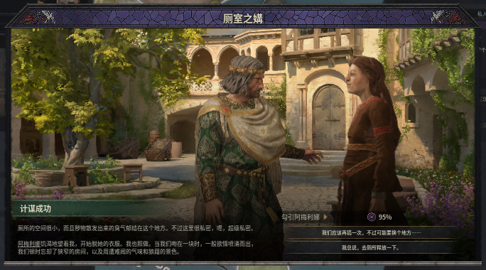
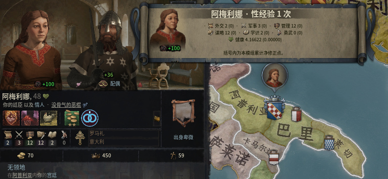

# 《超人强》当前工坊宣传图片

2026-10-04，**1.1.0 已实际更新公开**：三张统一红金风格的宣传海报加入第七项健康，区分能力±1与健康±0.00075，并说明通知查看方式。第四张保留真实勾引成功事件，第五张为新版本原生通知实机图。封面与五张媒体的公开CDN原件全部HTTP200、字节与解码像素一致，root直接审阅通过；见[发布报告](../mod_superman_qiang/docs/release-1.1.0-20261004/README.md)。

工坊条目：[3812991990](https://steamcommunity.com/sharedfiles/filedetails/?id=3812991990)。封面改为成年国王与王后，见 [封面来源](../mod_superman_qiang/docs/key-art.md)。运行版本为1.1.0，新通知与健康代码已变化，正式包绑定 `superman-qiang-v1.1.0`；不能沿用旧媒体候选的21文件不变结论。未发布的 `superman-qiang-media-v1/v2` 标签与全部过程素材保留历史。

## 当前顺序

| index | 主题 | 图片 | 尺寸 | bytes | SHA-256 |
|---:|---|---|---|---:|---|
| 0 | 七项属性：经验较多者吸取随机属性 | [01_absorption.jpg](superman_qiang_media/v3/01_absorption.jpg) | 1600×900 | 840,984 | `af7c226187d1024e62ed4ad881d2d07889a3c24d9715026442ccbd3ec835a238` |
| 1 | 六能力±1，健康±0.00075 | [02_transfer.jpg](superman_qiang_media/v3/02_transfer.jpg) | 1600×900 | 838,222 | `e4f9360eda0d65f9eb46d96654ea0e81075c3ad41ec2da5d90f82742860b9066` |
| 2 | 通知查看次数与属性 | [03_records.jpg](superman_qiang_media/v3/03_records.jpg) | 1600×900 | 802,191 | `cbe8a7be4a3e72f57480e8031525ab2be551dda0d53bbc67f01356bf353c371f` |
| 3 | 正常勾引成功事件 | [04_natural_event.jpg](superman_qiang_media/v2/04_natural_event.jpg) | 684×380 | 159,032 | `0f4f7ebc49ae07fadcca65e4382498c2ee3110f6bd0116807066b76f36ad6356` |
| 4 | 新原生通知直接显示次数与属性 | [05_notification.jpg](superman_qiang_media/v3/05_notification.jpg) | 785×364 | 138,982 | `51ac5484e3a82bcac65c65c2fe3fe3d058c2868715980171192f1d1886c0d6ff` |


## 来源和重建

使用内置 `image_gen`；本次三次实际编辑提示、引用的旧图、输出原图与完整SHA保存在 [generation-record.json](../images/superman_qiang_media_1_1_0/generation-record.json)。最终三张源PNG保存在同一目录；全部新外置过程保留于 `C:/ck3-superman-qiang-media-redo-20261004/art-1.1.0-P0001/`，旧v1的无字稿、首稿、五次生成与修字以及旧输出保留原样。

三张源图实读尺寸均为1672×941，居中等比裁切 `(0,0.25,1672,940.75)` 后投影至1600×900，Pillow LANCZOS；仅做发布尺寸/编码，内容与文字由内置图像工具制作。JPEG quality95、optimized progressive、4:4:4，每张严格小于1MiB。root直接审阅三份精确最终JPEG，见 [root-review.json](superman_qiang_media/v3/root-review.json)；[provenance.json](superman_qiang_media/v3/provenance.json) 保持首轮生成时的准备事实。

R21实际通知将属性直接显示在正文，先前“悬停看属性”没有实际支持，因此第三张另开 `art-1.1.0-P0002`，仅将短句修正为“通知查看次数与属性”。前两张源图及JPEG保持字节一致；旧第三张原图、输出、generation-record与原审阅保留，未用后续文件改写旧审阅。当前第三张来源与编码见[更正来源](superman_qiang_media/v3/correction-provenance.json)，root对新最终JPEG的实际审阅见[更正审阅](superman_qiang_media/v3/correction-root-review.json)。这两份增量记录与初始记录共同确定当前选图。

```text
tools\.venv\Scripts\python.exe tools/compose_superman_qiang_promotional_media.py --source-dir images/superman_qiang_media_1_1_0 --output-dir workshop/superman_qiang_media/v3 --manifest images/superman_qiang_media_1_1_0/generation-record.json --check
```

## 首发旧图与实际游玩取材

首发图已被用户否决，不再用于宣传。原PNG、JPEG、来源manifest与 [首发图片清单快照](superman_qiang_screenshots_initial_1.0.0.md) 保留作历史记录。

本次同时尝试了新production-only普通战役取材。2026-10-04更正：P0001误点后启动的实际为谋杀计谋，界面30%是成功几率，原报告将其误记为诱惑进度。P0002后续真实`murder_outcome_reworked.0013`失败事件确认了该错误；目标存活，未发生性行为，没有非零经验或属性转移宣传结果。旧报告和全部原始素材保留并追加勘误，这些截图不上传。最初430份原始资产索引、实际存档、停止与屏幕释放记录保留于 `C:/ck3-superman-qiang-media-redo-20261004/capture-P0001/`，不将计谋启动或尚未发生的结果写成取材成功。

宣传选择与中文介绍要求见 [promotional-media.md](../mod_superman_qiang/docs/promotional-media.md)，活动中文全文见 [BBCode](superman_qiang_description.bbcode)。图片与文案同次提交，发布后核对完整描述、五张CDN原图和独立Steam Change Notes。

P0002普通production战役已取得真实勾引成功事件与阿梅利娜自然累计1次记录：双方事前0→1、平手不吸取。见[永久取材证据](../mod_superman_qiang/docs/normal-gameplay-media-20261004/README.md)。事件图来自1.0.0正常游玩，体现保留的原版事件与经验规则，不用作1.1.0健康吸取证据。用户随后否决旧经验大窗，因此旧图与来源继续保留，但不再作为当前宣传；新通知图已在1.1.0 production-only加载该正常旧存档、真实右键查看后取得。



新通知来自R22纯22文件生产包加载真实游玩XP1正常旧存档。普通右键选择“查看性经验”即显示阿梅利娜的原生通知，无额外确认；姓名、48岁头像、六能力2/3/12/12/2/0、健康4.16622及净修正零与目标一致。GUI70由普通设置及实际画面核实，未人工改动角色经验或属性。完整原图1024×768、SHA `7b74e180a0bccf2bfdad678bff7bf363d77b57c37e9329de0283fa9f1a8840c6`；仅裁切 `(0,36,785,400)` 并用JPEG quality95、4:4:4编码，没有缩放、AI编辑或改写UI。原图、裁切参数和来源见[投影记录](superman_qiang_media/v3/05_notification.provenance.json)，root直接查看原图和精确最终JPEG的结论见[审阅](superman_qiang_media/v3/05_notification.root-review.json)。这张展示查看功能，不能作为实际健康吸取或非平手转移截图。


