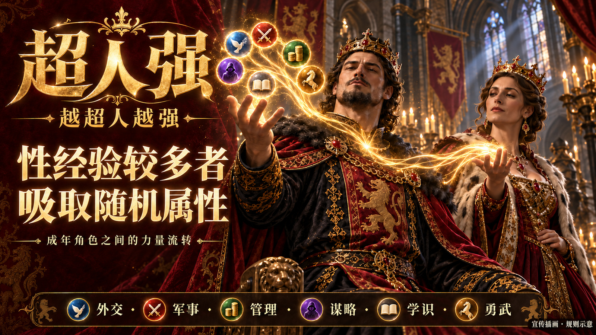
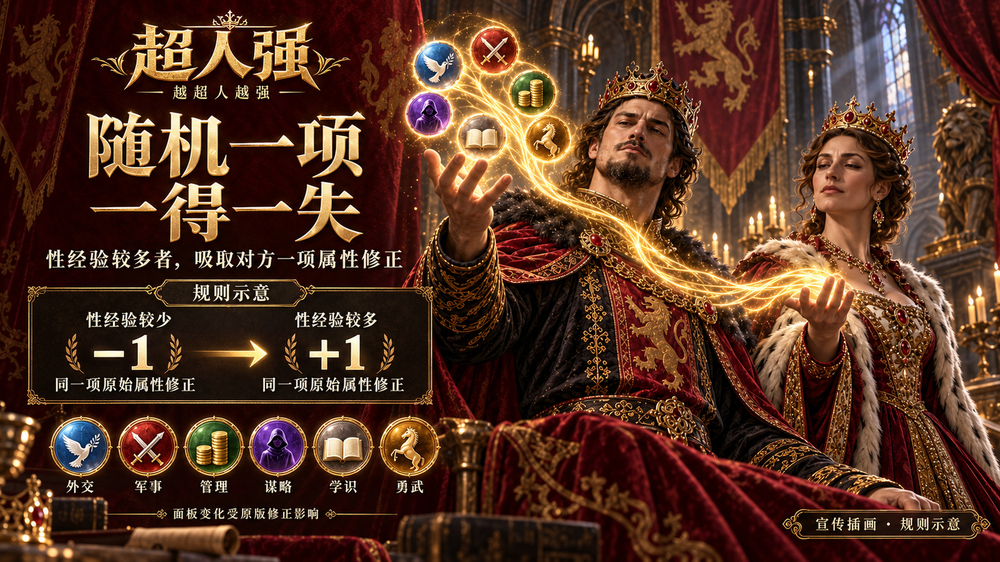

# 《超人强》当前工坊宣传图片

2026-10-04 展示修订 `1.0.0-media.1`：重做三张统一红金风格的宣传海报，替换首发经验 0 查看截图，并同步重写中文工坊介绍。图片为原创宣传插画与规则示意，均有明确标识，不声称是实机截图。上传前的图像与文字已冻结，公开回读在实际发布后补齐。

工坊条目：[3812991990](https://steamcommunity.com/sharedfiles/filedetails/?id=3812991990)。封面同步改为成年国王与王后，见 [封面来源](../mod_superman_qiang/docs/key-art.md)。游戏版本仍为1.0.0，正式包重新由媒体tag构建；除thumbnail外21文件与首发验收包相同。

## 当前顺序

| index | 主题 | 图片 | 尺寸 | bytes | SHA-256 |
|---:|---|---|---|---:|---|
| 0 | 性经验较多者，吸取随机属性 | [01_absorption.jpg](superman_qiang_media/v1/01_absorption.jpg) | 1600×900 | 858,996 | `a649270045e66df4e522b42f2bc919a164db9573ece273d8e4e6aecef264b152` |
| 1 | 随机一项，一得一失 | [02_transfer.jpg](superman_qiang_media/v1/02_transfer.jpg) | 1600×900 | 853,870 | `2828b5ef356ab1bffa70090ced6cf56e153195122bc1c0b5799bf1c8dc6f38d1` |
| 2 | 每次经历，都会留下记录 | [03_records.jpg](superman_qiang_media/v1/03_records.jpg) | 1600×900 | 861,548 | `a9dfb7f795217b0c0c25c045d9821ce9c0b30285e7e5b0f2acee17faf1dfab97` |






## 来源和重建

使用内置 `image_gen`；完整实际提示词、五次生成/修字调用、引用文件和原始SHA保存在 [generation-record.json](../images/superman_qiang_media_v1/generation-record.json)。最终三张源PNG保存在同一目录，原无字稿、首稿与全部外置过程保留于 `C:/ck3-superman-qiang-media-redo-20261004/art-P0001/`。

三张源图实读尺寸均为1672×941，居中等比裁切 `(0,0.25,1672,940.75)` 后投影至1600×900，Pillow LANCZOS；仅做发布尺寸/编码，内容与文字由内置图像工具制作。JPEG quality95、optimized progressive、4:4:4，每张严格小于1MiB。root直接审阅三份精确最终JPEG，见 [root-review.json](superman_qiang_media/v1/root-review.json)；外置 [provenance.json](superman_qiang_media/v1/provenance.json) 保持生成时的准备事实。

```text
tools\.venv\Scripts\python.exe tools/compose_superman_qiang_promotional_media.py --source-dir images/superman_qiang_media_v1 --output-dir workshop/superman_qiang_media/v1 --manifest images/superman_qiang_media_v1/generation-record.json --check
```

## 首发旧图与实际游玩取材

首发图已被用户否决，不再用于宣传。原PNG、JPEG、来源manifest与 [首发图片清单快照](superman_qiang_screenshots_initial_1.0.0.md) 保留作历史记录。

本次同时尝试了新production-only普通战役取材。2026-10-04更正：P0001误点后启动的实际为谋杀计谋，界面30%是成功几率，原报告将其误记为诱惑进度。P0002后续真实`murder_outcome_reworked.0013`失败事件确认了该错误；目标存活，未发生性行为，没有非零经验或属性转移宣传结果。旧报告和全部原始素材保留并追加勘误，这些截图不上传。最初430份原始资产索引、实际存档、停止与屏幕释放记录保留于 `C:/ck3-superman-qiang-media-redo-20261004/capture-P0001/`，不将计谋启动或尚未发生的结果写成取材成功。

宣传选择与中文介绍要求见 [promotional-media.md](../mod_superman_qiang/docs/promotional-media.md)，活动中文全文见 [BBCode](superman_qiang_description.bbcode)。图片与文案同次提交，发布后核对完整描述、三张CDN原图和独立Steam Change Notes。

用户追加要求必须包含实机截图，正常游玩取材已在独立capture-P0002继续；选定的真实非零记录与正式顺序在素材就绪后冻结。首发XP0图不重新上传。
